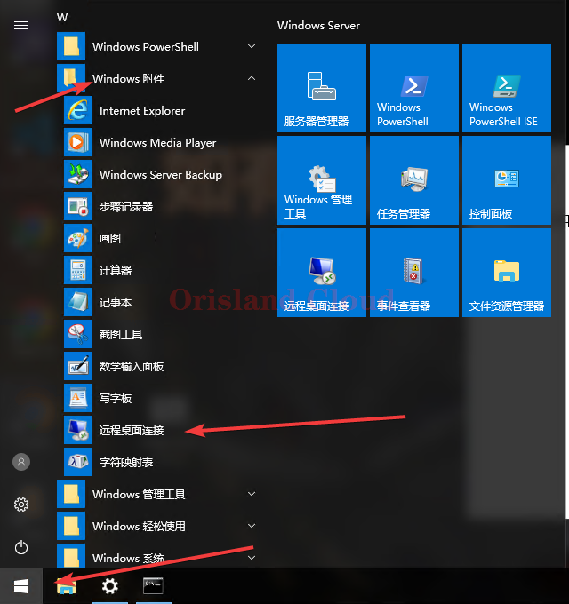

# Windows

## 打开远程软件

### 方法1

下载文件后解压后打开文件，随后跳转 [#lian-jie-zhuo-mian](windows.md#lian-jie-zhuo-mian "mention")



若此方法无效，请使用下面的方法。

### 方法2

单机你的Windows按钮 (1).png>) 或  (1) (1) (1) (1) (1) (1) (1) (1) (1).png>)，根据系统来进行图示操作寻找远程桌面程序并打开。

Win11：

<figure><figcaption></figcaption></figure>

Win10：

<figure><figcaption></figcaption></figure>

## 链接桌面

窗口出现后，单机显示选项。

<figure><figcaption></figcaption></figure>

计算机栏目应填入客服提供的ip，_<mark style="color:red;">**请注意ip的组成应为“域名:端口”的形式**</mark>_，其中，域名为一串英文字母，端口为数字，冒号为英文冒号，_<mark style="color:red;">**ip格式例如 xxx.orisland.top:11451**</mark>_。

用户名必须填写为_<mark style="color:red;">**Administrator**</mark>_，_<mark style="color:red;">**不可空置或不填**</mark>_。

<figure><figcaption></figcaption></figure>

请在密码栏填入客服给的远程密码，并勾选记住凭据，密码请务必手打，<mark style="color:red;">请勿复制密码</mark>，否则很容易出现<mark style="color:red;">密码错误</mark>的问题。

<figure><figcaption></figcaption></figure>

若后续出现了无法验证远程计算机身份的问题，请无视该问题，正常直接连接。

<figure><figcaption></figcaption></figure>

进入远程桌面如图所示。

<figure><figcaption></figcaption></figure>

## 重要事项

**请进入**[**密码修改章节**](../mi-ma-xiu-gai.md)**，完成服务器的初始化，请勿省略该步骤。**

**请进入**[**磁盘扩容**](../ci-pan-guan-li/ci-pan-kuo-rong.md)**章节，检查磁盘容量是否有剩余，本页面一般为必读页面。**

**请进入**[**上传文件到服务器**](../shang-chuan-wen-jian/)**章节，完成服务端的上传（可选，若不知道如何上传则必选）。**
