# 移动端

请通过下方的标签进行快速跳转。

## 软件安装

### 苹果

请打开苹果的应用商店app store后搜索"rd"，找到Miscrosoft远程桌面应用进行下载安装，该软件为微软官方出品的软件，无需付费也没有广告。

下方gif对这个过程进行了演示。

<figure><figcaption>
苹果搜索微软远程桌面
</figcaption></figure>

### 安卓

微软官方的远程控制软件这边直接给出apk文件提供下载。


蓝奏云


## 软件使用

### 远程连接

请首先根据不同的系统进行安装 [#ruan-jian-an-zhuang](yi-dong-duan.md#ruan-jian-an-zhuang "mention")，安装完成后继续下面的连接步骤。

若为第一次打开软件，首先同意协议。

<figure><figcaption>
软件例行环节
</figcaption></figure>

进入主界面后可在右上角找到加号，单机之后选择添加电脑选项。

<figure>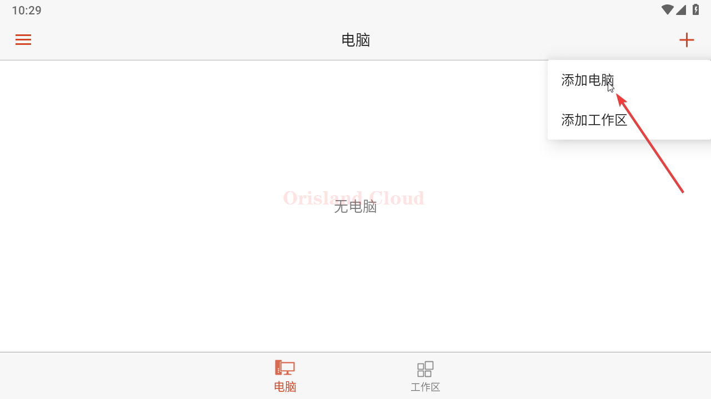<figcaption>
添加电脑
</figcaption></figure>

若出现如图所示的电脑检测选项，请无视，并选择手动添加。

<figure>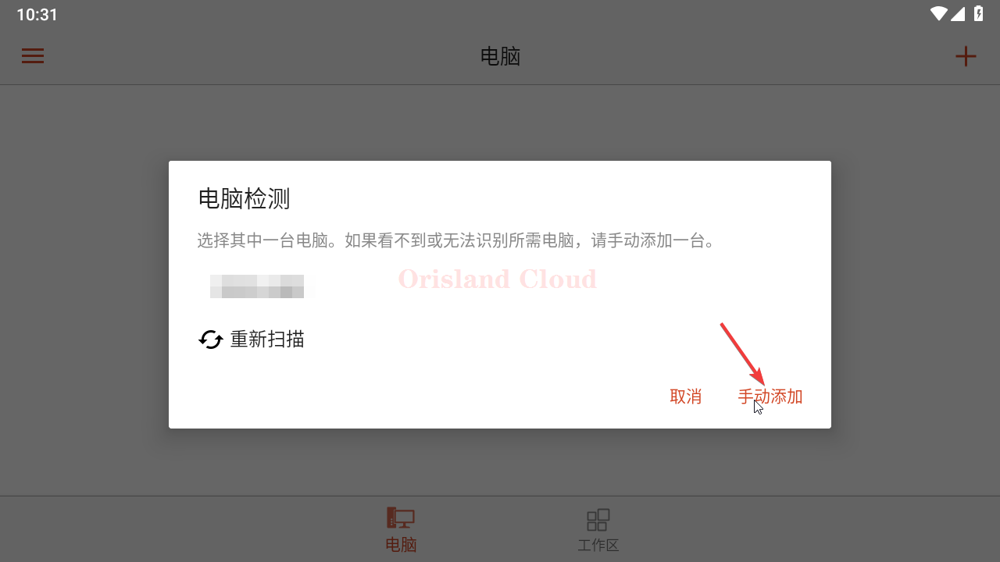<figcaption>
手动添加
</figcaption></figure>

请在图中的箭头位置输入客服提供的远程桌面连接地址，地址为一串英文字母，端口为数字，冒号为英文冒号，格式例如 xxx.orisland.top:11451，请勿省略任何部分。

<figure>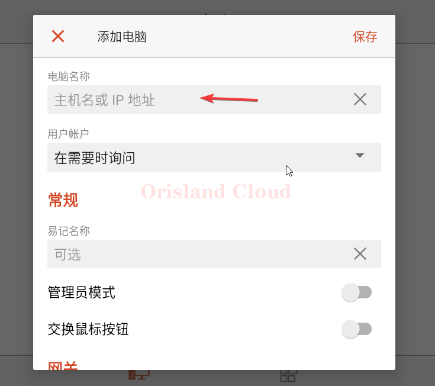<figcaption>
输入ip
</figcaption></figure>

在下一个用户账户选项中，请单机添加用户用户账户，手动输入用户名和密码。

<figure>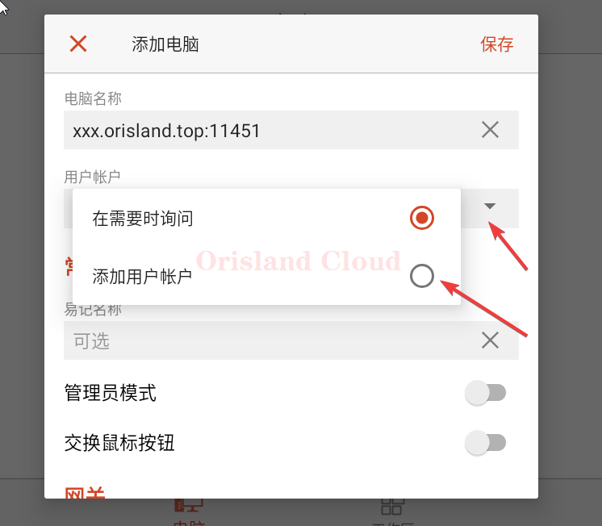<figcaption>
添加用户账户
</figcaption></figure>

请在用户名部分填入Administrator，不要输入错误，区分大小写，密码请以客服给的实际为准。

<figure>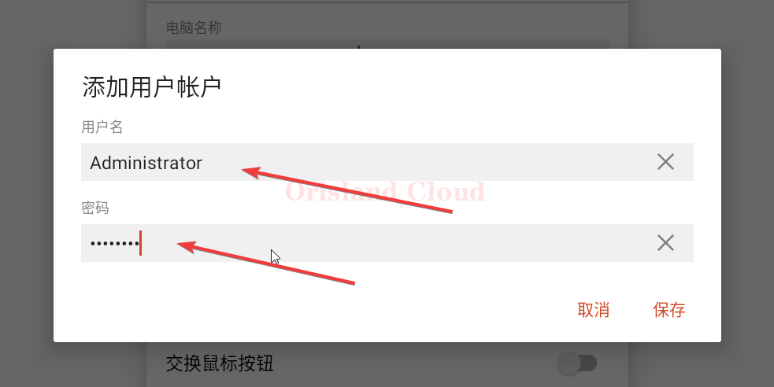<figcaption>
账户管理
</figcaption></figure>

其他选项可以按需要选择，拖动到下方可以找到，确定修改没有问题之后可以单机右上角保存。

<figure><figcaption>
更多远程连接选项
</figcaption></figure>

随后选择已经添加的桌面，进行远程连接。

<figure>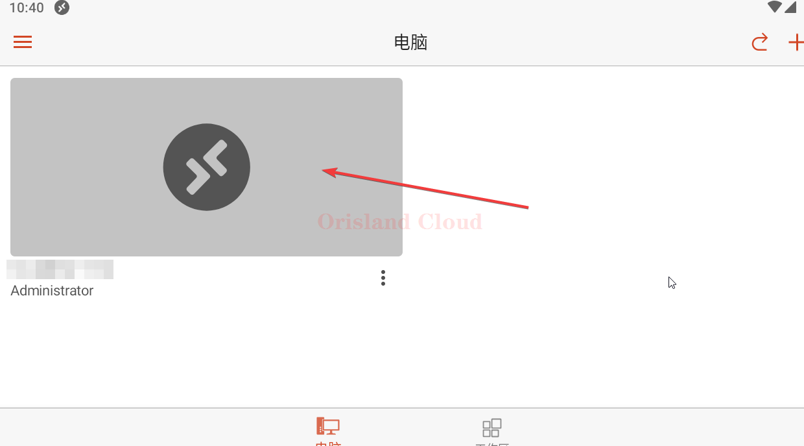<figcaption>
连接远程桌面
</figcaption></figure>

若出现如图警告，可以无视继续链接。

<figure>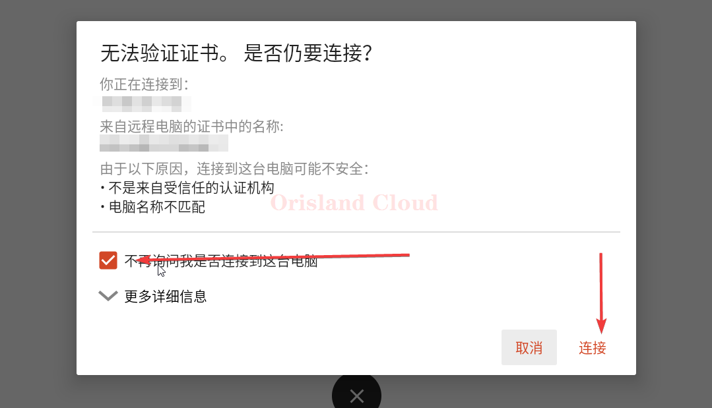<figcaption>
连接
</figcaption></figure>

<figure>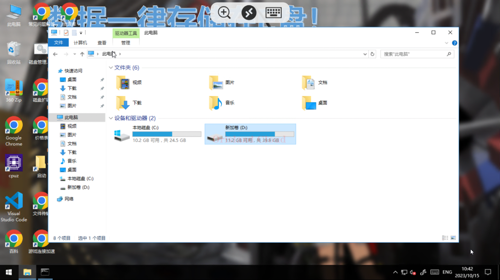<figcaption>
进入桌面
</figcaption></figure>

### 退出远程

请单机屏幕中间的图标，调出子菜单。

<figure>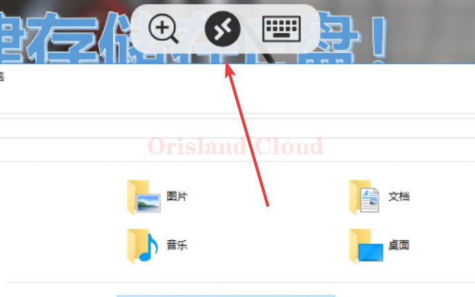<figcaption>
退出1
</figcaption></figure>

若您不需要结束链接，可以不单机X，直接单机左上角的主页按钮，如果您想关闭远程桌面，您可以直接单机X或者直接关闭远程软件。

<figure>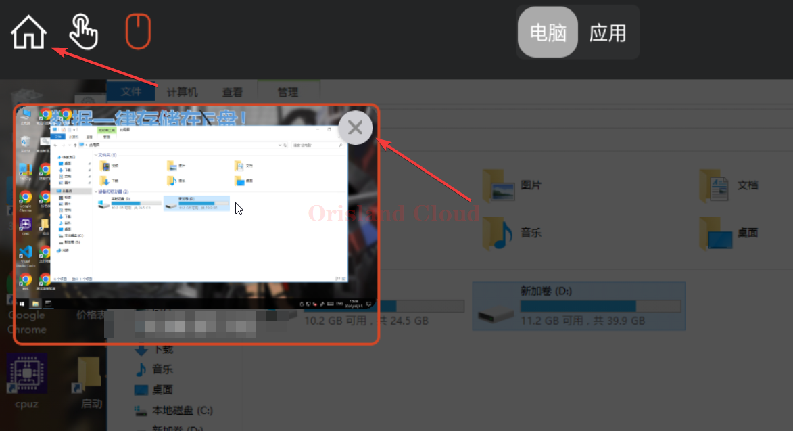<figcaption>
退出2
</figcaption></figure>

### 远程连接属性编辑

若您输入的远程信息有误，可以选择在远程控制的主界面里需要修改的主机右下角的三点位置，选择编辑按钮重新进入 [#yuan-cheng-lian-jie](yi-dong-duan.md#yuan-cheng-lian-jie "mention")部分进行设置。

<figure>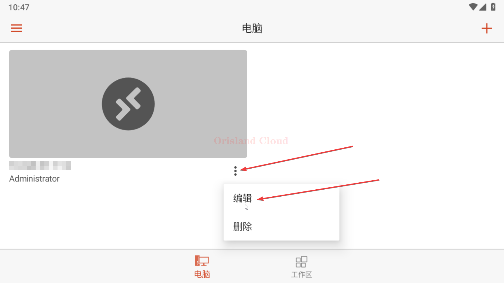<figcaption>
编辑远程桌面连接信息
</figcaption></figure>
