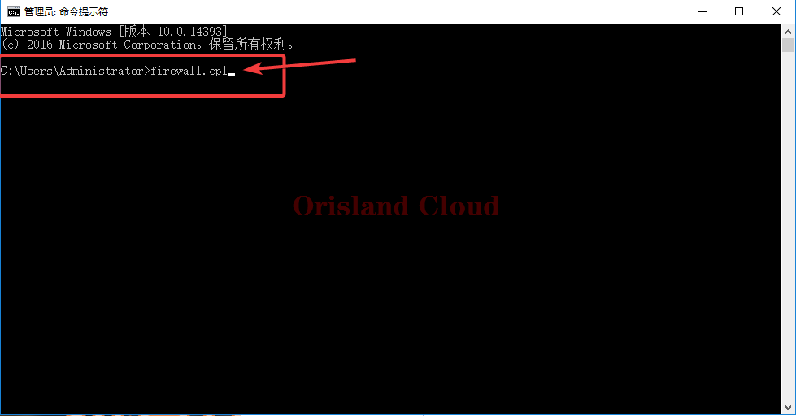
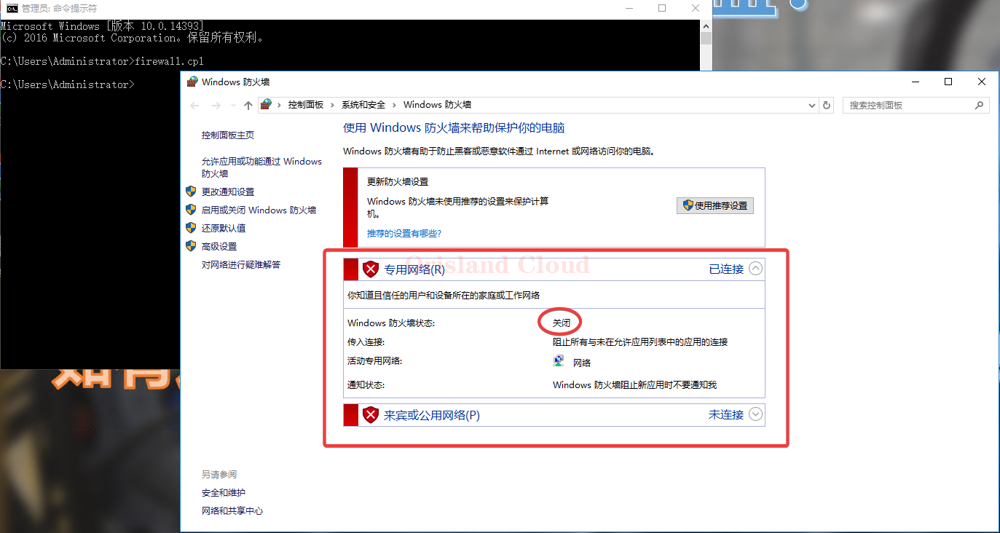
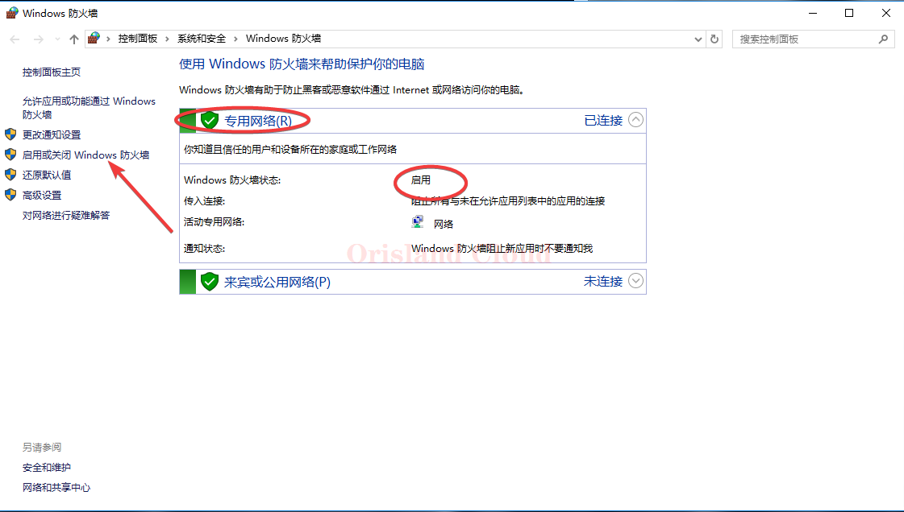
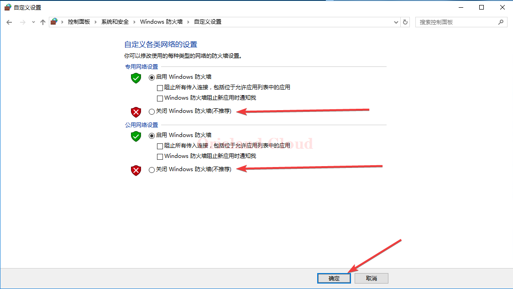

# 防火墙管理

右击，单机命令提示符按钮。

<figure><figcaption></figcaption></figure>

输入firewall.cpl，回车，打开防火墙管理面板。

<figure><figcaption></figcaption></figure>

请注意，图示中的防火墙关闭状态是正确的，防火墙方面已不需要配置。如果您打开的页面为绿色的对钩盾牌，请继续看完后续。

<figure><figcaption></figcaption></figure>

在绿色盾牌状态下，你应该，在左侧找到启动或关闭Windows防火墙选项卡，单机进入。

<figure><figcaption></figcaption></figure>

在窗口中选择关闭防火墙（不推荐），图中显示为未关闭防火墙的状态，选择完成后单机确定。

<figure><figcaption></figcaption></figure>
