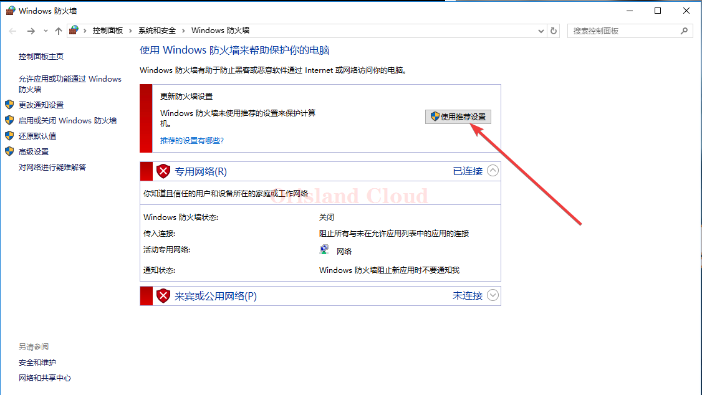
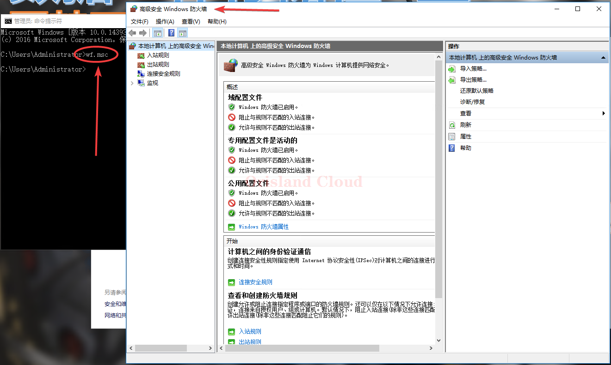
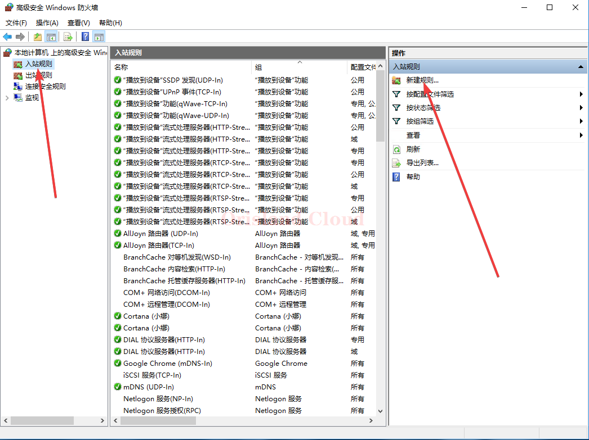
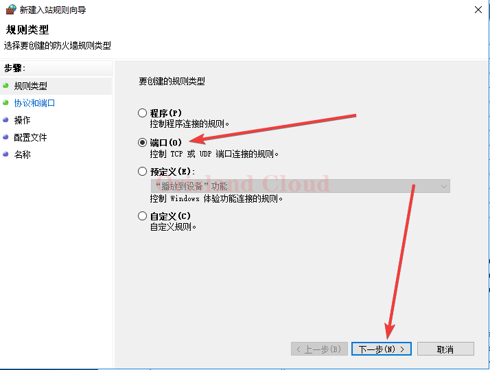
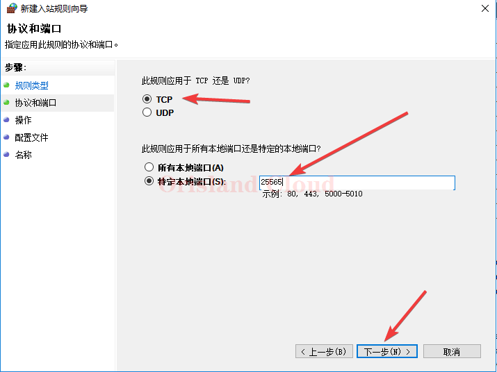
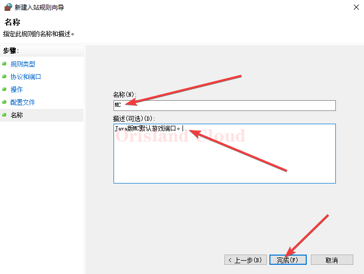
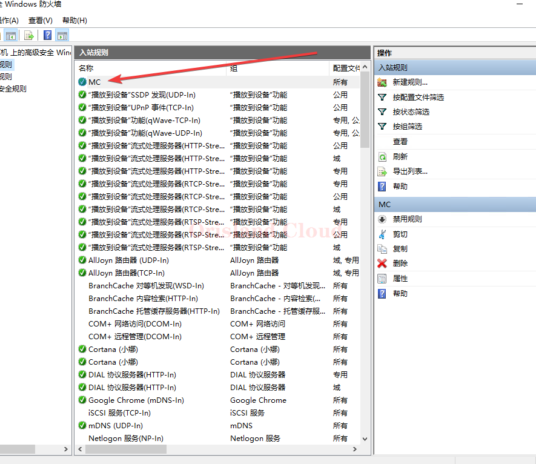
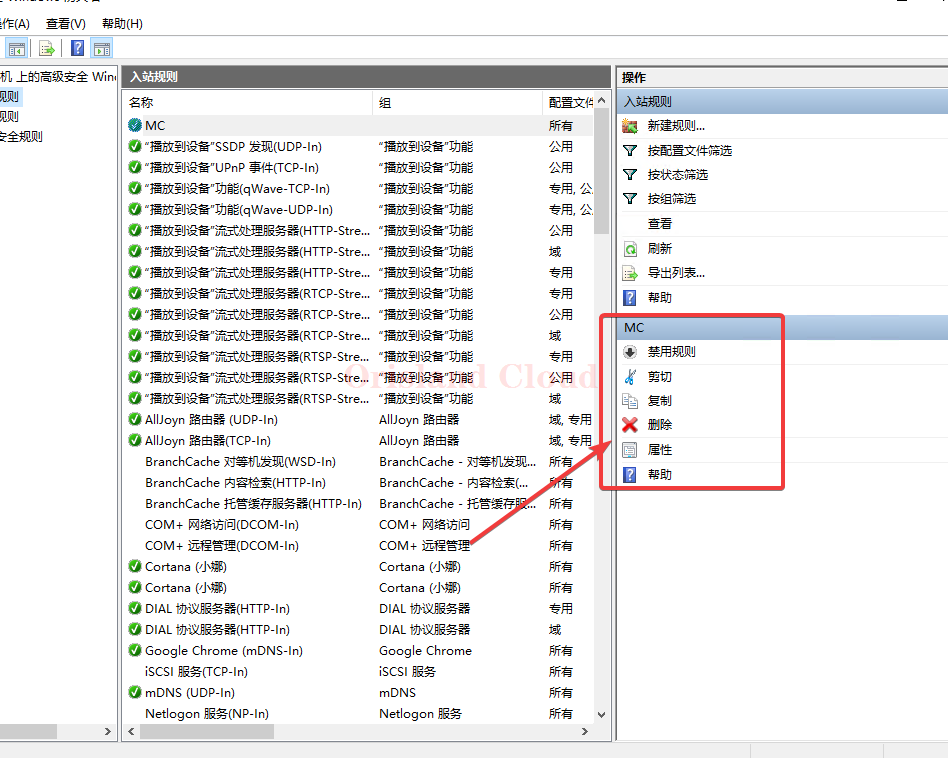

# 防火墙详细配置

打开防火墙的配置页面，若防火墙此时为红色，并显示为关闭状态，单机使用推荐设置重新打开Windows防火墙。

<figure><figcaption></figcaption></figure>

<figure><figcaption></figcaption></figure>

在CMD命令框中输入指令wf.msc，回车进入防火墙详细配置界面。

<figure><figcaption></figcaption></figure>

单机入栈规则选项，并在右侧找到新建规则选项。

<figure><figcaption></figcaption></figure>

由于可添加的规则众多，所以这边仅演示通用的端口开放，并以Java版MC常用的25565端口为例。

在选项卡中选择端口选项卡，并单机下一步。

<figure><figcaption></figcaption></figure>

由于Java版MC通讯所使用的协议为tcp，端口号为25565，所以在窗口中选择TCP，并选择特定本地端口后填入25565，此协议和端口根据不同的游戏服务端而有所不同。填入完成后单机下一步。

<figure><figcaption></figcaption></figure>

由于后续不需要进行其他操作，请单机下一步直到名称选项，填入本条规则的自定义名称，名称可以随意配置，但是推荐使用明确的有意义字符串，例如这里填入了MC，描述可填可不填。填入完毕后单机完成选项卡。

<figure><figcaption></figcaption></figure>

在防火墙列表中已发现刚刚填入的MC入站规则。

<figure><figcaption></figcaption></figure>

若需要删除本规则或者修改本规则，可以在右下方框中找到需要的功能选项卡，并进入修改，这里不再示范。

<figure><figcaption></figcaption></figure>
