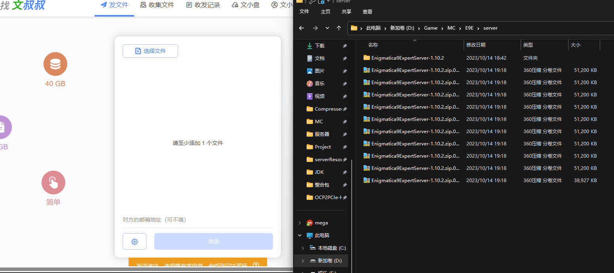
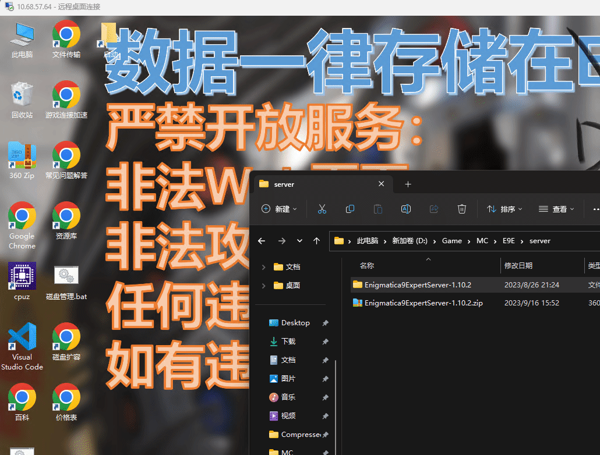
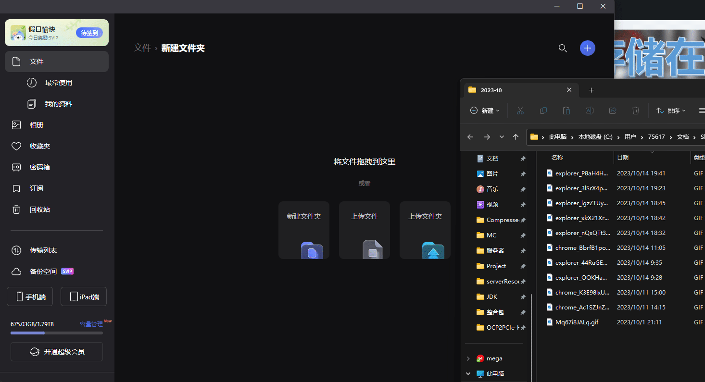

# Windows

在文件传输开始前，请先确定文件的大小，将文件分为小文件(1M\~300MB)，文件(300MB\~1G)，大文件(>1G)进行传输。

这里对限速盘，付费盘和容量传输较小和速度较慢的盘不做介绍和推荐。

在传输前，应将文件夹压缩，请勿直接传输文件夹。

下面将详细列举三种不同的方式进行文件传输，可以单机下面的标签进行快速跳转。

## 适用于中小文件的传输

本方法实际上也可以进行大文件的传输但是免费的次数有限。



请尽量将这个网站加入收藏夹，可以方便下次传输文件。

下面将详细说明这种方式的传输过程。

在传输文件前，请将文件夹进行压缩，如果对压缩过程有疑问，可参考 [ya-suo-yu-jie-ya.md](ya-suo-yu-jie-ya.md "mention")章节，若您需要压缩的文件>5G，<10G，那么请参考 [ya-suo-yu-jie-ya.md](ya-suo-yu-jie-ya.md "mention")章节中的_**分卷压缩**_部分，将5G的文件进行拆分上传。

下面给出gif动画进行相关参考，gif动画演示的为多文件上传和打包下载过程，另外由于匿名上传的限制性，推荐在传输大量文件的时候，先在网站进行登录，可以使用微信或者QQ直接登录，单个小文件一般不需要进行登录即可下载。

<figure><figcaption></figcaption></figure>

## 小文件传输

对于容量本身就不大的文件来说，您可以采取复制粘贴的方式直接进行传输。请注意，这种复制可能在由于网络波动而导致中断，越大的文件失败率越高，这种复制在中断后无法恢复，且服务器会留下不完整的文件，请在失败后进行删除。

下面的gif将演示如何通过复制和粘贴的方式将本地的文件复制到服务器，请注意在任何情况下应该尽量避免直接复制文件夹。

<figure><figcaption>
复制文件
</figcaption></figure>

## 超大文件传输

如果您需要传输的文件大于10G，您应该考虑使用类似阿里网盘这样的不限速网盘进行处理，下面的教程将将以阿里云盘为传输工具进行说明。



首先，您需要压缩您的文件夹，请尽量使用自解压的方式压缩，避免普通压缩，阿里云盘禁止分享，若您不需要分享文件给其他人下载，那么可以进行正常的压缩。压缩相关的教程可以进入 [ya-suo-yu-jie-ya.md](ya-suo-yu-jie-ya.md "mention")章节进行查看相关教程。

此种方法上传和下载过程均为软件内操作，下面给出了上传的教程。

<figure><figcaption>
阿里云盘上传
</figcaption></figure>
