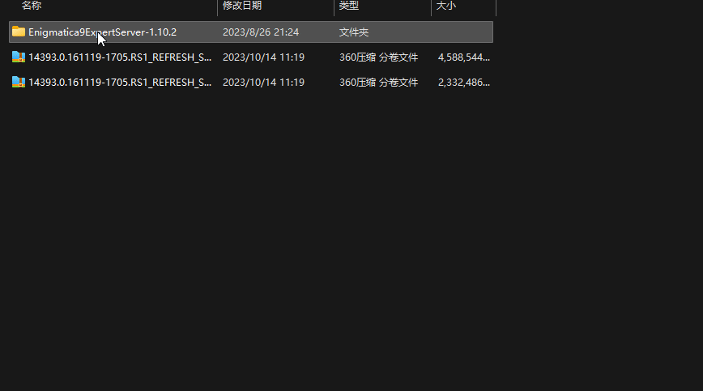

# 压缩与解压

这里压缩的软件以360压缩国际版为例，不提供其他软件的参考，其他压缩软件请自行搜索相关的压缩教程，这里也同样贴出该软件的下载地址。选这个软件的理由是国际版360压缩无推广无升级无弹窗无广告，可用格式全面，请避免使用国内版本。(不排除后期被360添加佐料的可能性，截止2023/10/13目前版本为1.0.0.1041)



下面将分别介绍集中常用的压缩，解压方法和使用场景，可以通过下方的标签进行快速跳转。

[#pu-tong-ya-suo](ya-suo-yu-jie-ya.md#pu-tong-ya-suo "mention") [#fen-juan-ya-suo](ya-suo-yu-jie-ya.md#fen-juan-ya-suo "mention") [#zi-jie-ya](ya-suo-yu-jie-ya.md#zi-jie-ya "mention")

[#jie-ya](ya-suo-yu-jie-ya.md#jie-ya "mention")

## 普通压缩

首先找到需要压缩的文件夹，右击文件夹，若为win11可以找到.png>)，若为win10则找到360压缩提供的“添加到压缩文件”选项卡.png>)，在弹出的小框内将文件夹内的所有文件添加到压缩包。等待进度条完成后在当前目录生成压缩文件，下面按不同的系统给出gif参考。

<figure><figcaption>
win11
</figcaption></figure>

<figure><figcaption>
win10
</figcaption></figure>

## 分卷压缩

分卷压缩是为了解决压缩文件超大体积的问题而存在，这种方法可以将任意大小的文件夹自动压缩为指定尺寸的文件。本操作常用于文件上传部分，大于4G的文件由于系统限制无法正常上传需要经过此步骤进行分卷压缩。

由于win11自带的压缩不支持分卷压缩，所以下面的所有操作都基于上面提到的压缩软件处理。win11请右击需要压缩的软件时，选择.png>)显示详细菜单后参考下面的gif动画进行操作。分卷压缩将文件压缩为多个文件，为了保证文件的完整性需要将导出的**所有文件**全部传输，不可缺少，请勿进行任何重命名操作避免文件丢失。

<figure><figcaption>
分卷压缩步骤
</figcaption></figure>

## 自解压

自解压可以将文件夹压缩为可执行的exe文件，相当于同时将压缩软件封装了一份迷你版进压缩包，此方法导出的文件为exe可执行文件，所以理论上该文件可以在任何windows系统内进行顺利解压。

本方法在这里介绍的原因是**阿里云盘不支持分享任何压缩包**，使用自解压的方式可以规避压缩限制顺利分享和上传。下面的gif动画中展示了具体的创建自解压和解压的过程。

<figure><figcaption>
自解压过程
</figcaption></figure>

## 解压

本操作用于将压缩文件释放为压缩前的文件。

下面的gif动画展示了具体的解压过程，gif动画中标注的解压路径可以按自己的需要做任意的修改，若不修改则默认解压在当前目录。

<figure><figcaption>
解压
</figcaption></figure>

