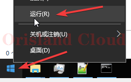

# 简单开机自启

**右击**开始菜单，单机`运行`，在弹出的小框中输入`shell:startup`

<figure><figcaption></figcaption></figure>

<figure><figcaption></figcaption></figure>

回车，弹出的文件夹则为开机自启文件夹，可以把需要开机自启的文件或快捷方式放进去或删除。

<figure><figcaption></figcaption></figure>

请注意，本操作添加的启动项全部为<mark style="color:red;">**登陆后生效**</mark>，<mark style="color:red;">**不会在开机完成但未登入时启动，即在开机进入桌面时启动，**</mark><mark style="color:orange;">**不包括未登录状态**</mark>。未登录状态如下图中的界面所示。

<figure><figcaption></figcaption></figure>
