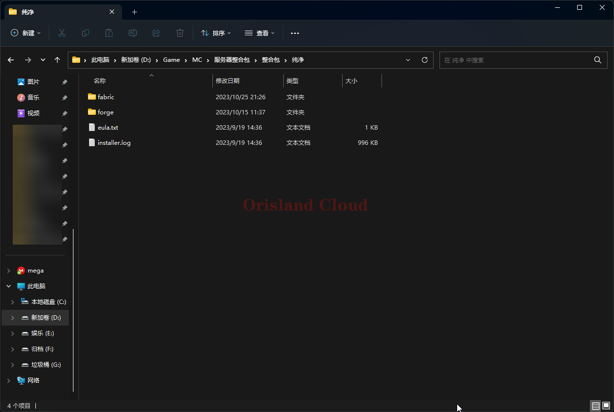
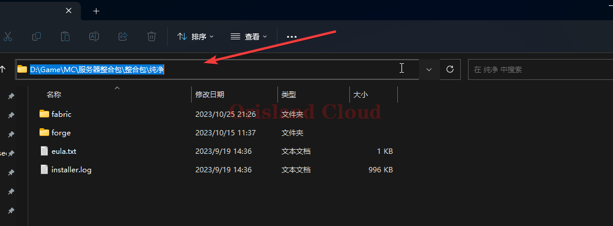
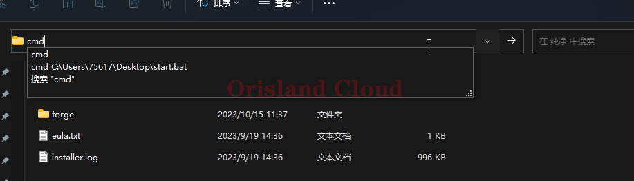
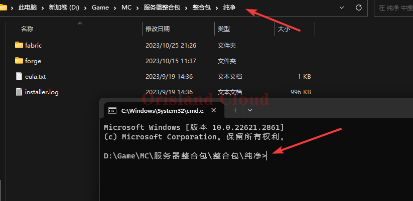

# 在当前目录启动命令行

首先，您应该打开目标文件夹。

<figure><figcaption></figcaption></figure>

鼠标单机地址栏，输入`cmd`。

<figure><figcaption></figcaption></figure>

<figure><figcaption></figcaption></figure>

回车，此时cmd命令行已经默认进入当前目录。

<figure><figcaption></figcaption></figure>
