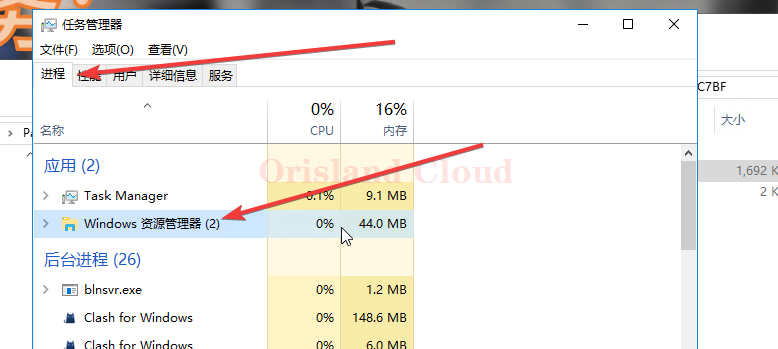
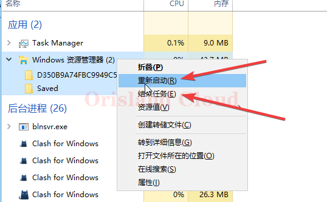

# 程序结束

请注意，<mark style="color:red;">**本操作为强制结束**</mark>，<mark style="color:red;">**除非该应用确定已经处于卡死的状态，否则不建议使用这种方式关闭程序**</mark>。

先启动任务管理器 [qi-dong.md](qi-dong.md "mention")

切换到进程选项卡 [#jin-cheng](xuan-xiang-ka.md#jin-cheng "mention")

找到卡顿的程序，这里以windows资源管理器为例。

<figure><figcaption></figcaption></figure>

按你的需要将程序关闭或重启。

<figure><figcaption></figcaption></figure>
