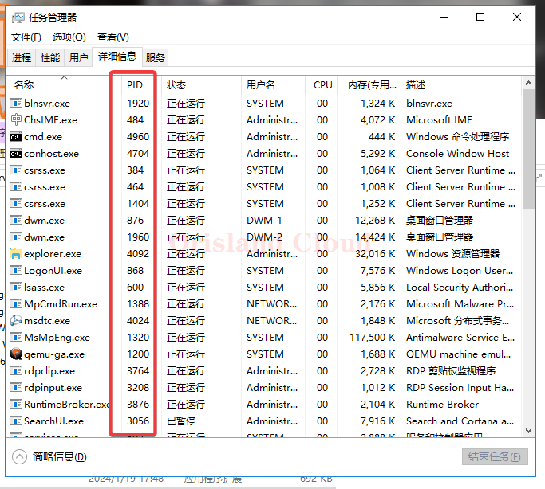

# 选项卡

<figure><figcaption></figcaption></figure>

## 进程

进程选项卡可以查看前后台任务，右击需要关闭的程序可以强制结束程序(不安全)。

<figure><figcaption></figcaption></figure>

您可以单机名称，cpu，或者内存标签来对方框中的列表进行排序。

<figure><figcaption></figcaption></figure>

## 性能

性能选项卡可以检测电脑的整体性能，你可以切换到需要的选项卡来查看当前服务器的数据是否正常。

<figure><figcaption></figcaption></figure>

## cpu切换单核查看

部分程序或游戏服务端对单核的要求极高且对多核优化较差，所以在运行这种单核程序时，需要以单核的情况来衡量当前服务器的压力。

右击cpu图形的空白处，可以按图所示切换为单核显示。

<figure><figcaption></figcaption></figure>

切换完成后。

<figure><figcaption></figcaption></figure>

## 详细信息

本页面一般用于配置其他项目通过PID寻找程序。

<figure><figcaption></figcaption></figure>
