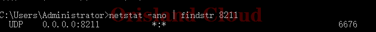
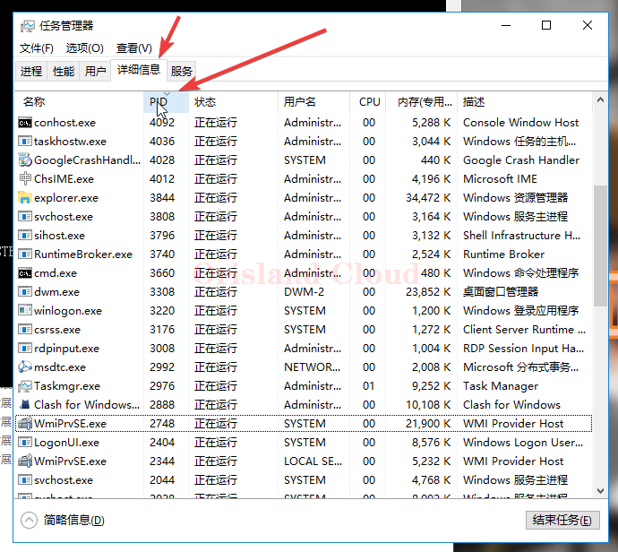
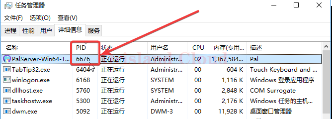

# 通过端口找占用的程序

以8211为例

启动cmd [qi-dong-ming-ling-hang](qi-dong-ming-ling-hang/ "mention")

在弹出的黑框中输入

> netstat -ano | findstr 你需要查找的端口

替换上面的8211，则需要输入的指令为

> netstat -ano | findstr <mark style="color:red;">**8211**</mark>

输入完成后观察输出，若有具体输出则找到了指定的端口，若没有具体的输出则没有找到指定的端口(常见于端口未开；服务端未启动；启动失败等)

<figure><figcaption>
找到对象
</figcaption></figure>

<figure><figcaption></figcaption></figure>

找到对象的情况下，可以看到最右侧有一个数字，这个数字可以很大可以很小，需要记录该数字，重新放入上面提到的代码中，比如上图的`6676`.

如果你不需要确认到底是什么程序占用了这个端口，只想直接关闭这个软件，那么你可以在cmd中执行下面的命令。

> taskkill /F /PID 你要结束的PID

以上面提到的`6676`为例，经过替换后，该命令会变更如下。请注意，这种方式结束进程为强制结束，没有确认执行的步骤，输入后回车则立即执行。

> taskkill /F /PID <mark style="color:red;">**6676**</mark>

若你需要知道是具体什么程序，你可以先打开任务管理器，切换到详细信息标签，单机PID，让任务管理器按PID排序。 [ren-wu-guan-li-qi.md](ren-wu-guan-li-qi.md "mention")

<figure><figcaption></figcaption></figure>

滚动滚轮直到你找到目标PID，这里以上面找到的`6676`做示范，这里则可以看到占用`8211`端口的程序为帕鲁的服务端，你可以右键该进程做你需要的处理。

<figure><figcaption></figcaption></figure>
