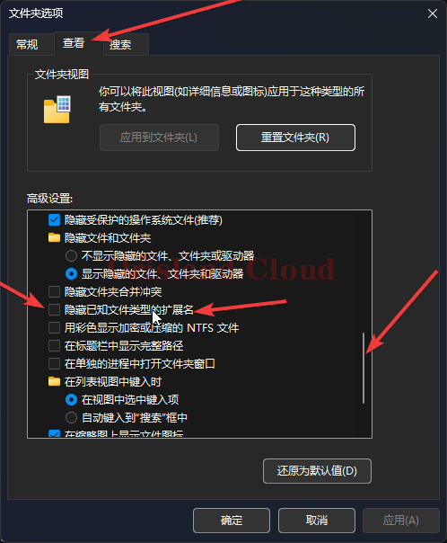
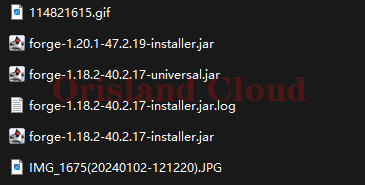

# 显示文件后缀

## win11

打开系统资源管理器（此电脑），在上方状态条中找三个点，单机后在弹出的竖框中选择`选项`。

<figure><figcaption></figcaption></figure>

<figure><figcaption></figcaption></figure>

在弹出的选项卡中，单机查看，滚动下方滚动条，找到如图所示条目，将勾选去除，单机确定即可完成。

<figure><figcaption></figcaption></figure>

若修改后打开文件夹，所有文件的后缀已经全部出现则代表更改完成。

<figure><figcaption></figcaption></figure>
