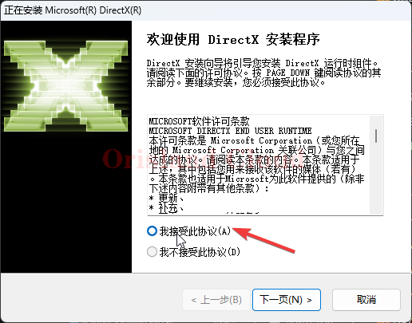

# DX12

提供一份下载链接，您也可以到其他地方下载dx12.



下载后解压文件 [#jie-ya](../fu-wu-qi-guan-li-yu-kong-zhi/shang-chuan-wen-jian/windows/ya-suo-yu-jie-ya.md#jie-ya "mention")

双击DXSETUP进行安装。

<figure><figcaption></figcaption></figure>

单机我同意之后，下一步直到完成。

> <mark style="color:blue;">除非您知道自己在做什么，否则一般上不需要做其他修改。</mark>

<figure><figcaption></figcaption></figure>

<figure><figcaption></figcaption></figure>
