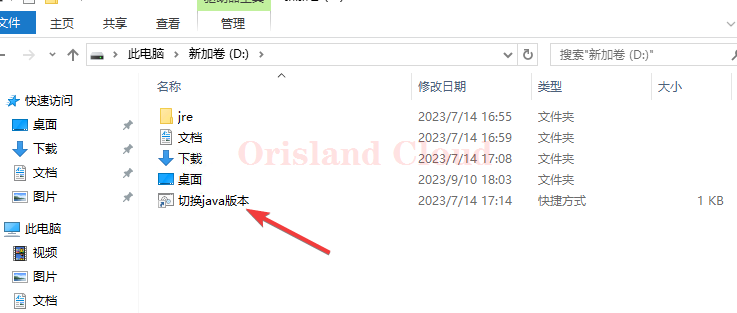
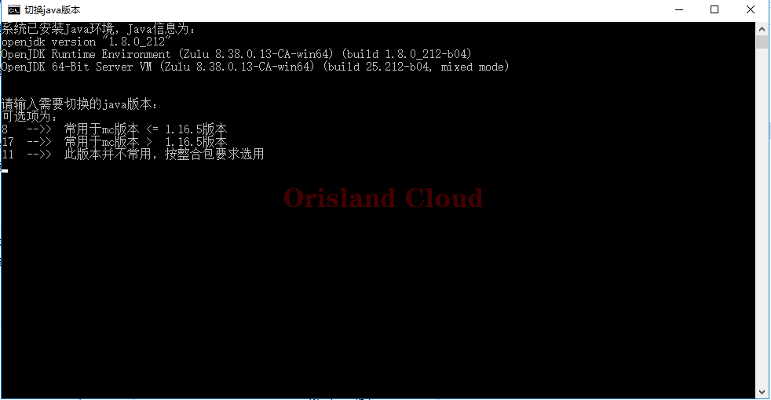
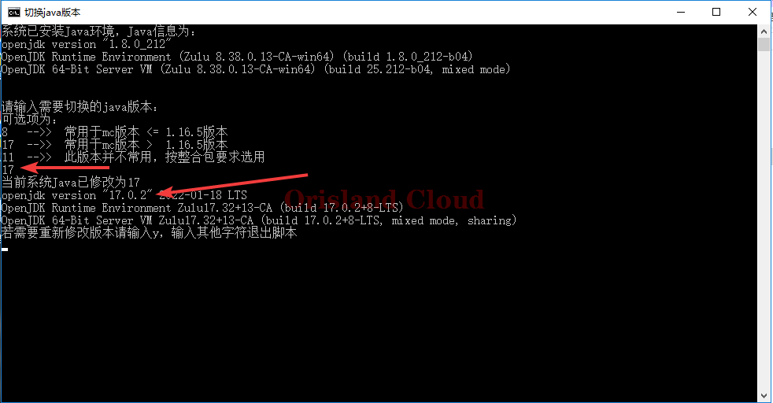

# 在本站内安装

虽然Java到目前为止仍然保持了高活跃度和迭代速度，但是目前游戏常用的Java版本仅为Java8和Java17，其他版本虽然可用，但是不推荐使用，如果您执意使用最新版本，或者旧版本造成的问题一律自行处理解决。

服务器内已预装Java17，如果需要切换Java版本请进行如下操作，D(E)盘中的jre文件夹请勿删除，这是JRE切换所需要的文件，删除会导致切换失败和脚本永久失效，若出现这种情况请转向[本站外模式](zai-ben-zhan-wai-an-zhuang.md)进行重新安装。

打开D(E)盘，找到切换java版本快捷方式，双击打开，若不存在此快捷方式请看[本站外模式](zai-ben-zhan-wai-an-zhuang.md)进行安装。

<figure><figcaption></figcaption></figure>

服务器内仅提供常用的Java版本。如果需要其他版本的java需要跳转到[本站外模式](zai-ben-zhan-wai-an-zhuang.md)进行安装。

在黑框中输入所需版本，例如切换到Java17，则输入数字17后按回车。

<figure><figcaption></figcaption></figure>

切换完成后显示如图所示，如果需要继续切换版本可以继续进行此脚本。

<figure><figcaption></figcaption></figure>
