# 在本站外安装

若您是Orisland Cloud的用户，由于文件丢失或者误删需要重新安装JRE，请首先进行文件清理，删除D(E)盘的jre文件夹。

<figure>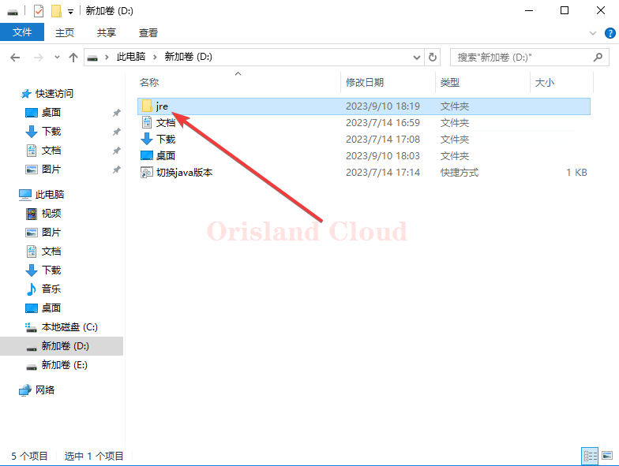<figcaption></figcaption></figure>

右击 ，选择命令提示符。

<figure>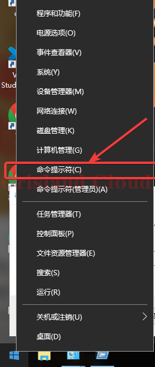<figcaption></figcaption></figure>

在黑框中输入control appwiz.cpl，并回车进入程序管理界面，寻找类似于openjdk xxx，zulu xxx等包含jdk，jre的程序，并右击相应的程序执行卸载。

<figure>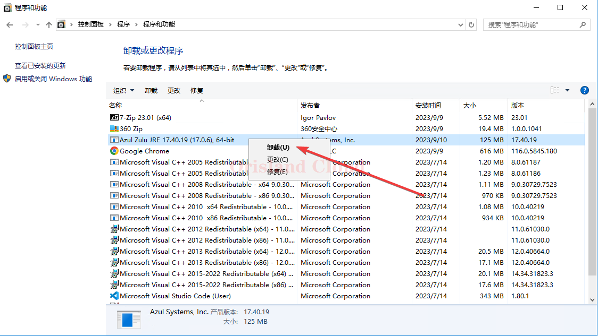<figcaption></figcaption></figure>

检查是否卸载完成，将黑框关闭，重新按照相同的方法打开，在黑框中输入java -version，若出现了错误的提示，则代表Java已经卸载完成。

<figure>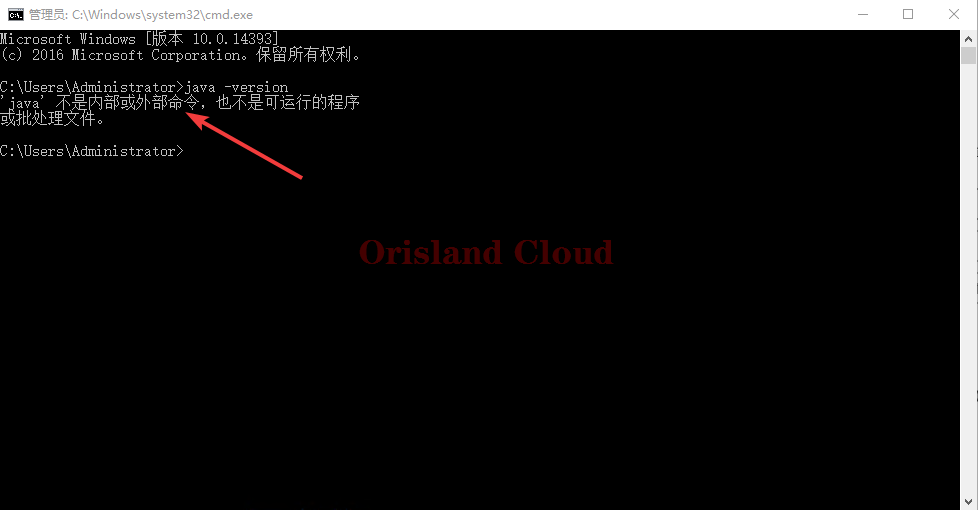<figcaption></figcaption></figure>

***

清理完成后开始Java安装。

首先明确你需要的Java版本，这里以使用较多的Java17举例，具体Java版本的选择请根据不同游戏或者根据游戏的不同版本需要进行挑选。这里为了尽快完成下载，统一使用体积更小的jre，这里提供两份一个是压缩版，一个是安装版。

若您需要Java17请单机下面的连接下载：

[安装版](https://cdn.azul.com/zulu/bin/zulu17.44.53-ca-jre17.0.8.1-win\_x64.msi)，[压缩版](https://cdn.azul.com/zulu/bin/zulu17.44.53-ca-jre17.0.8.1-win\_x64.zip)，[Linux版](https://cdn.azul.com/zulu/bin/zulu17.44.53-ca-jre17.0.8.1-linux\_x64.zip)。

若您需要Java8请单机下面的连接下载\*：

[安装版](https://cdn.azul.com/zulu/bin/zulu8.42.0.21-ca-jre8.0.232-win\_x64.msi)，[压缩版](https://cdn.azul.com/zulu/bin/zulu8.42.0.21-ca-jre8.0.232-win\_x64.zip)，[Linux版](https://cdn.azul.com/zulu/bin/zulu8.42.0.21-ca-jre8.0.232-linux\_x64.tar.gz)。

\*：为什么java8不使用最新版？答，新版由于结构改动会导致某些整合包直接抛出异常无法正常启动，全部使用相对旧一些，但是不是那么旧的版本即可正常启动。

请注意上述的所有Java下载地址提供的均为X64版本，如果你的系统为arm，macos，或者x32，请到源站寻找对应的Java版本。



若选择了安装版直接双击无脑下一步即可完成安装，除非你知道你在做什么，否则可以不需要修改安装过程中的任何默认配置。

<figure>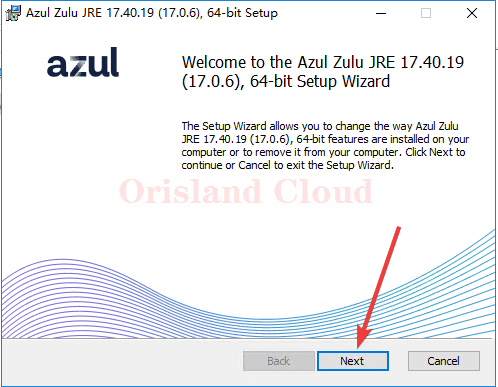<figcaption></figcaption></figure>

若选择了压缩版，则需要继续进行下面的配置。

解压下载的压缩包到任意文件夹，例如图中演示将下载的压缩包解压到D盘根目录，不同的压缩软件界面不同，请根据不同软件解压。

<figure>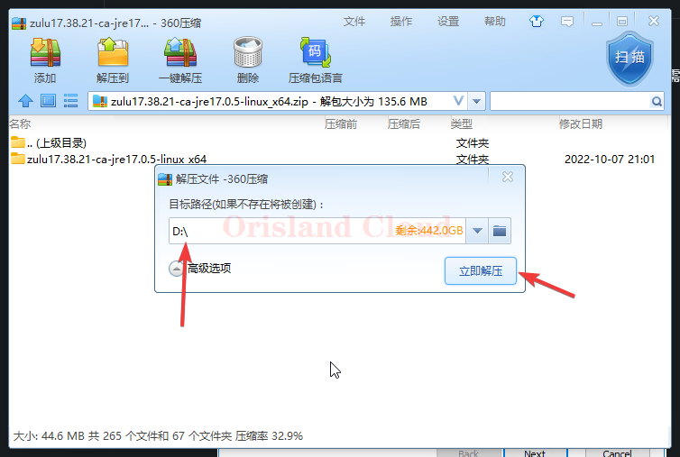<figcaption></figcaption></figure>

解压完成后到D盘找到你解压的文件夹，进入这个解压的文件夹内，单机地址栏，将地址栏内的所有字符复制备用。

<figure>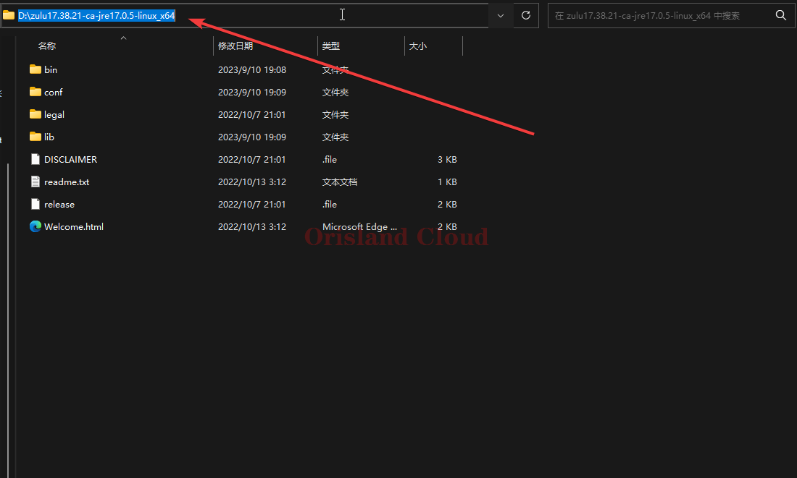<figcaption></figcaption></figure>

右键你的Windows按钮 (1).png>) 或  (1) (1) (1) (1) (1) (1) (1).png>)，选择命令提示符或Windows 终端。

<figure><figcaption></figcaption></figure>

输入systempropertiesadvanced，回车后，在出现的选项卡里单机环境变量。

<figure>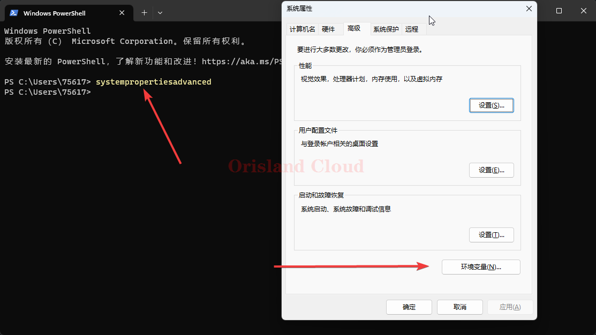<figcaption></figcaption></figure>

在弹出的窗口的上半部分寻找Path，并单机Path后单机编辑。

<figure>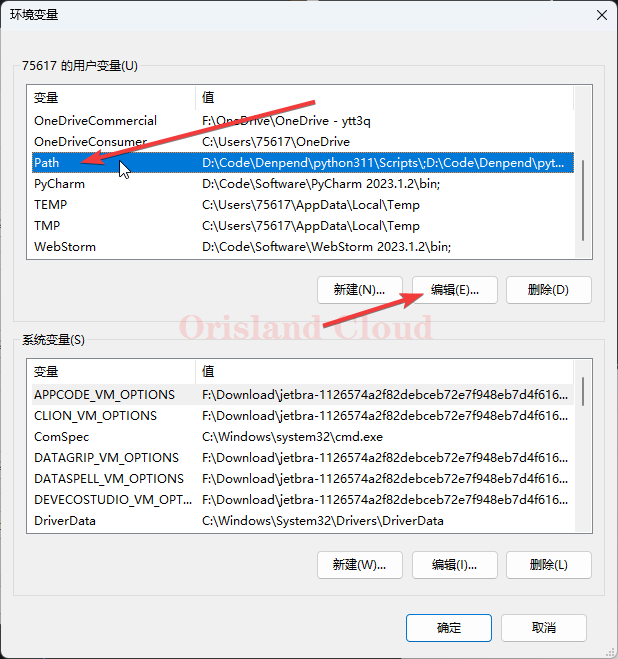<figcaption></figcaption></figure>

在弹出窗口中单机，新建，并将刚才备用的地址粘贴到小框内，并补全\bin，一定不要忘了补上\bin。修改完成后在弹出的三个窗口全部点确定即可完成Java的环境变量配置。

<figure>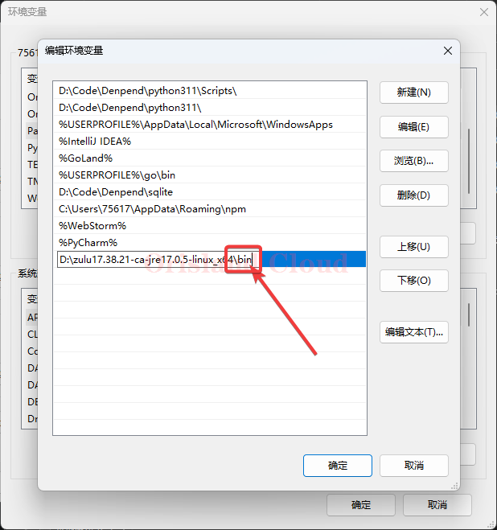<figcaption></figcaption></figure>

检查可用性，右键您的Windows按钮 (1).png>) 或  (1) (1) (1) (1) (1) (1) (1).png>)，选择命令提示符或Windows 终端。在黑框中输入java -version，若显示的结果为您刚才已经安装的版本则代表Java环境配置完毕。

<figure>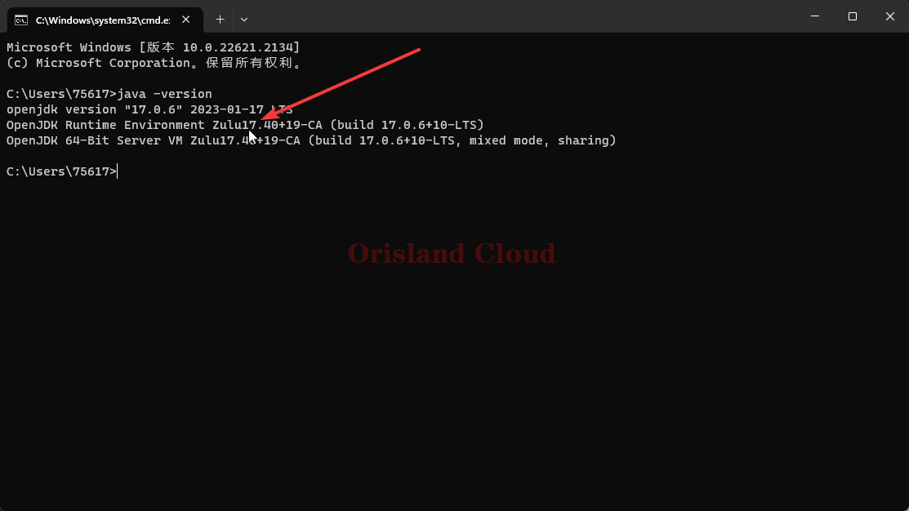<figcaption></figcaption></figure>
