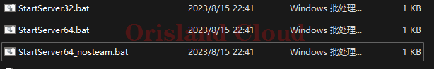
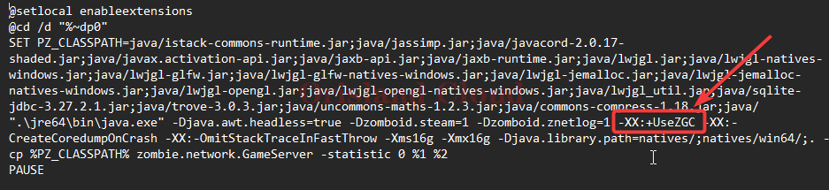
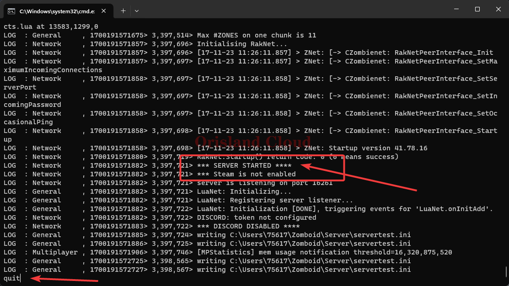
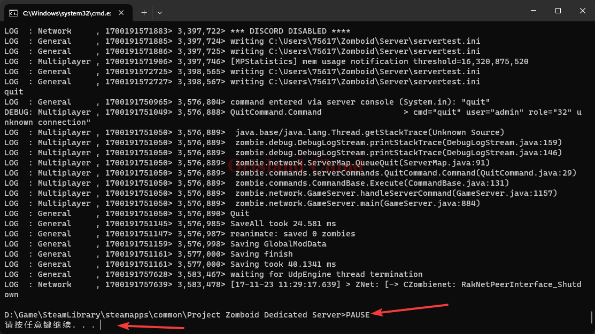
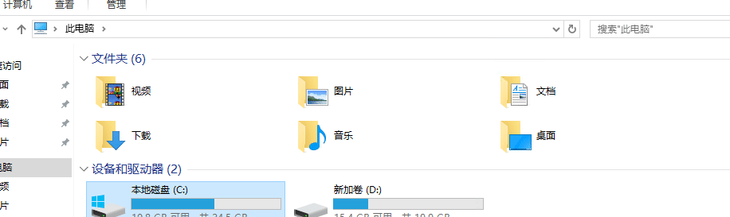
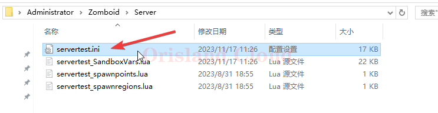
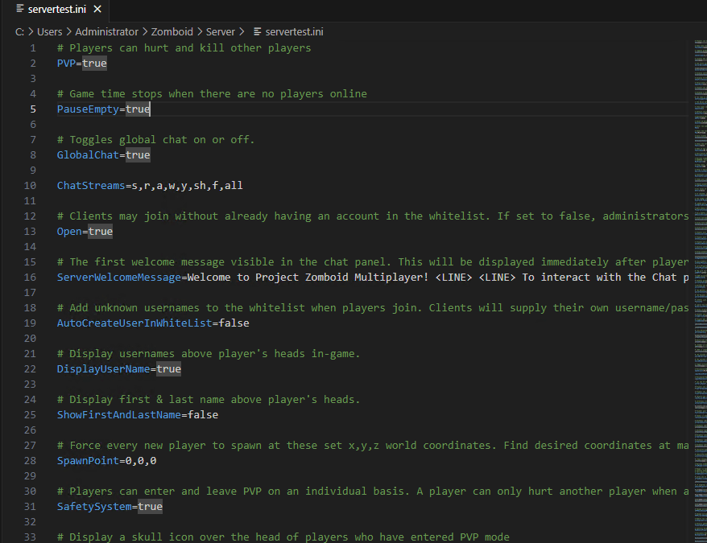
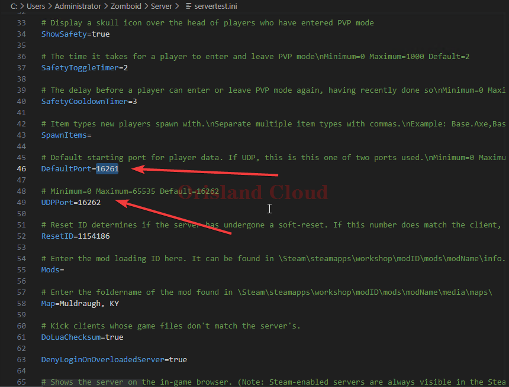
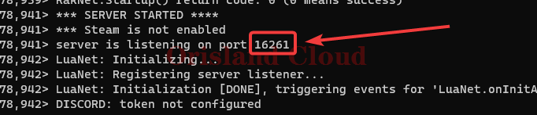
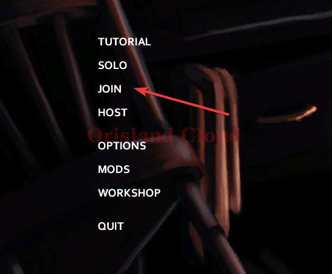

# 僵尸毁灭工程 Project Zomboid

请<mark style="color:red;">**不要听信网上各种教程的说法**</mark>，~~"必须win10以上才能开，必须winserver 2019以上才能开。"~~，此类说法是因为自己<mark style="color:red;">**对Java不了解导致的**</mark>，与游戏的服务端的跨平台性无关。僵尸毁灭工程的服务端由java编写，<mark style="color:red;">**良好的跨平台性**</mark>特点是这个编程语言的<mark style="color:red;">**最大优势之一**</mark>，一般<mark style="color:red;">**不会出现上面的系统版本问题，除非玩家自己不会配置**</mark>。

> 事前的说明，ZGC（The Z Garbage Collector）是JDK 11中推出的一款追求极致低延迟的实验性质的垃圾收集。但是ZGC会导致Java进程占用内存远超其他垃圾收集器，同时为了低时延而导致对于程序本身的性能也有所下滑。所以一般情况下，**并不是很推荐使用ZGC**。

## 准备

请首先准备两样东西进行开服前的必要准备。

* Java17环境。
* 僵尸毁灭计划服务端

## 开始

打开僵尸毁灭计划服务端，修改下面图中的三个文件（或只修改一个文件，您启动游戏也只需要一个，另外两个是不需要的，推荐使用StartServer64.bat），删除`-XX:+UseZGC`字段，或将图中的`ZGC`部分修改为G1GC。

<figure><figcaption></figcaption></figure>

<figure><figcaption></figcaption></figure>

修改完成之后，请务必保存文件，保存之后，双击修改之后的bat进行启动，在出现如图所示的结果后，在命令栏输入quit，回车等待服务器关闭结束退出，第二张图为服务器关闭后的显示。

<figure><figcaption></figcaption></figure>

<figure><figcaption></figcaption></figure>

请打开服务器的，并在下图中勾出的位置中输入\` C:\Users\\%USERNAME%\Zomboid\Server \`，并单机回车，进入该路径后，打开servertest.ini（若不是这个名字，请打开ini结尾后缀的文件）若该文件不存在，请按上面的叙述，至少启动一次服务端（可以使用nosteam.bat启动节约时间）。

<figure><figcaption></figcaption></figure>

<figure><figcaption></figcaption></figure>

您可以通过键盘的组合键ctrl+f快速的寻找`16261`所在的位置，也可以自行滚动查找，请将这两个数字调整为自己的开放端口，第二个端口一般配置为第一个端口数字+1。具体的开放端口数字请找客服索取或在其他云服务厂商的安全组进行配置，请注意，图里的两个端口都需要开放udp协议。<mark style="color:red;">**修改完成后请务必保存！**</mark>

<figure><figcaption></figcaption></figure>

<figure><figcaption></figcaption></figure>

修改完成后重启使用第一步中提到的方式启动服务器，等待完成，若出现下图中的字符，则服务器启动完成，方框中的端口是上面图中的第一个端口，两者必须相同才证明为修改完成，若仍为下图中的16261需要检查上一步是否保存。

<figure><figcaption></figcaption></figure>

## 游戏连接

游戏打开后单机join。

<figure><figcaption></figcaption></figure>

在右侧的窗口IP中输入服务器的公网IP或域名，端口写上面一步你配置的第一个端口(不是+1的那个)即可链接服务器。

<figure><figcaption></figcaption></figure>
