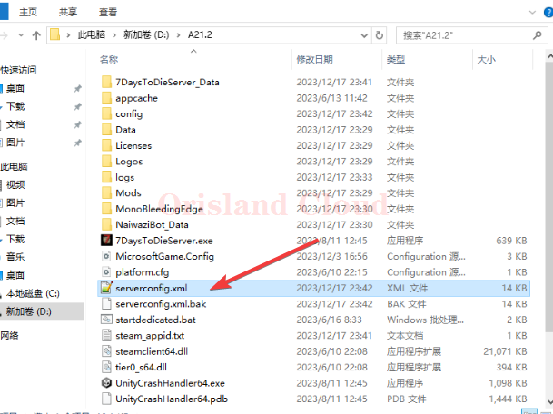
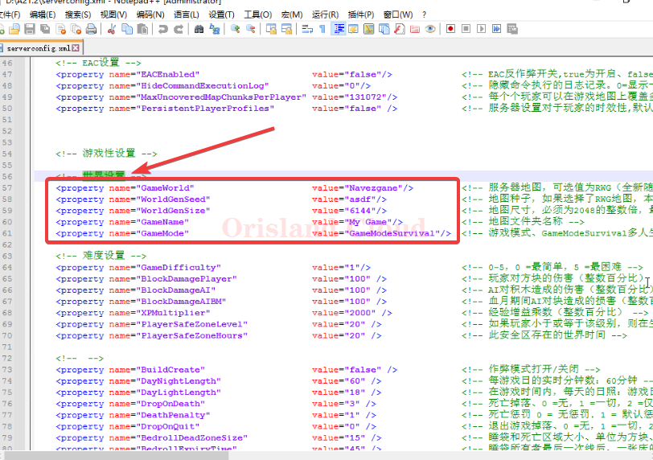
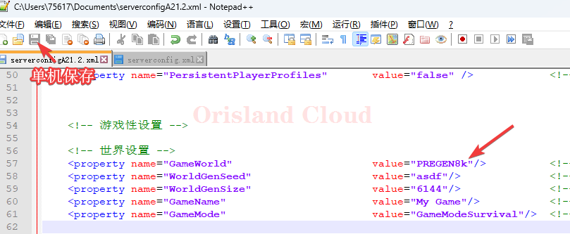
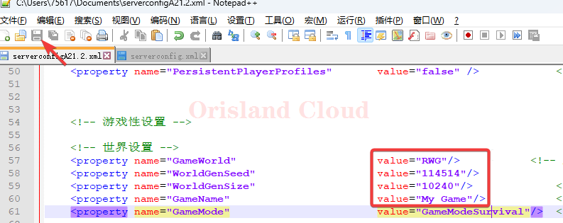

# 地图配置

## 修改前的必要准备

本节以A21.2为例，首先请先打开七日杀的根目录文件夹，找到serverconfig.xml文件。

<figure><figcaption></figcaption></figure>

打开后，请寻找世界设置选项，若没有该汉字，可以寻找GameWorld字段。

<figure><figcaption></figcaption></figure>

## 配置说明

| 字段名(property) | 默认值(value) | 作用            |
| ------------- | ---------- | ------------- |
| GameWorld     | Navezgane  | 可选地图和尺寸见下方表格  |
| WorldGenSeed  | asdf       | 地图种子，仅随机地图时生效 |
| WorldGenSize  | 6144       | 地图尺寸，仅随机地图时生效 |
| GameName      | My Game    | 地图本地文件夹名称     |

### 官方内置地图名称及其尺寸

| 地图名       | 尺寸                                |
| --------- | --------------------------------- |
| Navezgane | 6144                              |
| PREGEN6k  | 6144                              |
| PREGEN8k  | 8192                              |
| PREGEN10k | 10240                             |
| \*RWG     | 6144，8192，10240，12288，14336，16384 |

\*RWG地图有特殊的修改过程，请跳转 [#shi-yong-quan-sui-ji-di-tu](di-tu-pei-zhi.md#shi-yong-quan-sui-ji-di-tu "mention")。

## 地图修改

本节用于使用官方提供的地图，这里以`PREGEN8k`地图为例，演示如何替换地图。

### 使用常规地图

在地图修改时，建议首先确定服务器是否关闭，如果没有，请先关闭服务器再进行后续操作。 [#zheng-chang-guan-bi](qi-dong-guan-bi-zhong-qi.md#zheng-chang-guan-bi "mention")

将`GameWorld`字段对应的value调整为`PREGEN8k`，保存再启动后，服务器地图更换完成。 [#qi-dong](qi-dong-guan-bi-zhong-qi.md#qi-dong "mention")

<figure><figcaption></figcaption></figure>

### 使用全随机地图

在地图修改时，建议首先确定服务器是否关闭，如果没有，请先关闭服务器再进行后续操作。 [#zheng-chang-guan-bi](qi-dong-guan-bi-zhong-qi.md#zheng-chang-guan-bi "mention")

将`GameWorld`字段对应的value调整为RWG，将`WorldGenSeed`字段对应的`value`修改为任意字符，建议_**英文+数字**_的组合无特别要求，_<mark style="color:red;">**请勿掺杂汉字或特殊字符以免出错**</mark>_。

请将`WorldGenSize`对应的字段调整到你需要的随机地图尺寸，请务必让该数字为_<mark style="color:red;">**6144 ≤ 尺寸 ≤ 16384**</mark>_之间，且必须为_<mark style="color:red;">**`2048`**</mark><mark style="color:red;">**的整数倍**</mark>_。

`GameName`字段为具体的地图存放文件夹，您可以修改为其他的名称后让不同配置的地图同时存在，一般情况下可以不修改此名称。

<figure><figcaption></figcaption></figure>

保存再启动后，服务器地图更换完成。 [#qi-dong](qi-dong-guan-bi-zhong-qi.md#qi-dong "mention")

请注意，当使用`RWG`地图时，启动服务器的同时会进行地图生成，<mark style="color:blue;">**越大的地图对服务器的压力越大，启动时间越长，对服务器的配置需求越高**</mark>。
