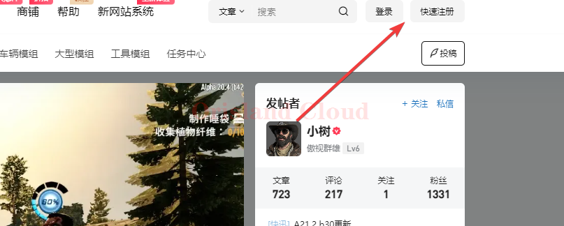
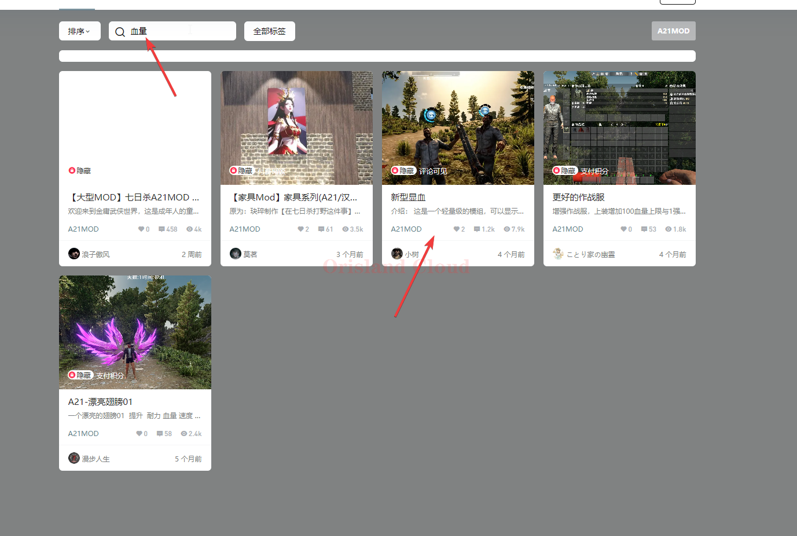
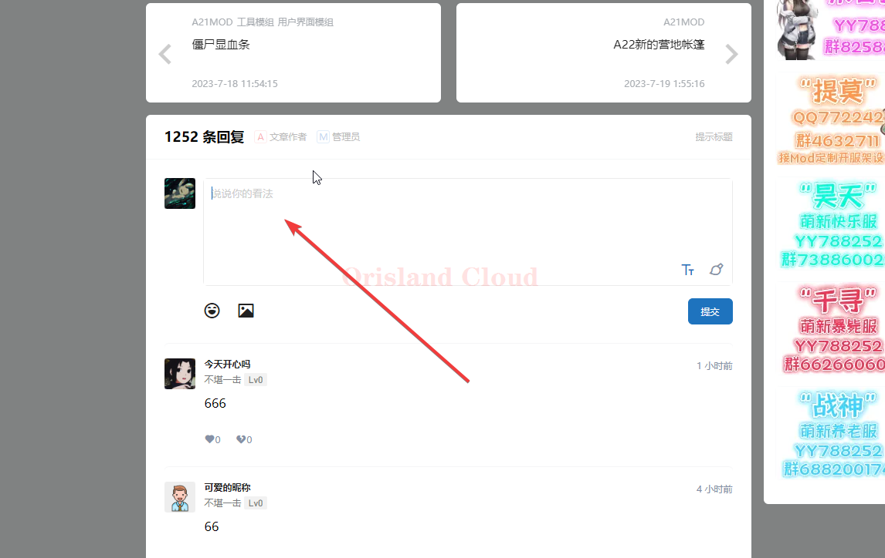
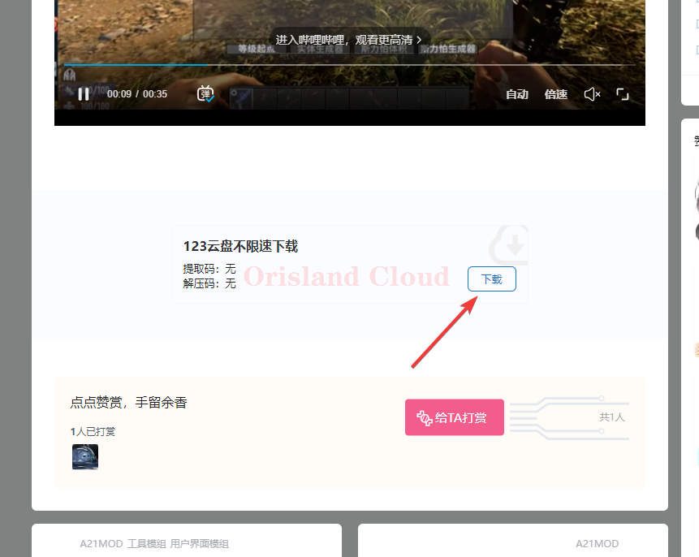
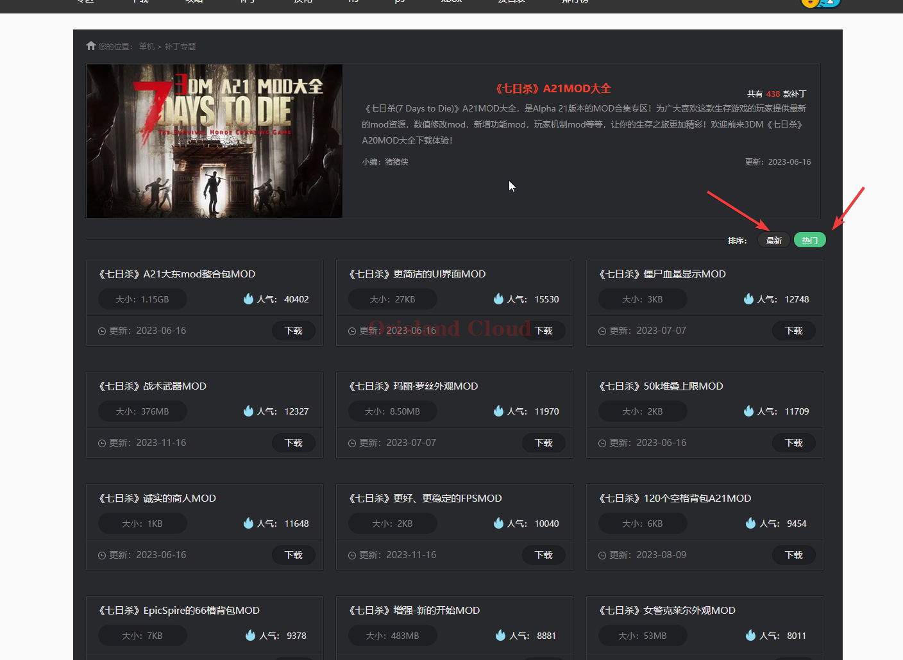
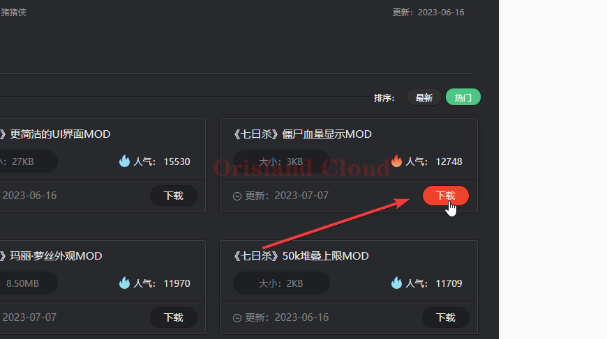
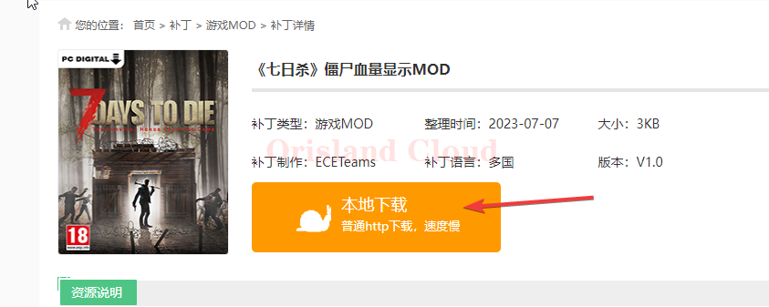
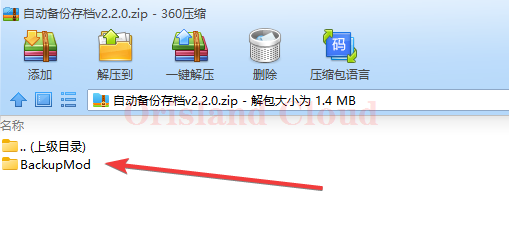
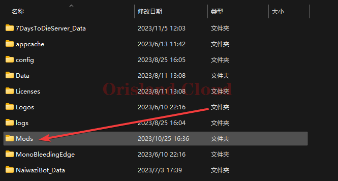
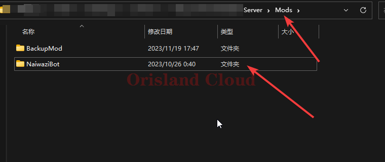

# mod安装

请记录下面的地址，所有的mod都应尽量从这些论坛中获取，不建议使用第三方经过二次修改的mod，这些mod可能造成安全问题。


七日杀中文站



三大妈七日杀mod版


下面将分开介绍如何从上面两个网站中下载mod。

## mod下载

### 七日杀中文站

打开上面的七日杀中文站，单机网站的右上角进行登录或注册。

<figure><figcaption></figcaption></figure>

搜索你需要的mod，这里以血量显示mod做演示，在网站的搜索框中输入“血量”，单机搜索结果中的相关项目。

<figure><figcaption></figcaption></figure>

进入项目后，滚动到下方，随意输入字符进行回复。单机提交后刷新页面。

<figure><figcaption></figcaption></figure>

在刷新出的内容进行单机下载。

<figure><figcaption></figcaption></figure>

### 3DM下载站

打开上面的3DM网站，可以按照最新和热门度进行排序，在列表中寻找自己需要的mod。

<figure><figcaption></figcaption></figure>

找到自己需要的mod后，单机下载选项，进入下载界面。

<figure><figcaption></figcaption></figure>

单机本地下载按钮。

<figure><figcaption></figcaption></figure>

跳转到指定的位置后，请勿使用图中红叉的部分进行下载，应选择箭头所指的下载方式。

<figure><figcaption></figcaption></figure>

## 安装

一般情况下，七日杀服务端的根目录为D盘的A21.2文件夹，请打开该文件夹。

一般下载的mod文件为压缩格式，_<mark style="color:red;">**请**</mark><mark style="color:purple;">**解压**</mark><mark style="color:red;">**后(请勿将带有rar或者zip结尾的文件直接放入mods文件夹内)**</mark>_，把文件夹复制到你的服务端的_<mark style="color:red;">**mods文件夹**</mark>_中。

<figure><figcaption></figcaption></figure>

<figure><figcaption></figcaption></figure>

复制完成后，服务端的mods文件夹内需要存在该文件夹，如下图。

<figure><figcaption></figcaption></figure>

复制完成后，返回服务端的根目录， [#zhong-qi](qi-dong-guan-bi-zhong-qi.md#zhong-qi "mention")服务端，如果不只需要具体的重启步骤可以单机重启进行查看。
