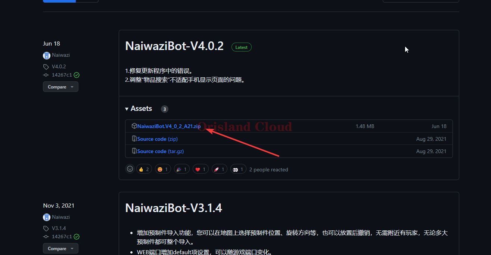

# Naiwazi面板

一般情况下，所有预设七日杀服务端都已经默认安装Nawazi面板，如果是自己安装的，可能没有，这里将进行说明。

Naiwazi面板是一款可以很方便管理七日杀游戏的全功能面板，对于大部分辅助来说，本面板为居家常备的必装mod。

## 安装

和安装mod类似，但是本面板的下载地址为下面的地址。



请注意，本网站由于不在国内，所以打开速度可能较慢，如果无法打开，请找客服索取对应版本的mod。

本文以A21版本的naiwazi为例，后续如果版本更新请参考下面的教程进行。打开网站后单机箭头所指的文件进行下载（文件名可能由于版本更新而有所不同，请认准.zip结尾的文件）。

<figure><figcaption></figcaption></figure>

下载完成后请参考 [#an-zhuang](mod-an-zhuang.md#an-zhuang "mention")部分将mod安装到七日杀的服务端。

安装完成后 [#zhong-qi](qi-dong-guan-bi-zhong-qi.md#zhong-qi "mention")七日杀服务端即可完成mod的安装。

## 配置使用

请注意，这个面板不是独立于七日杀的控制组件，这个面板的启动仍依赖于七日杀。这意味着如果你想使用面板控制服务器，那么你的服务器至少此时<mark style="color:red;">**必须是启动状态**</mark>。

由于mod本身的性质，请在七日杀服务端你的根目录找打文件`serverconfig.xml`，打开后找到`name="EACEnabled"`字段，将本行的`value="true"`修改为`value="false"`，请注意双银行的完整，不可使用输入法中的双引号或不写双引号，具体规范问题，参考 [xiu-gai-gui-fan.md](xi-jie-tiao-zheng/xiu-gai-gui-fan.md "mention")内的格式规范说明。

<figure><figcaption>
正确的改法
</figcaption></figure>

保存文件，然后服务端的 [#zhong-qi](qi-dong-guan-bi-zhong-qi.md#zhong-qi "mention")。

等待服务器加载完成后，观察控制台若出现如下的显示，则代表面板安装完成。

<figure><figcaption></figcaption></figure>

本条通知中包含了面板的端口信息，图中显示的端口为26906，这个端口的由来为游戏端口+6，所以如果没有找到这条通知，你也同样可以通过观察图中所示的方式，算出面板的端口号。

<figure><figcaption></figcaption></figure>

得到端口号后，你可以直接在服务器的浏览器中输入localhost:刚才的端口号访问面板，以上图中的26906为例，你应该在浏览器中访问的地址就是localhost:26906，如果你的端口号不是26906，请以你的为准。第一次登录面板，会进入用户名和密码的配置页面，配置用户名和密码后，即可完成面板的初始化。

<figure><figcaption></figcaption></figure>

配置完成后，进入服务器面板后台，面板安装配置完成。具体的面板各项功能请玩家自行探索或参考官方教程。

{% embed url="http://cn.naiwazi.com/bot/#/?id=%e5%ae%89%e8%a3%85" %}

<figure><figcaption></figcaption></figure>
