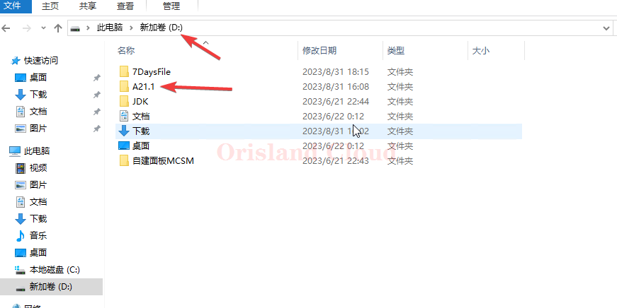

# 启动/关闭/重启

连接[远程桌面](../../fu-wu-qi-guan-li-yu-kong-zhi/deng-lu-yuan-cheng-zhuo-mian/)后，请打开D盘寻找七日杀的服务端，一般为版本号作为文件夹的名称，本教程将以A21.1作为举例。找到A21.1文件夹后双击进入。

<figure><figcaption></figcaption></figure>

## 启动

寻找文件夹中的`启动服务器.bat`文件（若该文件不存在，请寻找`startdedicated.bat`这两个文件一样），找到后双击即可打开。打开后会先出现一个黑框，无需关闭黑框，等待七日杀服务端本体出现之后可以关闭之前的黑色方框。请注意，在正常的情况下，服务器启动不会有闪退问题，如果七日杀任务栏有闪烁消失的问题，先确认是否七日杀的服务端已经被彻底关闭而不是后台扔在运行，参考 [#fei-zheng-chang-guan-bi](qi-dong-guan-bi-zhong-qi.md#fei-zheng-chang-guan-bi "mention")进行检查。

<figure><figcaption></figcaption></figure>

当任务栏出现下图的显示时，服务器启动完成。

<figure><figcaption></figcaption></figure>

## 关闭

关闭七日杀的服务端有两种方法，推荐使用正常方法关闭七日杀的服务端，第二种方法仅用于特殊用途的非正常关闭。

### 正常关闭

在任务栏中找到七日杀的标志，单机打开正在运行的黑框时，点右上角的X再点yes等待黑框自行消失完成关闭。

<figure><figcaption></figcaption></figure>

<figure><figcaption></figcaption></figure>

### 非正常关闭

这种关闭方法为非正常关闭 ，有损坏存档，丢失进度的风险，一般情况下请勿使用这种方法关闭服务器。

右击任务栏，单机任务管理器，打开任务管理器

<figure><figcaption></figcaption></figure>

在任务管理器的进程选项卡中寻找标签，右键，单机结束任务，在某些时候，这个程序可能在后台进程的栏目中，请耐心寻找，若该标签不存在，则代表七日杀服务端处于退出状态。

<figure><figcaption></figcaption></figure>

## 重启

先 [#guan-bi](qi-dong-guan-bi-zhong-qi.md#guan-bi "mention")，然后 [#qi-dong](qi-dong-guan-bi-zhong-qi.md#qi-dong "mention")。
