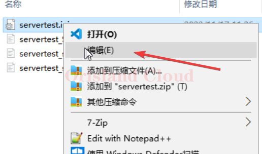
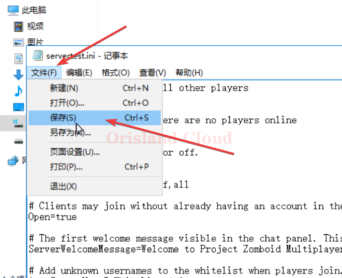
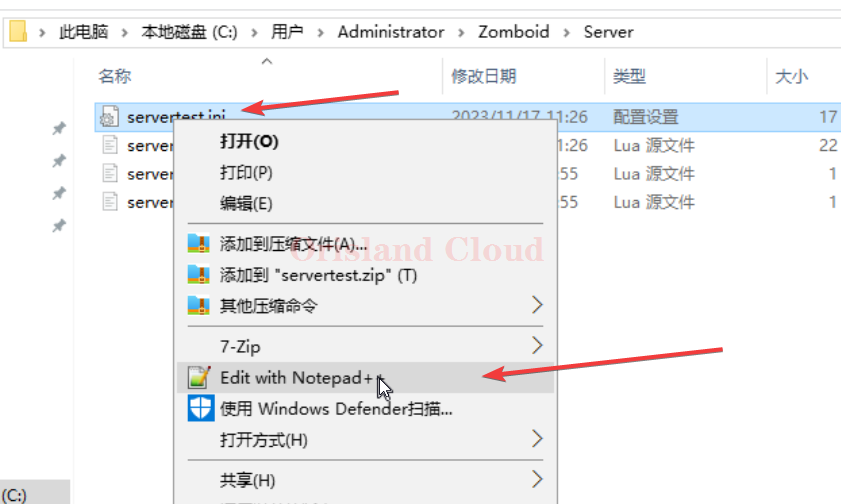
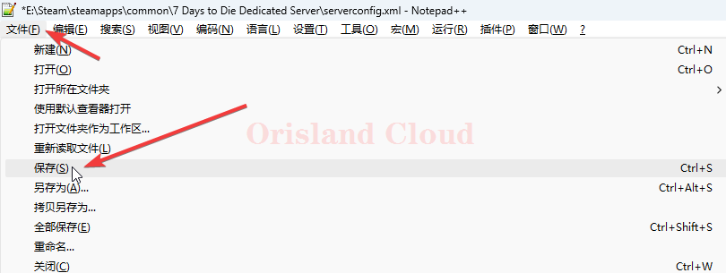
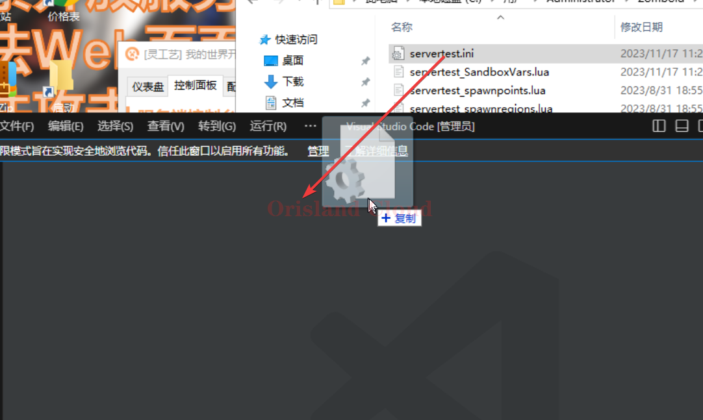
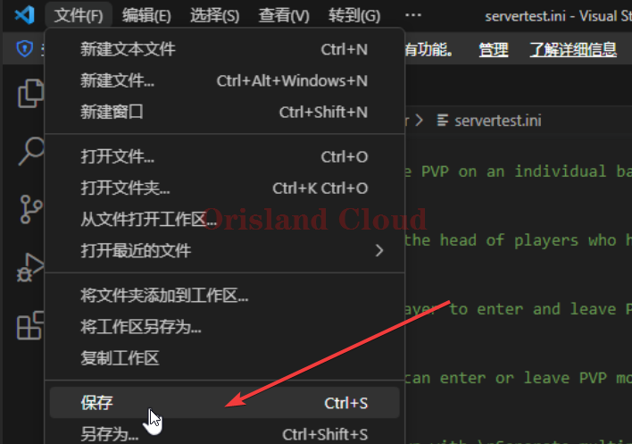

# 保存

本文介绍了常用软件的保存方式。

通用的保存快捷键，ctrl + s，这个快捷键可以替代下面的单机保存过程。

## 记事本

一般情况下，可以右击文件，单机`编辑`选项卡启动，是windows自带的文本管理软件，使用作为简单普遍，但是因为该软件无法对特定的格式进行突出显示，所以仅推荐用于较为简单的文本修改。

<figure><figcaption></figcaption></figure>

在对文件进行修改保存后，可以使用快捷键，或单机左上角文件，再点保存进行保存。

<figure><figcaption></figcaption></figure>

## Notepad++

目前市面上常用的轻量化编辑器，推荐该编辑器。

<figure><figcaption></figcaption></figure>

使用快捷键或单机左上角文件，单机保存选项卡。

<figure><figcaption></figcaption></figure>

## VSCode

市面上最广泛使用的编辑器，泛用性及其广泛，但是相比notepad++较重。

若右击文件，没有发现VSCode编辑选项，那么可以先从桌面打开.png>)，再将需要打开的文件拖动到窗口中实现文件的打开。

<figure><figcaption></figcaption></figure>

保存可以使用快捷键或单机左上角文件，后单机保存选项卡。

<figure><figcaption></figcaption></figure>
