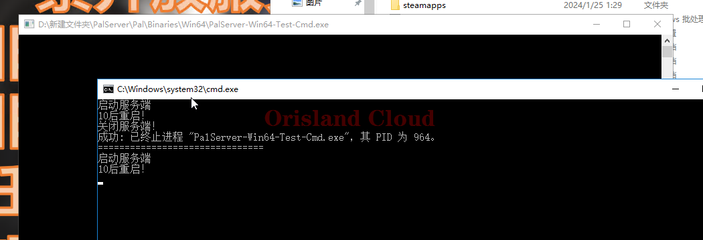

# 定时重启服务端

## 准备

下载bat文件。



## 启动

将这个`bat`文件，放置到`PalServer`的根目录下。

<figure><figcaption></figcaption></figure>

在打开前请先关闭服务端。 [#guan-bi](qi-dong-guan-bi.md#guan-bi "mention")

双击打开即可完成。

<figure><figcaption></figcaption></figure>

## 自定义配置

右击文件，单机编辑。

<figure><figcaption></figcaption></figure>

您可以对服务端启动的参数，重启间隔进行修改。

> 除非您知道自己在做什么，否则我们不建议您对分配进行修改。

<figure><figcaption></figcaption></figure>
