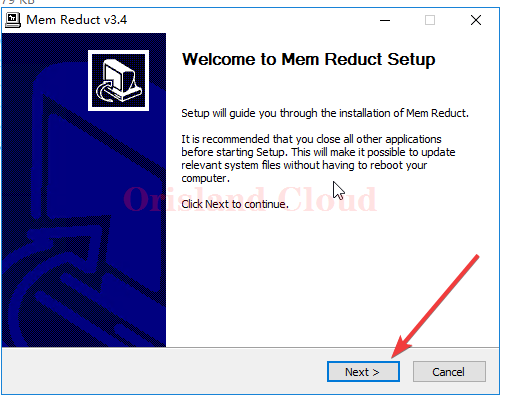
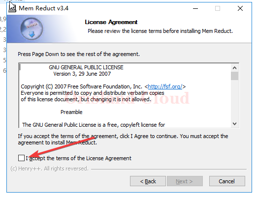
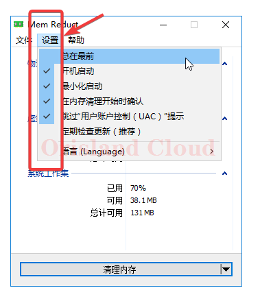

# 内存清理

> 由于帕鲁刚发售时，官方的服务端对内存的需求堪称离谱，所以需要进行自动的内存清理来帮忙释放内存。

这里使用的软件是[**memreduct**](https://github.com/henrypp/memreduct)**,这里附带github地址。**



也提供一份拷贝。



下载后打开，除非你知道自己在做什么，可以一路下一步到.png>)完成。

<figure><figcaption></figcaption></figure>

<figure><figcaption>
这里需要打个对钩
</figcaption></figure>

安装完成后软件会自动启动。

你可以对软件进行一些设置让软件开机自启，并自动清理，最前端显示看自己的需要即可。

<figure><figcaption></figcaption></figure>
