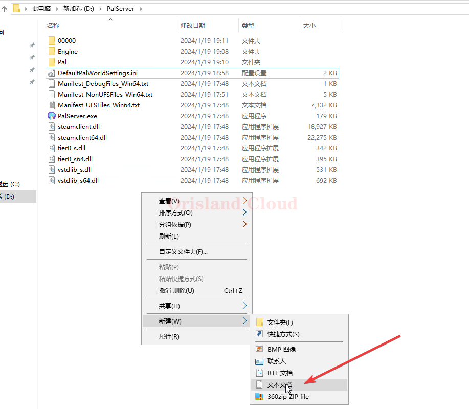

# 启动参数

## 推荐配置

建议使用以下配置来启动服务器。

> PalServer.exe -useperfthreads -NoAsyncLoadingThread -UseMultithreadForDS

## 使用指定参数启动服务端

在服务端所在目录新建文本文档，名字随便起，这里以`启动`作为文件的名字。

<figure><figcaption></figcaption></figure>

并将结尾的txt修改为bat后出现警示，可以无视点确认。 [xian-shi-wen-jian-hou-zhui.md](../../../../xi-tong-bian-xie-cao-zuo/xian-shi-wen-jian-hou-zhui.md "mention")

<figure><figcaption></figcaption></figure>

右击新建的文件，单机编辑。

<figure><figcaption></figcaption></figure>

将`PalServer.exe`填入文件。

<figure><figcaption></figcaption></figure>

在`PalServer.exe`字段后面加个空格，然后继续输入后续的启动参数。

需要知道这里能填入什么参数可以看 [can-shu-yi-lan.md](can-shu-yi-lan.md "mention")。

这里以修改端口为例，目的将默认的8211端口修改25565端口启动服务端。

> _<mark style="color:red;">**不要自作聪明的把参数另起一行，无论参数有多长都必须写在一行里，另起一行的所有参数无效。**</mark>_
>
> 

<figure><figcaption></figcaption></figure>

保存后，双击启动bat。

出现服务器的窗口，查询后端口修改正常，原本的8211变为25565开放。 [tong-guo-duan-kou-zhao-zhan-yong-de-cheng-xu.md](../../../../xi-tong-bian-xie-cao-zuo/tong-guo-duan-kou-zhao-zhan-yong-de-cheng-xu.md "mention")

<figure><figcaption></figcaption></figure>
