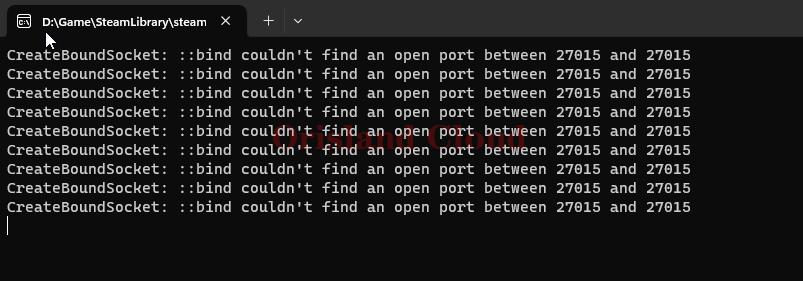

# 启动，关闭

## 启动

一般情况下，可以在桌面找找是否存在一个.png>)的图标，这个快捷方式是服务端的快捷方式，你可以直接通过这个图标来启动服务器。

如果该图标不存在，你可以在服务器的根目录[^1]寻找`PalServer.exe`文件.png>)来启动服务端，但是一般情况下，**不推荐直接启动**，快捷方式中往往配置了一些和服务端有关的相关配置，直接启动会导致这些配置失效。

打开后，出现一个黑色方框(或其他颜色如果你修改过)，没有任何输出这是正常的，这代表着服务端_<mark style="color:red;">**开放完成，**</mark>_[_<mark style="color:red;">**已可以在游戏内连接**</mark>_](#user-content-fn-2)[^2]，当然也可能会出现输出一行字的情况，这也是正常的。

<figure><figcaption>
1
</figcaption></figure>

<figure><figcaption>
2
</figcaption></figure>

在出现下面的图片时，代表出了一些问题，原因为`27015`端口被占用，你可以通过`cmd`命令行查找到底是什么程序占用了`27015`端口，目前已知会占用`27015`的是`itune`和帕鲁服务端本身，这意味着你可以通过这个提示来检查是否自己多开了服务端。

<figure><figcaption></figcaption></figure>

## 关闭

把 [#qi-dong](qi-dong-guan-bi.md#qi-dong "mention")里打开的小黑框关掉就是关服。

<figure><figcaption></figcaption></figure>

## 检查是否启动成功

请首先打开命令行 [qi-dong-ming-ling-hang](../../../xi-tong-bian-xie-cao-zuo/qi-dong-ming-ling-hang/ "mention")。

您可以在黑框中输入下面的指令来查询服务端是否启动正常。

> netstat -ano | findstr 服务器端口

一般，在您没有手动修改启动指令和端口的情况下，可以输入

> netstat -ano | findstr 8211

来进行检查。

若在输入指令回车后出现如下的显示，则代表服务端开放正常。

<figure><figcaption></figcaption></figure>

若您回车后出现空白界面则代表服务端开放失败，_或者您手动指定了其他的端口开放服务器_。

<figure><figcaption></figcaption></figure>

[^1]: 在本站一般为D盘的Palserver

[^2]: 不要在傻等了，没有满屏跑代码环节
