# 端口配置

## 现象

在端口未配置或，配置错误时，最明显的现象是，加入游戏时间**非常漫长**，进入游戏后按tab，可以看到除了主机为绿色外，所有玩家均为黄色或红色。

<figure><figcaption></figcaption></figure>

## 配置过程

在租赁服务器后，会得到一串关于端口号的信息，这里以40000-40003为例，如果你的世界分为更多层，而不只是默认的森林和地穴的话，你可能需要更多的端口进行配置，整体配置方法一致。

本文以双层世界为例。

<figure>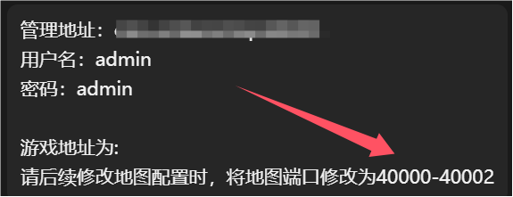<figcaption></figcaption></figure>

### 登陆面板

打开游戏面板，用默认密码登录。

<figure>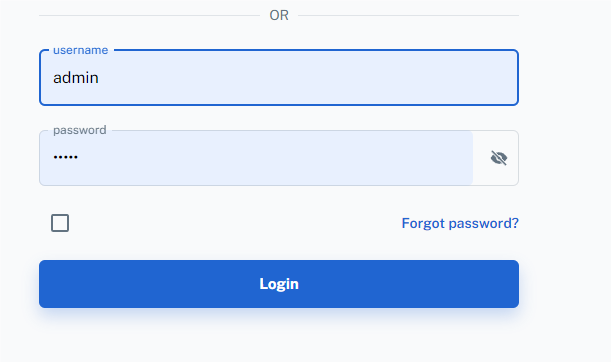<figcaption></figcaption></figure>

### 房间设置

在左侧界面中进入房间设置选项。

<figure><figcaption></figcaption></figure>

并将图示的按钮调整为全部。

<figure><figcaption></figcaption></figure>

滑动鼠标滚轮滚动向下，在多世界世界栏目中，找到通讯端口选项，该端口的默认值10888，需要修改。

<figure>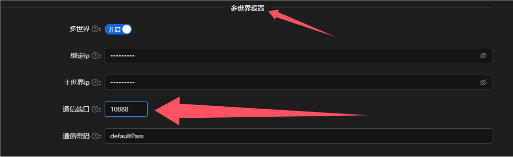<figcaption></figcaption></figure>

将上面40000-40002范围中的40000用于该端口，端口顺序可随意调整，但<mark style="color:red;">**不可重复**</mark><mark style="color:red;">或</mark><mark style="color:red;">**使用范围外的端口**</mark>。

<figure>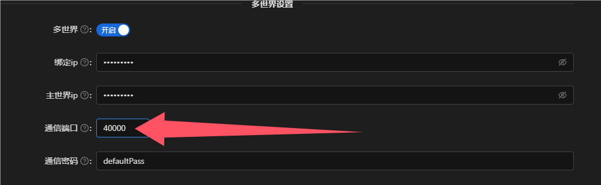<figcaption></figcaption></figure>

继续下滑滚轮，<mark style="color:red;">单机保存</mark>。

<figure>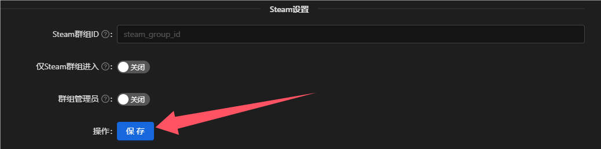<figcaption></figcaption></figure>

### 世界设置

打开左侧世界设置选项，可以看到右侧的界面，最上方为当前存档的世界列表，本文为默认的双世界分为森林和地穴，如果你的服务器为更多层世界，则上方会有更多选项。

<figure>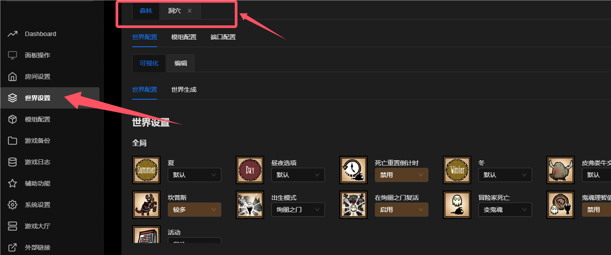<figcaption></figcaption></figure>

单机森林选项卡，单机端口配置选项。

<figure>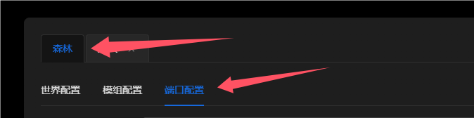<figcaption></figcaption></figure>

默认的森林端口为10999，需要进行修改，在刚才的端口范围中，由于我们已经使用过了40000，所以这里选择40001作为森林端口，填入端口选项。<mark style="color:red;">**端口不可重复使用，但前后顺序可变**</mark>。

> **注意此时可能会在上方提示端口可能已经使用，请无视这条提示和右侧的端口列表，按教程配置。**

<figure>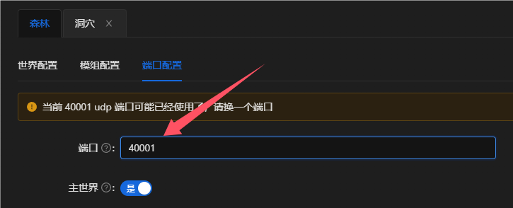<figcaption></figcaption></figure>

修改完成后，单机下方的<mark style="color:red;">保存世界</mark>，其他的部分不需要修改。

本文仅讨论端口部分，其他部分请按需进行配置，一般情况下无需修改。

<figure>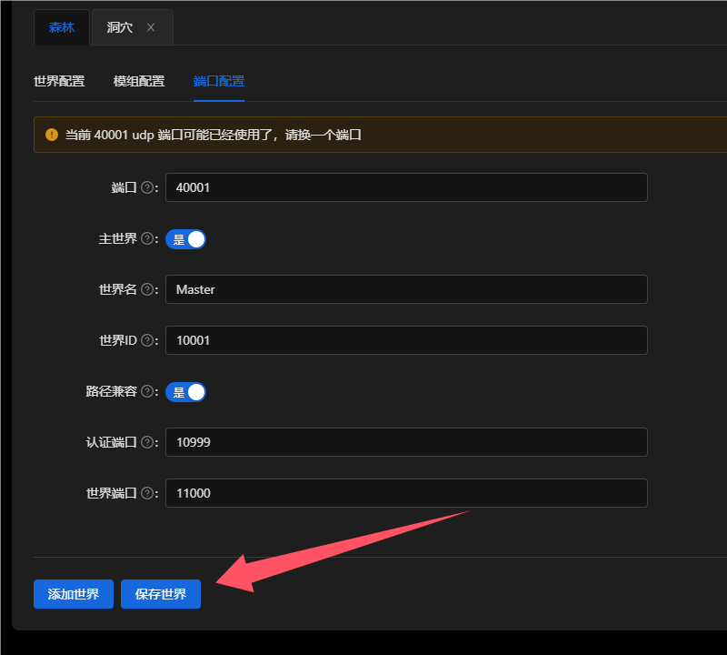<figcaption></figcaption></figure>

相同方式操作洞穴，将默认的10998设置为我们范围内的最后一个端口40002，并<mark style="color:red;">单机保存世界</mark>，如果你有更多世界，请进行类似操作直到端口全部分配完成。

<figure>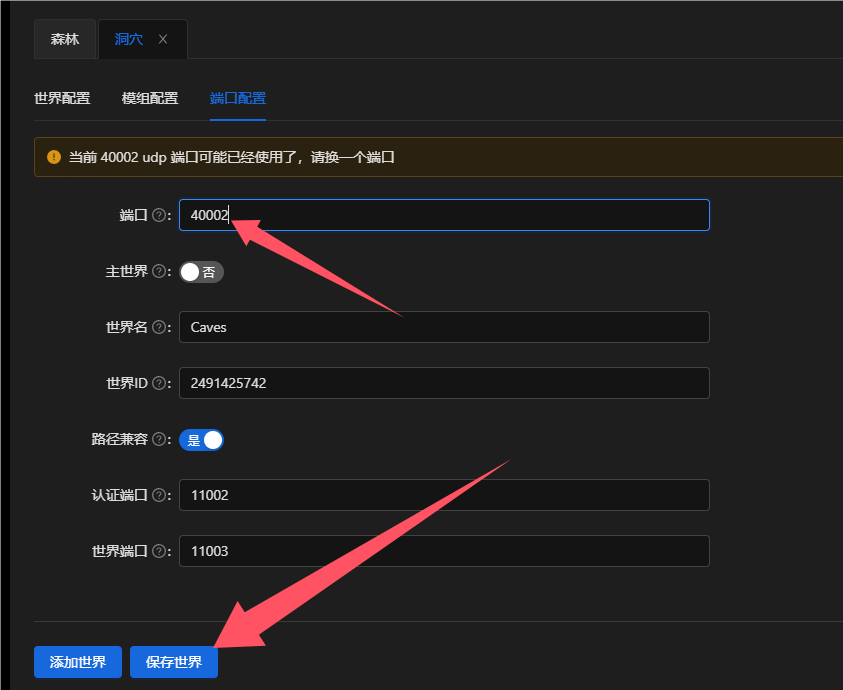<figcaption></figcaption></figure>

### 配置检查

上面的三个端口配置完成后，请刷新该页面，<mark style="color:red;">重复检查端口是否保存</mark>，是否为自己配置的端口号。

## 配置完成

进入游戏后，延迟恢复正常，连接速度大幅度缩短，且可以通过面板操作中给出的代码直连。

<figure>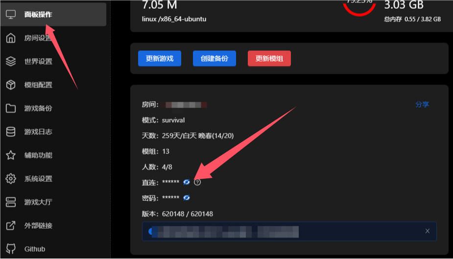<figcaption></figcaption></figure>
