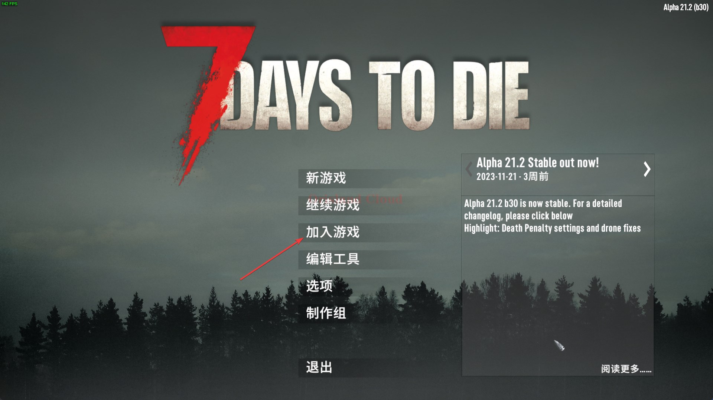
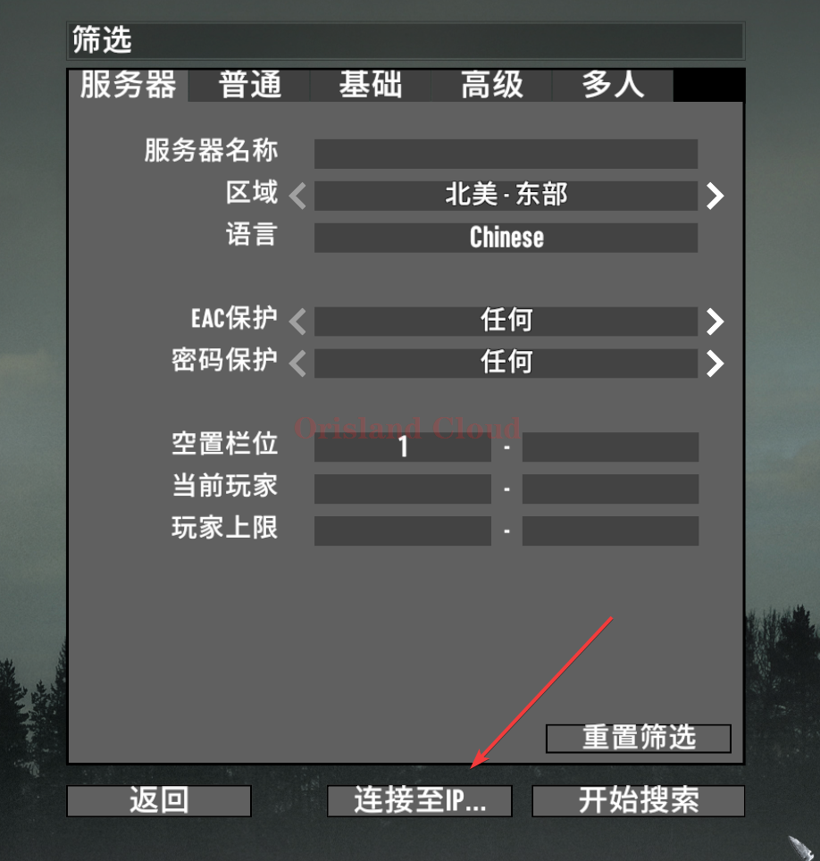
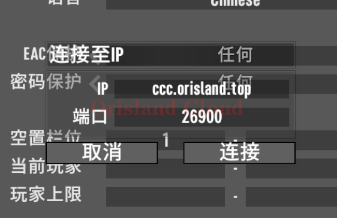

# 加入游戏

请根据你的需要快速的跳转需要的章节。

[#sou-suo-jia-ru](jia-ru-you-xi.md#sou-suo-jia-ru "mention") [#ip-jia-ru](jia-ru-you-xi.md#ip-jia-ru "mention")

## 搜索加入

## IP加入

打开游戏后单机加入游戏。

<figure><figcaption></figcaption></figure>

在窗口中单机连接到IP

<figure><figcaption></figcaption></figure>

请根据您服务器的IP和端口号在IP栏和端口栏进行输入，图中的ip和端口为<mark style="color:red;">**样例**</mark>，<mark style="color:red;">**具体情况请按实际处理**</mark>。

<figure><figcaption></figcaption></figure>

单机连接即可通过IP加入服务器。

