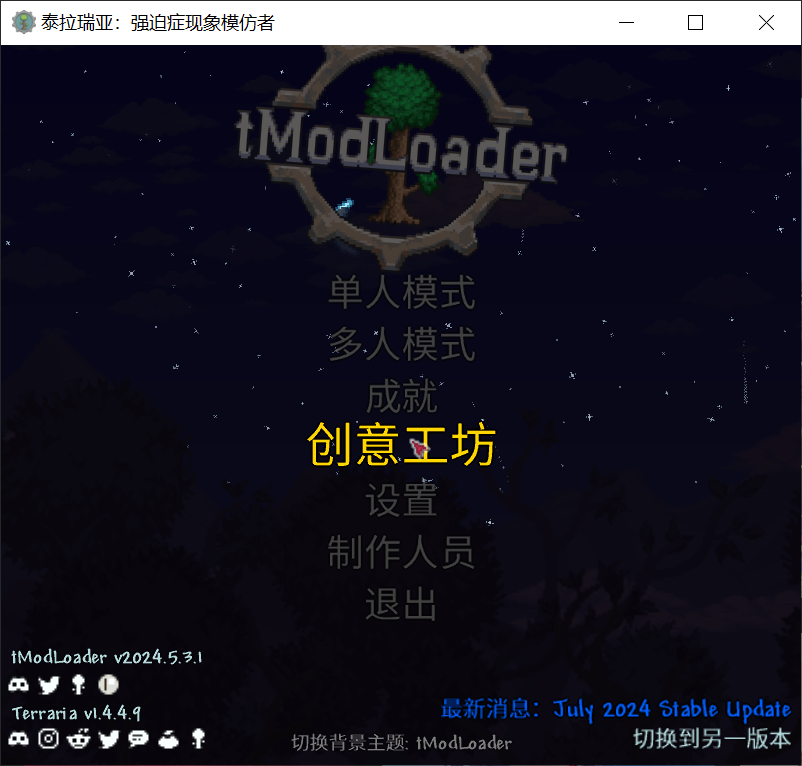

# tmod

## 安装

前往[资源站](../../../zi-yuan-zhan.md)或使用[steamcmd](../fu-wu-duan-an-zhuang-yu-geng-xin/steamcmd-an-zhuang-ren-he-fu-wu-duan.md)下载所需要的tomod版本，这里推荐首先在资源站里进行搜索。

下载压缩包后解压到所需文件，这里以D盘的server文件夹为例。

## 运行服务端

找到解压文件夹里的start-tModLoaderServer.bat（linux启动同名但后缀为sh的文件）文件，双击打开。

启动服务端时，会询问是否使用steam服务端，这里输入n之后回车。

<figure><figcaption>
输入n
</figcaption></figure>

等待片刻后进入世界创建界面，在这个界面可以进行如下操作。

* n 创建新时间
* d 数字 删除这个数字对应的世界
* m 显示mod列表

<figure><figcaption></figcaption></figure>

### 创建新世界

输入n回车。

<figure><figcaption></figcaption></figure>

依次进行世界类型配置，分别为以下属性。

世界规模

* 小
* 中
* 大

<figure><figcaption></figcaption></figure>

难度

* 经典
* 专家
* 大师
* 旅行

<figure><figcaption></figcaption></figure>

邪恶生物群系

* 随机
* 腐化之地
* 猩红之地

<figure><figcaption></figcaption></figure>

世界名称（之后会在一开始显示名称）

<figure><figcaption></figcaption></figure>

地图种子（影响地图生成）

如果不输入任何数值则为随机生成地图，除非你有需要指定生成的种子，否则这里可以留空。

<figure><figcaption></figcaption></figure>

等待生成完毕

<figure><figcaption></figcaption></figure>

地图生成完成，服务端自动返回初始界面，此时下方已经显示了创建的新世界test，序号为1.

<figure><figcaption></figcaption></figure>

### 启动服务端

选择1，回车启动世界。

配置服务器最大人数，如果不输入，则默认16

<figure><figcaption></figcaption></figure>

配置服务器端口，如果不输入默认7777，如非有特殊要求，这里可以直接回车保持默认。

<figure><figcaption></figcaption></figure>

自动转发端口，如非有特殊要求，这里可以直接回车保持默认。

<figure><figcaption></figcaption></figure>

服务器密码，默认为空，如果不希望有外人加入，以及有安全方面的考虑，请配置密码。

<figure><figcaption></figcaption></figure>

等待世界加载。

<figure><figcaption></figcaption></figure>

出现图示内容后世界启动完成，此时可以在游戏内进行连接。

<figure><figcaption></figcaption></figure>
