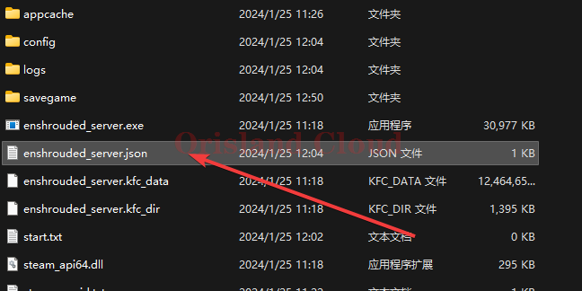

# 服务端配置

## 准备

如果服务端已开放，建议先关掉。 [#guan-bi](qi-dong-guan-bi.md#guan-bi "mention")

找到雾锁世界的服务端所在文件夹，打开后找到文件，`enshrouded_server.json`，打开该文件。

<figure><figcaption></figcaption></figure>

## 说明与修改

配置文件内容如图，修改时请务必保留两边双引号且注意双引号必须为英文。

<figure><figcaption></figcaption></figure>

| 配置项           | 值         | 说明              |
| ------------- | --------- | --------------- |
| name          | 服务器房间名称   | 可以修改服务器的对外显示房间名 |
| password      | 服务器多人连接密码 | 强烈建议配置该项避免陌生人进入 |
| saveDirectory | 存档位置      | 存放服务端存档的地方      |
| logDirectory  | 日志位置      | 存放服务端日志的地方      |
| ip            | 可以连入ip的显示 | 请勿修改此项          |
| gamePort      | 游戏端口      | 服务端口1           |
| queryPort     | 请求端口      | 服务端口2           |
| slotCount     | 可同时加入的人数  | 最大在线人数          |

## 保存

修改完成后必须保存，重启服务端才能生效。

[bao-cun.md](../qi-ri-sha-7-days-to-die/xi-jie-tiao-zheng/bao-cun.md "mention") [#qi-dong](qi-dong-guan-bi.md#qi-dong "mention")

