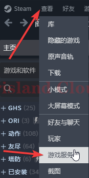
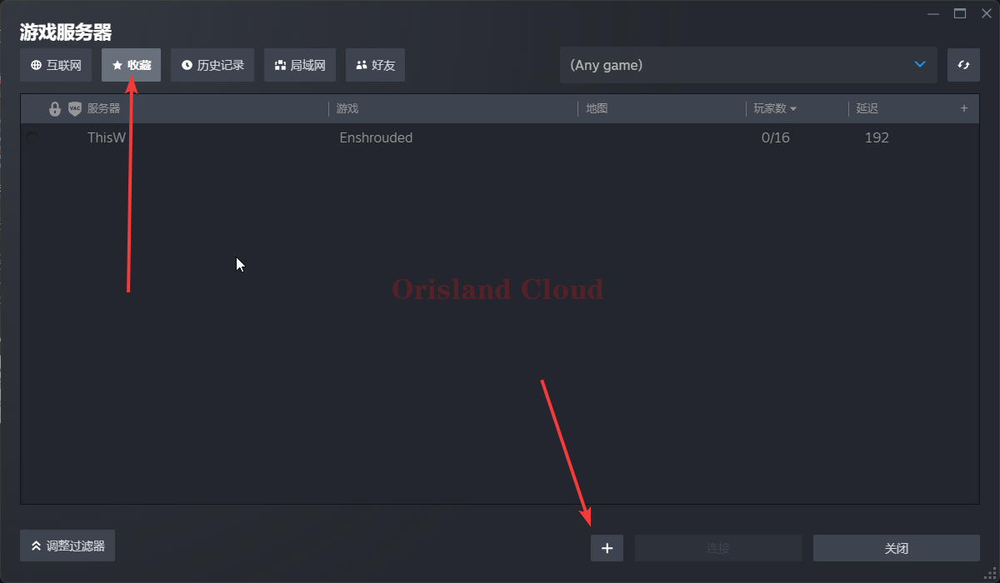
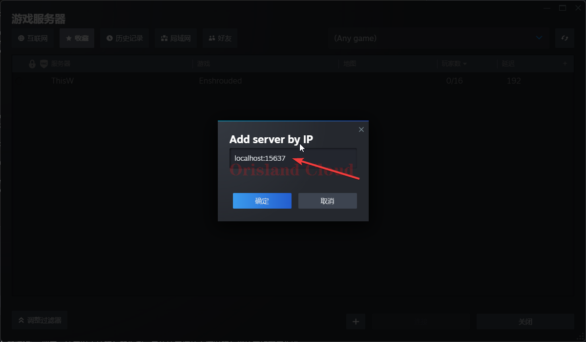
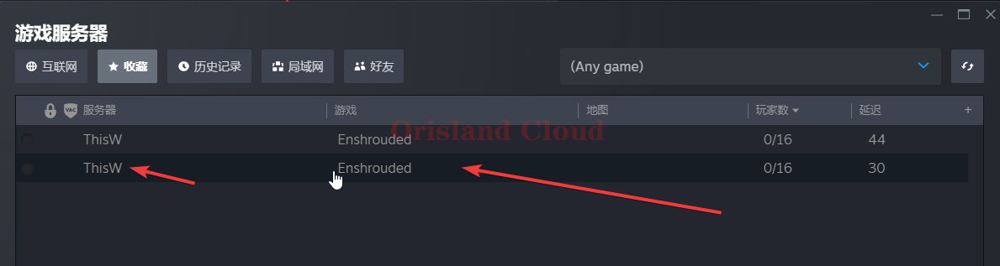
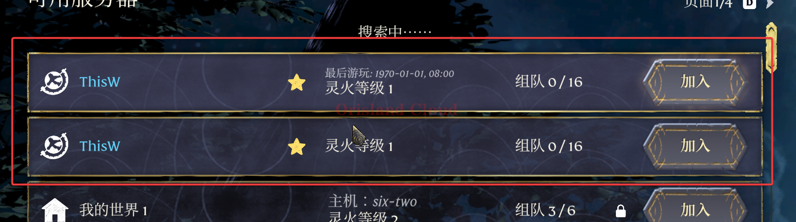

# 服务器加入

## 说明

由于官方游戏内未设置直连ip的选项，所以目前考虑从`steam`平台添加连入。

本操作也可以在游戏打开的同时配置，游戏内会实时刷新。

## steam配置

打开`steam`，在左上角单机查看，单机游戏服务器，

<figure><figcaption></figcaption></figure>

切换到收藏选项卡，单机下方加号。

<figure><figcaption></figcaption></figure>

输入您的服务器远程`ip+端口`，这里以本地服务器为例，具体这里填什么请以服务端的网络配置为准，这里端口请以 [#shuo-ming-yu-xiu-gai](fu-wu-duan-pei-zhi.md#shuo-ming-yu-xiu-gai "mention") 中的`queryPort`项的值为准，请勿填入`gamePort`配置的值。

<figure><figcaption></figcaption></figure>

单机确认，添加完成后列表中出现服务器，若一切正常，服务器名称应为您在配置文件中配置的`name`。

<figure><figcaption></figcaption></figure>

## 游戏内连接

打开游戏，依次单机选项卡，`游玩`，`加入`，您添加的服务器已经出现在游戏列表中，单机加入即可。

<figure><figcaption></figcaption></figure>
