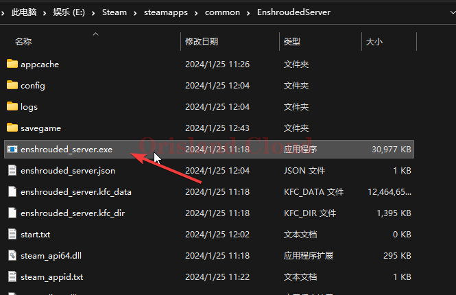
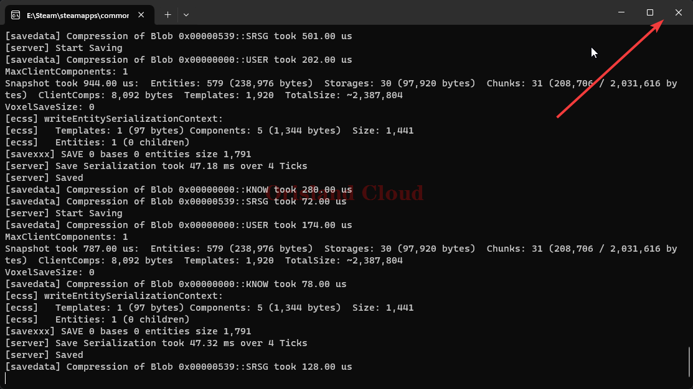

# 启动，关闭

## 启动

安装完成后，打开雾锁王国的服务端文件夹(EnshroudedServer)，双击enshrouded\_server.exe打开即可完成启动。 [fu-wu-duan-de-an-zhuang-yu-geng-xin.md](fu-wu-duan-de-an-zhuang-yu-geng-xin.md "mention")

<figure><figcaption></figcaption></figure>

## 关闭

把黑框叉掉就是关闭服务端。

<figure><figcaption></figcaption></figure>

## 服务器启动成功的标志

在黑框中出现如下的片段即服务端启动完成。

```
[Session] 'HostOnline' (up)!
[Session] finished transition from 'Lobby' to 'Host_Online' (current='Host_Online')!
[server] Load deserialization took 2.77 s
```
