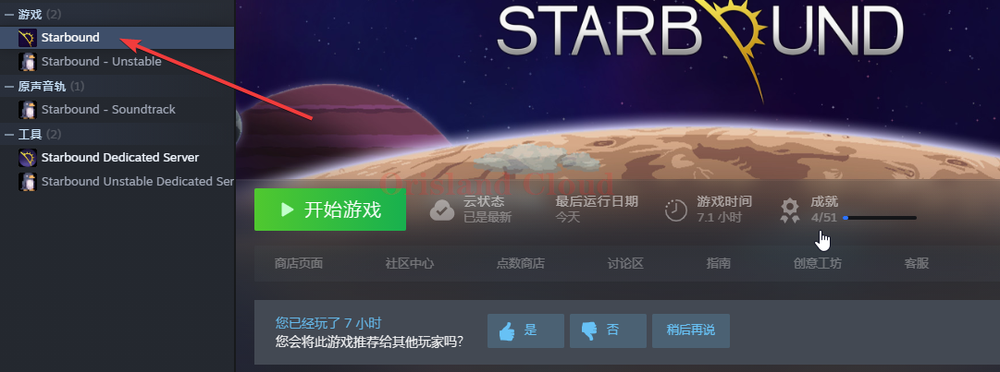
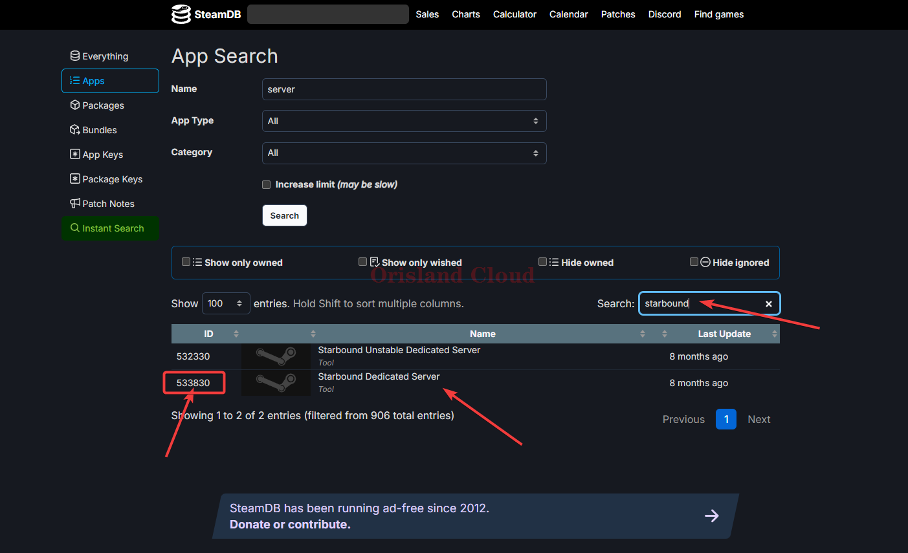
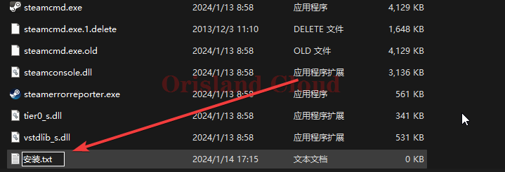
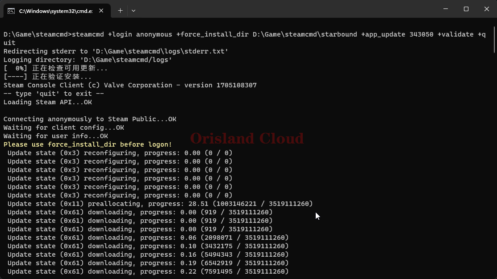
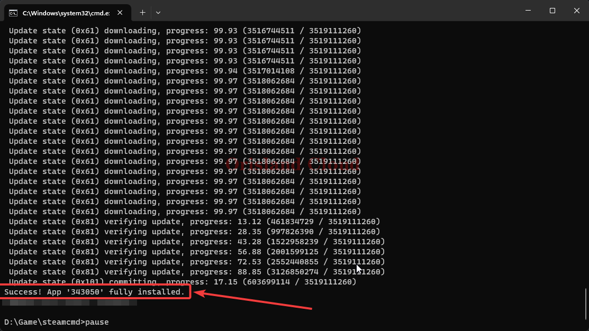
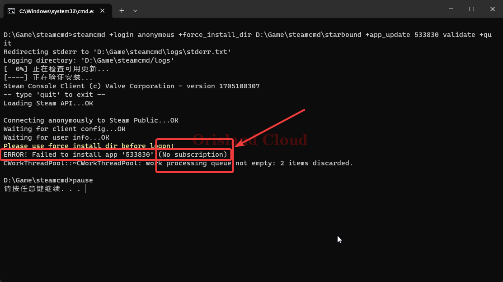

# SteamCMD安装任何服务端

你可以完全把SteamCMD工具当做一个_<mark style="color:red;">**Steam官方出品**</mark>_的仅用于下载的下载器，省去了原本Steam官方的图形界面，专注于下载指定ID的服务端，短小精悍。

> **并非所有的游戏均提供了服务端，请在后续步骤前确保您需要的游戏在steam上发布了专属服务端提供下载。**

## 准备

请记住下面两个地址，以备后面的教程中需要。您的服务端具体的Steam ID可以从这两个网站进行查询。


本页更新存在滞后性



实时，准确


下面将介绍如何利用SteamCMD下载一个服务端。

以游戏星界边境为例。

## 服务端下载安装

### 获取服务端SteamID

您首先需要在您的电脑上打开steam，查询星界边境游戏的英文名称，如图所示，Starbound。

<figure><figcaption></figcaption></figure>

复制名称后在 [#zhun-bei](steamcmd-an-zhuang-ren-he-fu-wu-duan.md#zhun-bei "mention")中提到的地址1或者地址2进行相关的搜索，这里以地址2为例，可以得知starbound的steam id为[533830](https://steamdb.info/app/533830/)

<figure><figcaption></figcaption></figure>

### SteamCMD下载相关服务端

SteamCMD允许使用匿名的方式登录下载服务器（即使您的steam内并没有购买此游戏，即公开下载），对某些服务端进行下载。

因为厂商的一些限制，部分游戏的服务端无法以匿名的方式下载，要求必须以Steam账户登录，且必须已经购买游戏的用户才可下载。

所以下面将分为匿名和非匿名的方式下载进行介绍。不过一般情况下，应首先考虑使用匿名的方式进行下载，可以免去登录过程。

[#ni-ming-xia-zai](steamcmd-an-zhuang-ren-he-fu-wu-duan.md#ni-ming-xia-zai "mention")

[#fei-ni-ming-xia-zai](steamcmd-an-zhuang-ren-he-fu-wu-duan.md#fei-ni-ming-xia-zai "mention")

#### 匿名下载

这里以饥荒为例，在SteamCMD根目录下新建文档文件，名称随意。

<figure><figcaption></figcaption></figure>

请根据自身的情况改动下面的代码，并将改动后的代码复制到该文件中。

> steamcmd +login anonymous +force\_install\_dir 安装地址 +app\_update 游戏的SteamID validate +quit pause

比如这里[查询饥荒的服务端](steamcmd-an-zhuang-ren-he-fu-wu-duan.md#huo-qu-fu-wu-duan-steamid)SteamID为<mark style="color:blue;">343050</mark>，我希望将饥荒服务端下载到<mark style="color:blue;">`D:\Game\steamcmd\starbound`</mark>，那么上面的代码可以修改为如下所示，红色字体为发生修改的部分。

> steamcmd +login anonymous +force\_install\_dir <mark style="color:red;">`D:\Game\steamcmd\starbound`</mark> +app\_update <mark style="color:red;">343050</mark> validate +quit pause

将这些代码复制到刚刚新建的文件中，并将该文件的后缀从txt修改为bat。

> &#x20;txt后缀不显示？ [xian-shi-wen-jian-hou-zhui.md](../../../xi-tong-bian-xie-cao-zuo/xian-shi-wen-jian-hou-zhui.md "mention")

修改完成后，如图所示。若后续仍需要对文件进行修改，可以右击bat文件，单机编辑（win11请单机显示更多选项后寻找）

<figure><figcaption></figcaption></figure>

双击打开等待安装完成，具体速度根据各位的实际网速（或服务器网速）来决定。

<figure><figcaption></figcaption></figure>

安装完成后如图。

<figure><figcaption></figcaption></figure>

#### 非匿名下载

建议先用匿名下载进行测试，如果出现如下问题，则需要使用steam账号登录账号使用，以非匿名的方式进下载。**请注意，登录的账号应已拥有服务器对应的游戏**。

如下图所示，使用 [#ni-ming-xia-zai](steamcmd-an-zhuang-ren-he-fu-wu-duan.md#ni-ming-xia-zai "mention")时出现下面的错误：

> ERROR! Failed to install app 'xxxxxx' (No subscription)

则代表您正在安装的游戏不能使用匿名的方式下载服务端。

<figure><figcaption></figcaption></figure>

这里以星界边境的服务端为例，[经查询](steamcmd-an-zhuang-ren-he-fu-wu-duan.md#huo-qu-fu-wu-duan-steamid)，星界边境服务端的SteamID为533830。

请根据自身的情况改动下面的代码，并将改动后的代码复制到该文件中。

> steamcmd +login steam账号 steam密码 +force\_install\_dir 安装地址 +app\_update 服务端SteamID validate +quit pause

比如这里[查询星界边境的服务端](steamcmd-an-zhuang-ren-he-fu-wu-duan.md#huo-qu-fu-wu-duan-steamid)SteamID为533830，我希望将饥荒服务端下载到<mark style="color:blue;">`D:\Game\steamcmd\starbound`</mark>，那么上面的代码可以修改为如下所示，红色字体为发生修改的部分。

> steamcmd +login 我的steam账号 我的steam密码 +force\_install\_dir <mark style="color:red;">`D:\Game\steamcmd\starbound`</mark> +app\_update <mark style="color:red;">533830</mark> validate +quit pause

将这些代码复制到刚刚新建的文件中，并将该文件的后缀从txt修改为bat。

> &#x20;txt后缀不显示？ [xian-shi-wen-jian-hou-zhui.md](../../../xi-tong-bian-xie-cao-zuo/xian-shi-wen-jian-hou-zhui.md "mention")

修改完成后，如图所示。若后续仍需要对文件进行修改，可以右击bat文件，单机编辑（win11请单机显示更多选项后寻找）

<figure><figcaption></figcaption></figure>

双击打开等待安装完成，具体速度根据各位的实际网速（或服务器网速）来决定。

当SteamCMD的黑框显示：

> Success! App 533830 fully installed！

则代表安装完成。

## 服务端更新

一般一些热门游戏的服务端会随着游戏版本进行升级。

此时重新运行一次安装即可，安装命令会自动检查版本并更新到最新。

[#steamcmd-xia-zai-xiang-guan-fu-wu-duan](steamcmd-an-zhuang-ren-he-fu-wu-duan.md#steamcmd-xia-zai-xiang-guan-fu-wu-duan "mention")

## SteamCMD进阶

此部分待补充，先参考官方说明。


