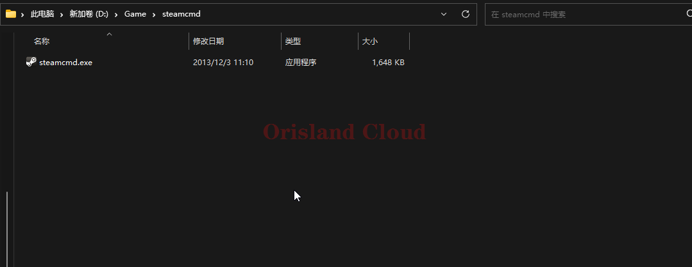
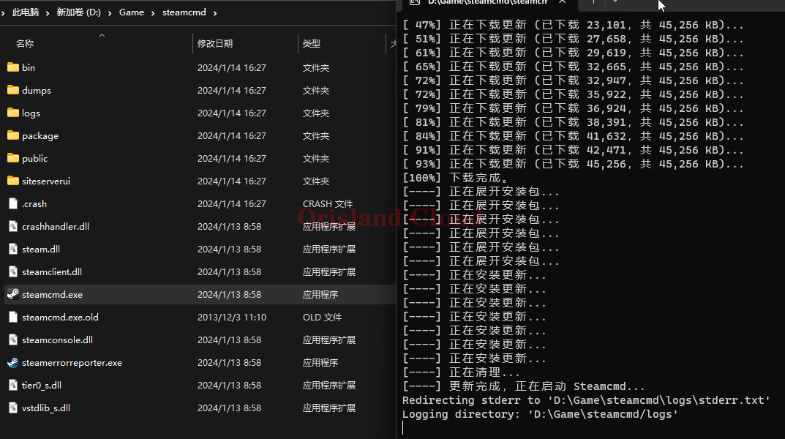
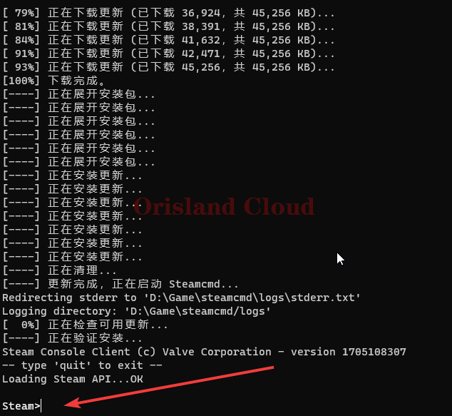

# SteamCMD工具安装

在服务器安装所需游戏的服务端时，往往只需要SteamCMD工具就可完成安装，无需考虑Steam本体这种体积和功能太多的工具。本章主要介绍如何使用SteamCMD来安装所需服务端。

在一切开始之前，请先下载SteamCMD本体，这里提供多处下载。







官方对SteamCMD工具的介绍



请在新建一个文件夹放置这个文件，_<mark style="color:red;">**不要**</mark>_把这个文件放在一个原本就存在较多文件的文件夹避免不必要的麻烦。

<figure><figcaption></figcaption></figure>

双击打开，等待SteamCMD程序完整自身文件下载和更新。

<figure><figcaption></figcaption></figure>

当出现图中所示的显示后，SteamCMD安装完成。

<figure><figcaption></figcaption></figure>
