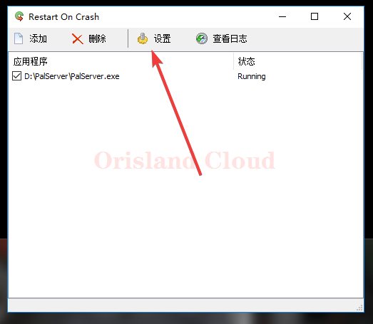

# 崩溃自启

> 帕鲁在开服后初始版本存在严重的内存问题，经常导致内存溢出崩溃，崩溃重启很有必要。

## 下载

请先下载软件放到任意地方。



## 启动

打开软件如图。

<figure><figcaption></figcaption></figure>

## 配置

单机添加，在弹出的窗口中单机`选择一个文件`或`选择正在运行的程序`，哪个都可以，这里以`选择一个文件`做示范。

在弹出窗口中找到帕鲁服务端的目录(一般本站默认在D盘`PalServer`文件夹)，双机`PalServer.exe` 确认。

<figure><figcaption></figcaption></figure>

为将工作目录调整为帕鲁服务端地址，并勾选所需的相关的选项。

<figure><figcaption></figcaption></figure>

请在这里添加一个空格后，填入多核优化参数. 修改后如图所示。如果你有其他的服务端参数也需要在这里输入，使用空格分隔。 [qi-dong-can-shu](qi-dong-can-shu/ "mention")

> \-useperfthreads -NoAsyncLoadingThread -UseMultithreadForDS

<figure><figcaption></figcaption></figure>

## 测试有效性

全部修改完成后单机OK。若您在设置时，该服务端没有运行，程序会稍等后启动服务端则代表配置完成。

<figure><figcaption></figcaption></figure>

## 参数修改

单机设置。

<figure><figcaption></figcaption></figure>

配置保活软件开机自启，如果开机自启中已经包含了服务端，可以先移除服务端启动防止重复自启或者将上面配置中的等待时间略微延长。查看服务器有哪些简单的开机自启项： [jian-dan-kai-ji-zi-qi.md](../../../xi-tong-bian-xie-cao-zuo/kai-ji-zi-qi/jian-dan-kai-ji-zi-qi.md "mention")

`宽限期`指当服务器频繁崩溃(崩溃间隔小于宽限期)时，最短重启间隔来避免程序因问题反复崩溃重启浪费系统资源。

<figure><figcaption></figcaption></figure>

## TIPs

注意当服务器因内存溢出崩溃时，服务器<mark style="color:purple;">**有概率会直接进入黑屏状态**</mark>(内存过低直接把服务器本身也杀了)，这种情况<mark style="color:purple;">**软件无能为力**</mark>，<mark style="color:red;">需联系管理员协助重启</mark>。
