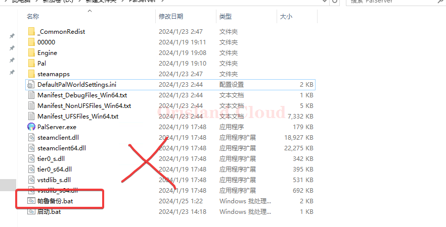
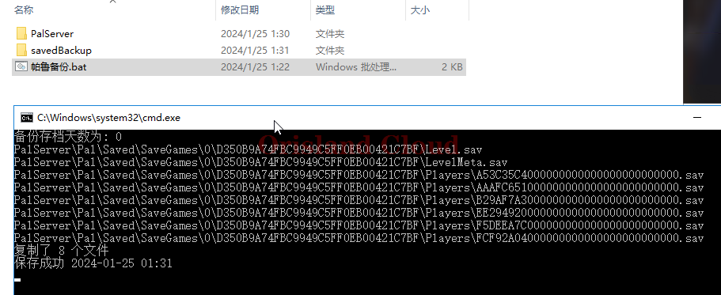
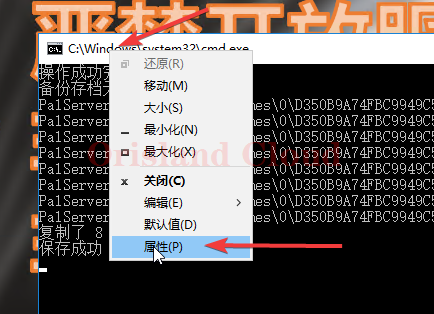
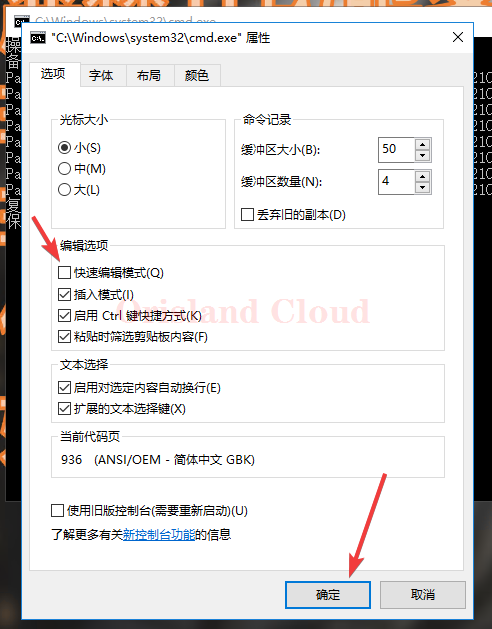

# 存档定时备份

> 因为频繁的崩溃有概率会直接导致崩档，这边提供一种方式对存档进行规律性备份

## 准备

提供以bat的方式对指定文件夹进行备份。



## 配置启动

将bat放置到帕鲁服务器的同级位置，不要把备份bat放置到帕鲁服务端文件夹内(即PalServer内)

<figure><figcaption></figcaption></figure>

<figure><figcaption></figcaption></figure>

双击打开即可，bat默认10分钟备份一次，默认将服务器的存档备份到savedBackup文件夹内，分天，分时原结构文件夹存储。

> 请注意，为了让脚本中的脚本完全生效，请您打开脚本出现下面的黑框时，单机右上x直接关闭脚本，重新再开一次。

<figure><figcaption></figcaption></figure>

## 防止卡框

> windows的快速编辑模式会导致bat在执行的过程中卡住，这里说明如何关闭该功能避免卡顿。
>
> 备份脚本中已内置该操作，启动第一次脚本后，关闭重开后永久生效。

右击bat文件的上方白框，单机属性。

<figure><figcaption></figcaption></figure>

将快速编辑选项取消勾选后，单机确定。

<figure><figcaption></figcaption></figure>
