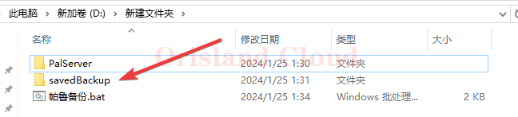
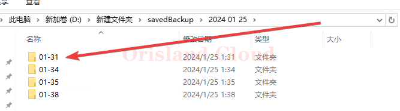
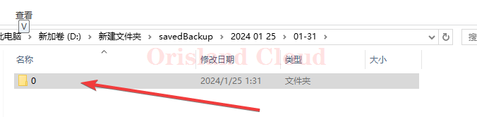
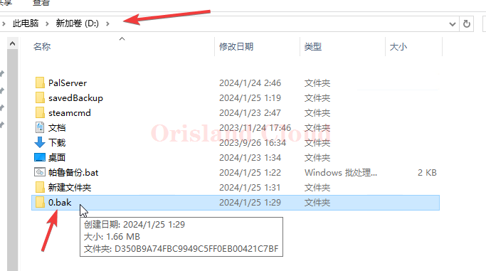
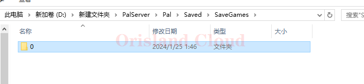

# 还原备份存档

_<mark style="color:red;">**对存档的任何操作都应该以关闭服务器为优先。**</mark>_ [#guan-bi](../qi-dong-guan-bi.md#guan-bi "mention")

打开备份的文件夹，默认为`savedBackup`。

<figure><figcaption></figcaption></figure>

选择您需要还原的备份日期，这里以`2024/1/25`的存档为例，一般情况下，本文件夹内会存放多日的存档供您选择。

<figure><figcaption></figcaption></figure>

选择您要回档的时间点，这里以回档`1点31`为例，打开该文件夹。

<figure><figcaption></figcaption></figure>

一般情况下，该文件夹内只有名称为0的文件夹，复制该文件夹。

<figure><figcaption></figcaption></figure>

回到帕鲁服务端的目录(一般在`D盘的PalServer文件夹`)，依次进入`Pal文件夹`，`Saved文件夹`，`SaveGames文件夹`。如果您没有做出其他调整，这里会出现名字为0的文件夹。

<figure><figcaption></figcaption></figure>

将该文件夹移动到其他位置后，修改文件名为任意其他名称，这里直接复制到了D盘，以`0.bak`为例。您也可以直接把该文件移除避免备份程序备份无用的报废存档。

<figure><figcaption></figcaption></figure>

将您刚才复制的文件，粘贴到这里。

<figure><figcaption></figcaption></figure>

重新启动服务端。[#qi-dong](../qi-dong-guan-bi.md#qi-dong "mention")
