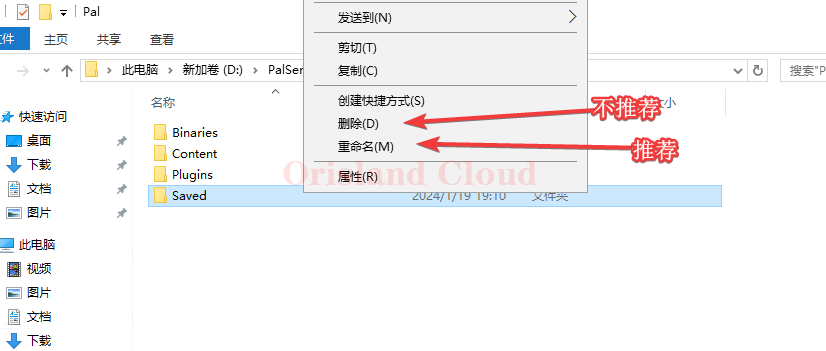

# 重开

在对服务器的存档进行操作时，请先关闭服务端。 [#guan-bi](../qi-dong-guan-bi.md#guan-bi "mention")

找到帕鲁服务端的目录(在本站默认为D盘的`PalServer`目录)，打开`Pal`文件夹删除或修改`Saved`文件夹名称。

请注意本操作是高危操作，请在操作前务必确认，推荐采用重命名的方式来进行存档移除。

<figure><figcaption></figcaption></figure>

使用重命名的方式来删除存档只需要将`Saved`文件夹修改为其他名称即可，比如将`Saved`修改为`Saved`，这样在服务端重启找不到存档的情况下，会自动重建地图。

<figure><figcaption></figcaption></figure>
