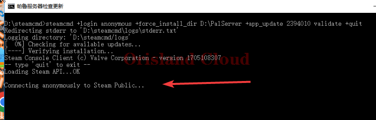
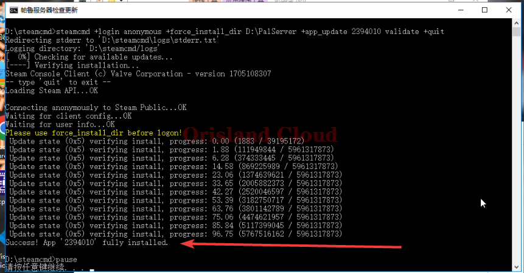
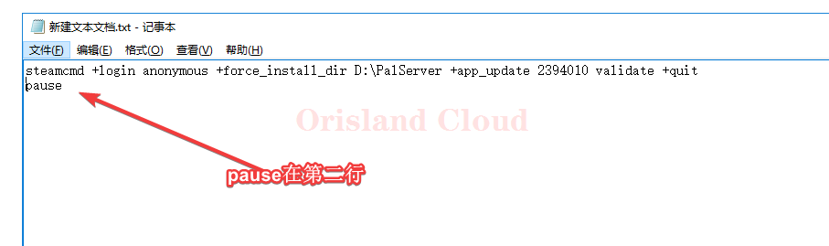
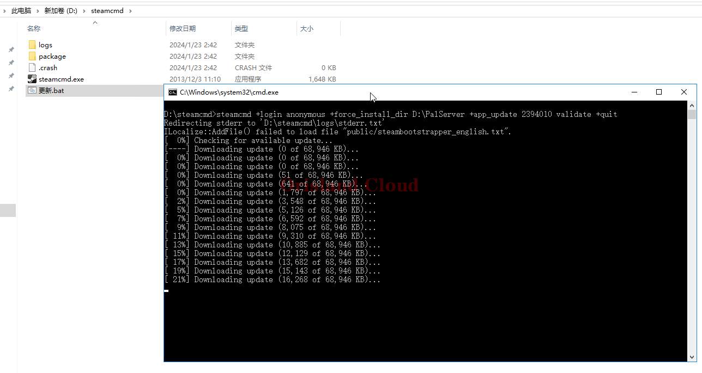
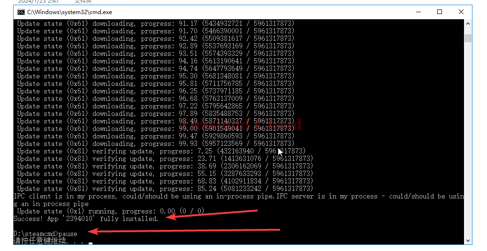

# 服务端安装与更新

服务端安装和更新目前提供借助`SteamCmd`工具的方式进行。

安装和更新同理，可以直接按更新的流程进行服务器的安装。

请先下载`SteamCMD`章节的软件 [#fu-wu-duan-xia-zai-an-zhuang](../fu-wu-duan-an-zhuang-yu-geng-xin/steamcmd-an-zhuang-ren-he-fu-wu-duan.md#fu-wu-duan-xia-zai-an-zhuang "mention")

<mark style="color:red;">**请在更新前，确认服务端已经关闭。**</mark>

**快速跳转** [#ruodpan-yi-cun-zai-geng-xin-bat](fu-wu-duan-an-zhuang-yu-geng-xin.md#ruodpan-yi-cun-zai-geng-xin-bat "mention") [#ruodpan-bu-cun-zai-geng-xin-bat](fu-wu-duan-an-zhuang-yu-geng-xin.md#ruodpan-bu-cun-zai-geng-xin-bat "mention")

## 若D盘已存在更新bat

若你的D盘已经存在一个`bat`图标，且名字为服务器检查更新的快捷方式，您可以直接双击打开更新服务端，程序会自动运行直到更新完成。

<figure><figcaption></figcaption></figure>

若程序卡在如图所示位置，并出现`retry`的标识，请您关闭该黑框后重新打开，是`steam`服务器连接不稳定导致。

<figure><figcaption></figcaption></figure>

帕鲁服务端更新完成

更新完成的服务端的输出结尾为 `fully installed`，具体如图所示。

<figure><figcaption></figcaption></figure>

## 若D盘不存在更新bat

请先下载`steamcmd`软件本体，只下载个文件即可。 [#xia-zai](../fu-wu-duan-an-zhuang-yu-geng-xin/steamcmd-gong-ju-an-zhuang.md#xia-zai "mention")

将这个`steamCMD`文件单独放在一个文件夹中。

<figure><figcaption></figcaption></figure>

新建文本文档起名为更新，并写入如下字符，注意`pause`为第二行。

> steamcmd +login anonymous +force\_install\_dir <mark style="color:red;">帕鲁服务器地址</mark> +app\_update 2394010 validate +quit
>
> pause

请修改红色字符为帕鲁的服务端地址，这里以服务器默认安装的`D:\PalServer` 为例，则需要写入文件的字符串如下。

```
steamcmd +login anonymous +force_install_dir D:\PalServer +app_update 2394010 validate +quit
pause
```

保存文件，将文件的后缀修改为bat [xian-shi-wen-jian-hou-zhui.md](../../../xi-tong-bian-xie-cao-zuo/xian-shi-wen-jian-hou-zhui.md "mention")

<figure><figcaption></figcaption></figure>

修改bat后启动。

该程序会首先下载补全`steamcmd`所需的文件后进行服务端的更新下载任务。

<figure><figcaption></figcaption></figure>

服务器更新完成后，显示如图。

若更新卡在了连接`steam`服务器`retry`请重新打开这个`bat`文件重试。

<figure><figcaption></figcaption></figure>

为方便下次更新你可以右击该bat发送到桌面快捷方式方便下次更新。
