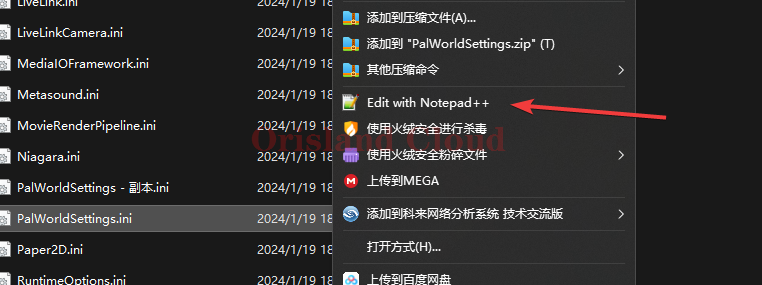
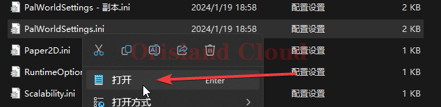
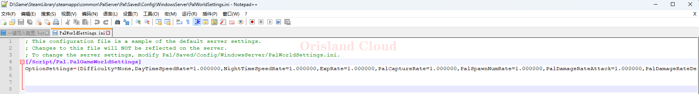
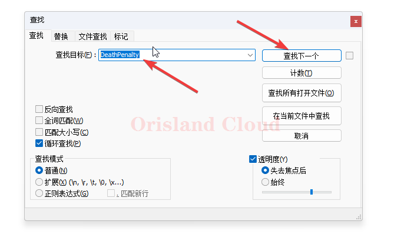
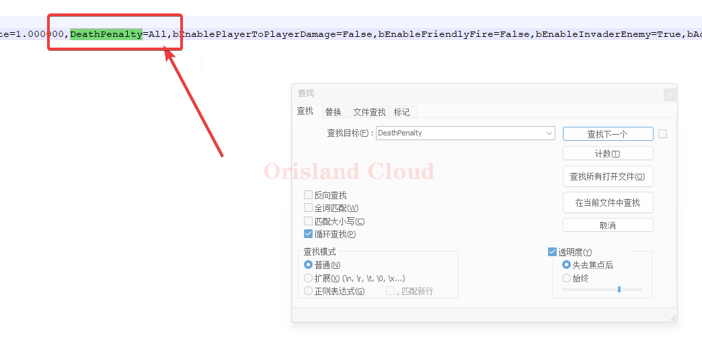
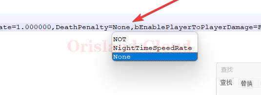

# 配置调整

> 本教程为<mark style="color:red;">**临时教程**</mark>，等待细化。
>
> 2024/1/22日之后配置的所有进行了一些初始化操作，可以直接跳转到对照表进行查看 [#dui-zhao-biao](pei-zhi-tiao-zheng.md#dui-zhao-biao "mention")

打开palserver目录，找到.png>)

复制该文件到, `PalServer\Pal\Saved\Config\WindowsServer`

<figure><figcaption></figcaption></figure>

复制完成后，删除这个文件夹中的`PalWorldSettings.ini`文件。

<figure><figcaption></figcaption></figure>

将刚才复制过来的文件，去掉开头的`Default`，将`DefaultPalWorldSettings.ini`改成`PalWorldSettings.ini`

<figure><figcaption></figcaption></figure>

修改完成后双击打开或右击编辑，这里为了方便以notepad进行打开，如果没有的话也可以用记事本打开。

<figure><figcaption>
notepad
</figcaption></figure>

<figure><figcaption>
记事本
</figcaption></figure>

打开后的结果是这样的则没有问题。

<figure><figcaption></figcaption></figure>

## 对照表

附带配置对照表(_<mark style="color:blue;">**自翻加工，仅供参考不排除错误的可能性，需后期矫正**</mark>_)。

| Difficulty                         | Difficulty                                                                                                    |
| ---------------------------------- | ------------------------------------------------------------------------------------------------------------- |
| DayTimeSpeedRate                   | 白天速率                                                                                                          |
| NightTimeSpeedRate                 | 夜晚速率                                                                                                          |
| ExpRate                            | 经验倍率                                                                                                          |
| PalCaptureRate                     | 帕鲁捕获率                                                                                                         |
| PalSpawnNumRate                    | 帕鲁刷怪速率                                                                                                        |
| PalDamageRateAttack                | 帕鲁伤害倍率                                                                                                        |
| PalDamageRateDefense               | 对帕鲁造成伤害的倍率                                                                                                    |
| PlayerDamageRateAttack             | 来自玩家伤害的倍率                                                                                                     |
| PlayerDamageRateDefense            | 伤害玩家的倍率                                                                                                       |
| PlayerStomachDecreaceRate          | 玩家饥饿流逝速率                                                                                                      |
| PlayerStaminaDecreaceRate          | 玩家体力减少倍率                                                                                                      |
| PlayerAutoHPRegeneRate             | 玩家回血倍率                                                                                                        |
| PlayerAutoHpRegeneRateInSleep      | 玩家睡眠回血倍率                                                                                                      |
| PalStomachDecreaceRate             | 帕鲁饥饿度流失倍率                                                                                                     |
| PalStaminaDecreaceRate             | 帕鲁耐降低倍率                                                                                                       |
| PalAutoHPRegeneRate                | 帕鲁回血速率                                                                                                        |
| PalAutoHpRegeneRateInSleep         | 帕鲁在帕鲁球里的回血速率                                                                                                  |
| BuildObjectDamageRate              | 建筑攻击伤害速率                                                                                                      |
| BuildObjectDeteriorationDamageRate | 结构测定率(暂时未知)                                                                                                   |
| CollectionDropRate                 | 可收集物品倍率                                                                                                       |
| CollectionObjectHpRate             | 可收集物品hp倍率                                                                                                     |
| CollectionObjectRespawnSpeedRate   | 可收集物品回收间隔                                                                                                     |
| EnemyDropItemRate                  | 掉落倍率                                                                                                          |
| DeathPenalty                       | 
死亡惩罚配置：

None：没有惩罚

Item：丢失除了仪器外的物品, 

ItemAndEquipment：丢失物品和仪器

All :丢失一切，包括库存的帕鲁
 |
| GuildPlayerMaxNum                  | 工会最大玩家                                                                                                        |
| PalEggDefaultHatchingTime          | 孵蛋时间                                                                                                          |
| ServerPlayerMaxNum                 | 服务器最大可加入玩家                                                                                                    |
| ServerName                         | 服务器名字                                                                                                         |
| ServerDescription                  | 服务器描述                                                                                                         |
| AdminPassword                      | 管理员密码                                                                                                         |
| ServerPassword                     | 服务器密码                                                                                                         |
| PublicPort                         | 公开端口号（对私服无效，仅对公开社区服有效）                                                                                        |
| PublicIP                           | 公开Ip（如上）                                                                                                      |
| RCONEnabled                        | RCON功能启动                                                                                                      |
| RCONPort                           | 配置RCON的端口                                                                                                     |

可以对照此表修改配置改成适合自己的配置。

修改举例，将死亡掉落修改为死亡不掉落任何物品。

打开`PalWorldSettings.ini`文件，按住键盘`ctrl + f`或notepad++中的这个按钮。

<figure><figcaption></figcaption></figure>

在弹出的窗口中输入`DeathPenalty`。

<figure><figcaption></figcaption></figure>

找到匹配项后，将等号后面的`ALL`修改为表格中提到的`None`。

<figure><figcaption></figcaption></figure>

<figure><figcaption></figcaption></figure>

修改完成后保存，启动或重启服务器。 [bao-cun.md](../qi-ri-sha-7-days-to-die/xi-jie-tiao-zheng/bao-cun.md "mention")
