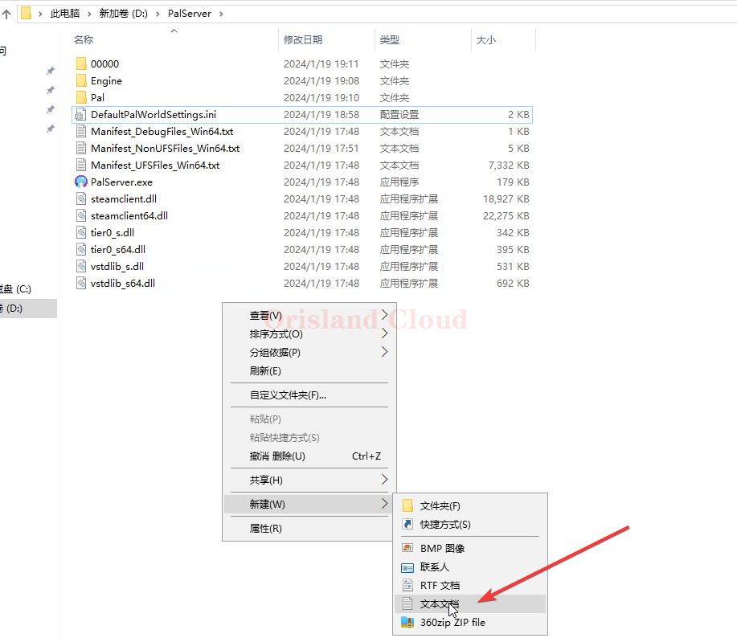
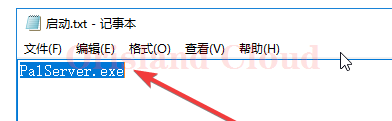

# 启动参数

## 使用指定参数启动服务端

在服务端所在目录新建文本文档，名字随便起，这里以`启动`作为文件的名字并打开。

<figure><figcaption></figcaption></figure>

将PalServer.exe填入刚才的文本文件。

<figure><figcaption></figcaption></figure>

在PalServer.exe字段后面加个空格，然后继续输入后续的启动参数。

