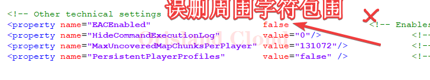

# 修改规范

本章所有的修改都建立在符合修改规范的标准之上，错误的格式和数据会导致服务端闪退，闪烁消失，无法启动等问题，请_<mark style="color:red;">**务必严格按照规范进行修改**</mark>_。

正确的修改范例：

<figure><figcaption></figcaption></figure>

下面将列举<mark style="color:red;">**错误的修改方式**</mark>，请注意避免。因为人与人的大脑结构各不相同，所以这里只列举的部分常见错误。

<figure><figcaption>
错误样例1
</figcaption></figure>

<figure><figcaption>
错误样例2
</figcaption></figure>

<figure><figcaption>
错误样例3
</figcaption></figure>

<figure><figcaption>
错误样例4
</figcaption></figure>
