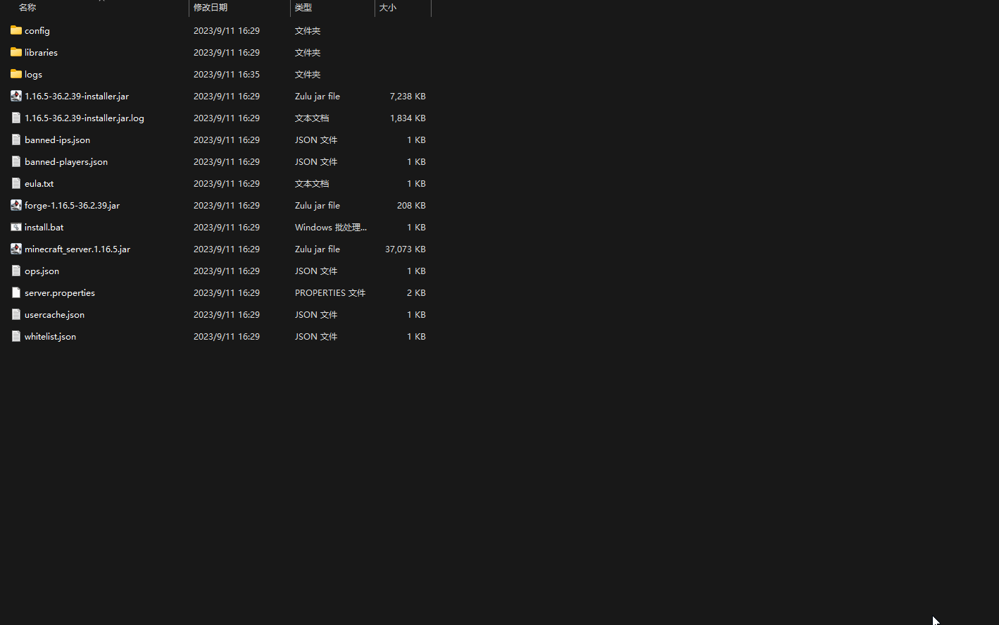

# 启动崩溃

请注意，在解决任何问题之前，<mark style="color:red;">耐心是一切的前提</mark>，任何<mark style="color:red;">没有耐心</mark>，<mark style="color:red;">只问不想或只问不答</mark>的做法都<mark style="color:red;">无法真正的解决问题。</mark>如果您是抱着这种心态来处理MC的相关问题的，我劝您重新调整态度来过。大家都是从新手期走过来的，区别仅在于某些人的新手期短，有些人却因为自己的浮躁而永远无法跨过这个时期。

您需要让自己的MC服务端启动出现错误时候留下错误信息，而不是闪烁消失。

所以对于≤ 1.16.5的版本，您需要这样启动服务端。

首先打开MC服务端的文件夹，右击空白处选择新建文本文档，打开文档。

<figure><figcaption></figcaption></figure>

在排错之前，您需要知道下面这个表格，这对于<mark style="color:red;">Mod服</mark>的MC的启动排错非常重要，纯净服下面会另说。

<table><thead><tr><th width="369" align="center">MC版本</th><th align="center">Java版本</th></tr></thead><tbody><tr><td align="center">≤ 1.16.5</td><td align="center">8</td></tr><tr><td align="center">> 1.16.5</td><td align="center">17</td></tr></tbody></table>

由于Fabric服一般为较高版本服务器，所以目前考虑≤ 1.16.5版本的mod服mc均为forge服务器。

在无法启动服务器的时候，多半是因为Java版本选择错误导致的。

如果你的服务器版本在1.16.5之后，比如1.18.2,1.19.2等等之后的版本，你应选择的Java
