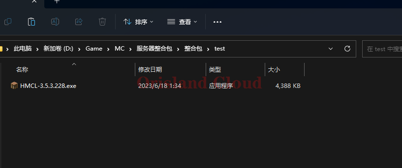
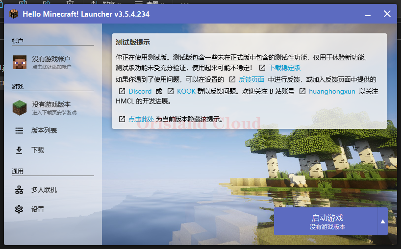
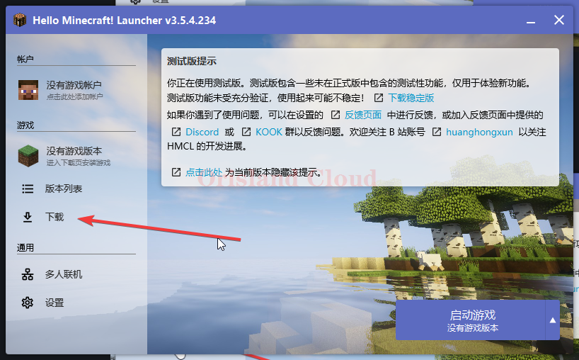

# 安装游戏

## 软件准备

如果您的电脑没有安装过Java，您可以跳转到Java安装章节 [java-an-zhuang.md](../java-an-zhuang.md "mention")

请先下载HMCL [#hmcl](../qi-dong-qi.md#hmcl "mention")。

在您的电脑上找一个位置用来存放mc，请使用空白文件夹单独放置启动器。将下载的HMCL启动器放在这里。

<figure><figcaption></figcaption></figure>

打开软件后，界面如图所示。

<figure><figcaption></figcaption></figure>

## 游戏安装准备

单机`下载`按钮。

<figure><figcaption></figcaption></figure>

## 安装需要的游戏

请按需跳转。

[chun-jing.md](chun-jing.md "mention")[zheng-he-bao.md](zheng-he-bao.md "mention")
