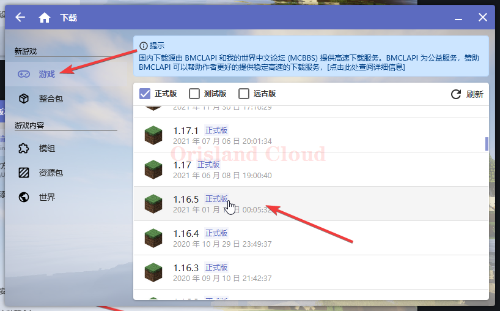
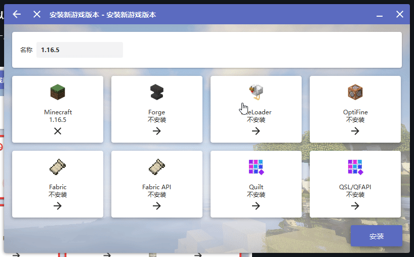

# 纯净

在下载列表中寻找您需要的版本，单机。这里以1.16.5_<mark style="color:blue;">**为例**</mark>_。

<figure><figcaption></figcaption></figure>

#### （可选）同时安装forge或fabric，以及光影

本节可跳过，如果_您不打算在后续安装光影或者mod_，只想体验**原生版本**，请跳过此步骤。

`forge`，`fabric`，`quilt`，只能存在其一，请在安装前确定自己需要的加载器。光影可以与上述加载器_<mark style="color:blue;">**同时安装**</mark>_，如果需要的话可以点上，1.16.5您可以按自己的需要重新命名，一般情况下应避免汉字。

<figure><figcaption></figcaption></figure>

这里以安装`forge`和`光影`为例，单机`forge`后，选择自己需要的`forge版本`（一般为最新）和需要的`光影版本`（一般为最新），之后单机安装即可。

<figure><figcaption></figcaption></figure>
