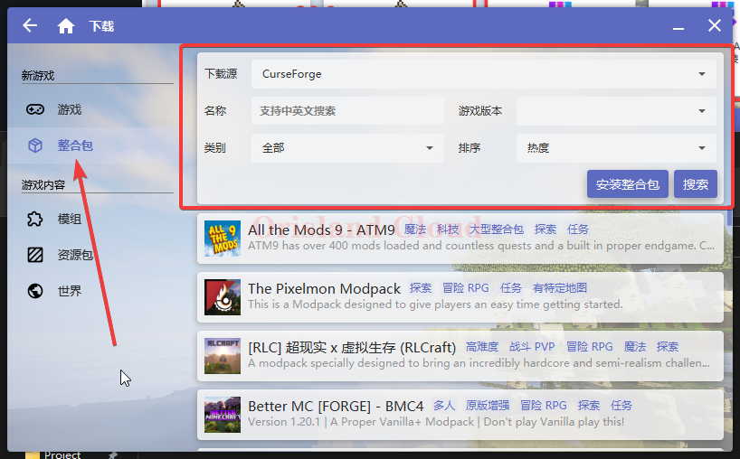
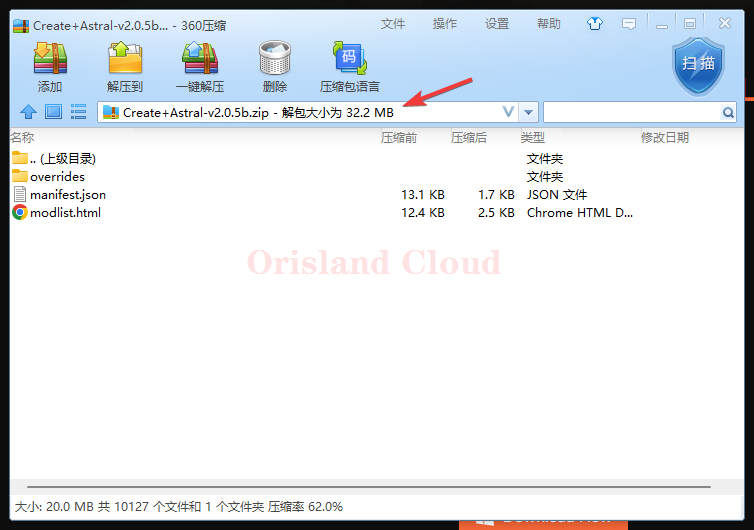
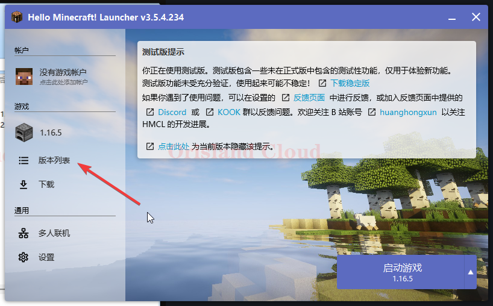
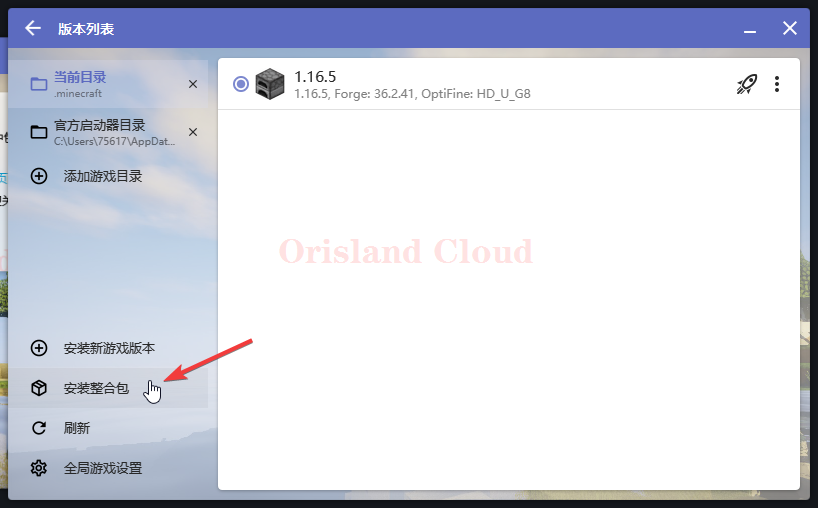
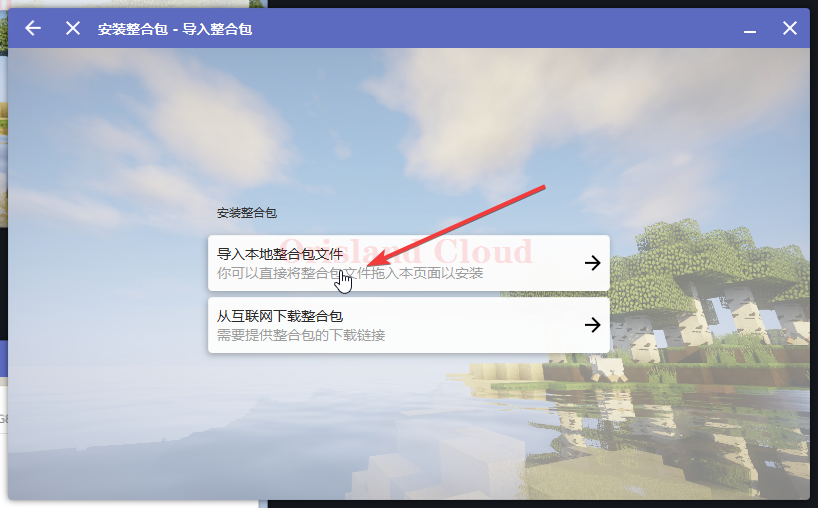
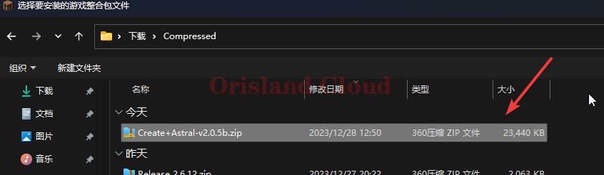
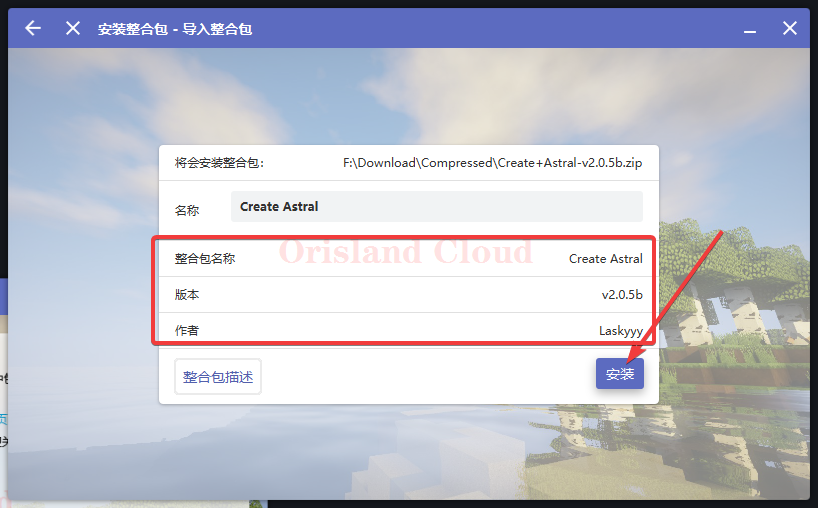

# 整合包

在下载列表中单机整合包选项，您可以在右上角的小框内筛选条件搜索您需要的整合包。

由于不同的网络状况，您的搜索速度可能有所不同，请耐心等待。

<figure><figcaption></figcaption></figure>

这里以[curseForge](https://www.curseforge.com/minecraft/search?page=1\&pageSize=20\&sortType=1\&class=modpacks)平台上的较为经典的机械动力整合包为例进行安装示范。

<figure><figcaption></figcaption></figure>

### 安装zip整合包

某些整合包是以zip导出进行分享的，您可以使用启动器导入指定整合包。

_<mark style="color:red;">**\*请注意，并不是所有整合包都需要导入的，部分整合包已经内置启动器，是一个完整的游戏，解压即可游玩无需导入。**</mark>_

这里仍然以机械动力整合包的压缩文件举例。

通常情况下，需要导入的zip文件大小并不算很大，且打开后一般只包含少量文件。

<figure><figcaption></figcaption></figure>

单机版本列表。

<figure><figcaption></figcaption></figure>

单机安装整合包。

<figure><figcaption></figcaption></figure>

单机导入本地整合包文件。

<figure><figcaption></figcaption></figure>

找到需要导入的文件后双击打开或选择右下角打开。

<figure><figcaption></figcaption></figure>

若能正确读出整合包信息，单机安装后等待完成即可。

<figure><figcaption></figcaption></figure>
