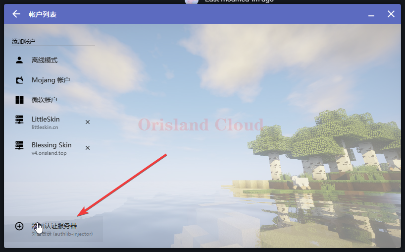
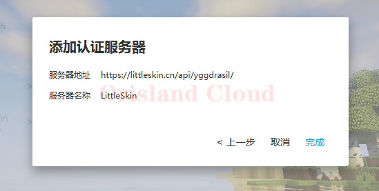
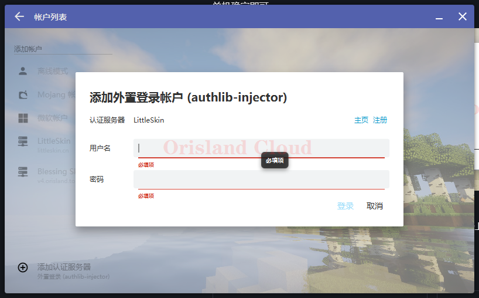
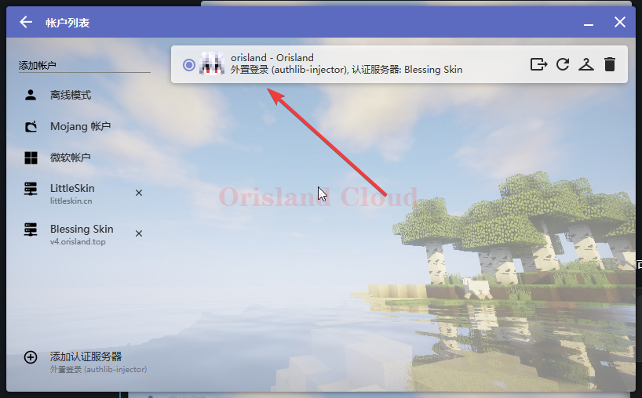

# 外部登录

对于某些服务器来说，拜托正版登录服务器的不稳定性是必要的。

如果您的目标服务器使用的是类似littleskin的皮肤站，那么您的外部登录地址为：

> [https://littleskin.cn/api/yggdrasil](https://littleskin.cn/api/yggdrasil)

顺带提供一份傻瓜式的注册教程，其他自建皮肤站类似 [#zhu-ce-yu-jiao-se-chuang-jian](../../wai-bu-deng-lu.md#zhu-ce-yu-jiao-se-chuang-jian "mention")。

如果您的目标服务器使用的是自建皮肤站，那么您的外部登录地址需要去相关群或频道获取。

这里以littleskin为例演示添加过程，实际情况请自行调整地址。

单机添加认证服务器。

<figure><figcaption></figcaption></figure>

将服务器的外部认证地址填入框框单机下一步。若一切正常，则出现如图所示，若提示安全问题可以忽略单机确定即可。

<figure><figcaption></figcaption></figure>

左侧出现对应的外部验证服务器后，单机，输入您在认证服务器上注册的用户名和密码后，即可完成登录。

<figure><figcaption></figcaption></figure>

用户名密码正确时，登录完成。

<figure><figcaption></figcaption></figure>
