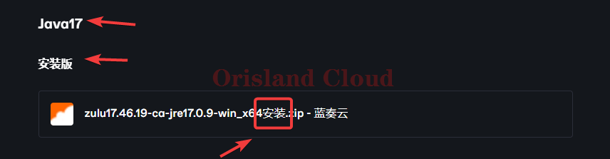
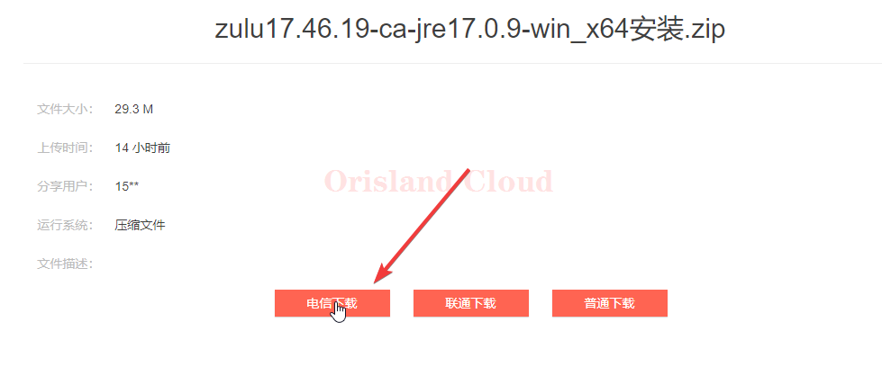
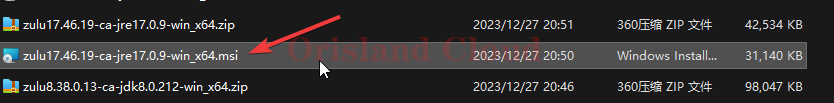
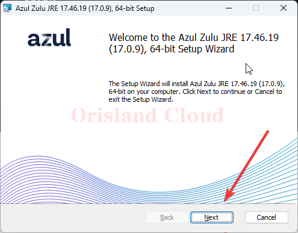
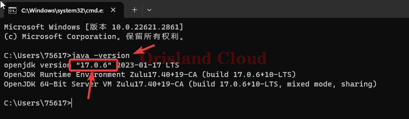
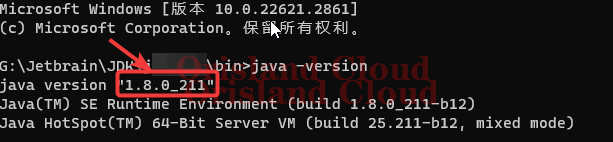

# Java安装

本节仅提供_<mark style="color:red;">**Windows**</mark>_版本_<mark style="color:red;">**64位**</mark>_的Java，不提供MAC，Linux以及其他系统的Java安装包。

首先，您应该确认自己系统的java版本。 [#que-ding-xi-tong-de-mo-ren-java-ban-ben](java-an-zhuang.md#que-ding-xi-tong-de-mo-ren-java-ban-ben "mention")

请根据下面的表格来选择您应该安装的Java版本，一般情况下，您不需要使用表格外的其他版本Java。

<table><thead><tr><th width="367" align="center">MC版本</th><th align="center">Java版本</th></tr></thead><tbody><tr><td align="center">≤ 1.16.5</td><td align="center">8</td></tr><tr><td align="center">> 1.16.5</td><td align="center">17</td></tr></tbody></table>

## Java下载资源

本节分为两部分，安装版，和压缩版，安装版本解压后为msi，此版本自带安装向导和环境向导配置，更适合萌新体质；压缩版不带安装向导，更适合对Java版本管理更熟练的玩家。

如果您不会解压文件，可以参考 [#jie-ya](../../../../fu-wu-qi-guan-li-yu-kong-zhi/shang-chuan-wen-jian/windows/ya-suo-yu-jie-ya.md#jie-ya "mention")。

### Java8

#### 安装版



#### 压缩版



### Java17

#### 安装版



#### 压缩版



## 安装版使用

首先，请先按照您需要的版本在上面的下载地址中下载带有“安装”字样的文件，这里以Java17为例。

<figure><figcaption></figcaption></figure>

<figure><figcaption></figcaption></figure>

解压下载的文件，得到msi结尾的文件后，双击打开。 [#jie-ya](../../../../fu-wu-qi-guan-li-yu-kong-zhi/shang-chuan-wen-jian/windows/ya-suo-yu-jie-ya.md#jie-ya "mention")

<figure><figcaption></figcaption></figure>

请一直单机`Next`按钮，安装前的最后一步该按钮会变为`Install`。除非您知道自己在做什么，否则请勿在中途进行修改。

<figure><figcaption></figcaption></figure>

## 确定系统的默认Java版本

跳转回开头 [java-an-zhuang.md](java-an-zhuang.md "mention")。

[qi-dong-ming-ling-hang](../../../../xi-tong-bian-xie-cao-zuo/qi-dong-ming-ling-hang/ "mention")，输入`java -version`，回车，若如图所示，则安装指定版本`java`成功。

<figure><figcaption></figcaption></figure>

若出现如下字符，或者出现java安装版本与预期版本不符，则安装出现问题。需要修正环境变量。

<figure><figcaption>
安装错误
</figcaption></figure>

<figure><figcaption>
预期安装java17后显示为java8
</figcaption></figure>

环境变量修正请跳转 [#huan-jing-bian-liang](../../../../you-xi-huan-jing/java/zai-ben-zhan-wai-an-zhuang.md#huan-jing-bian-liang "mention")
