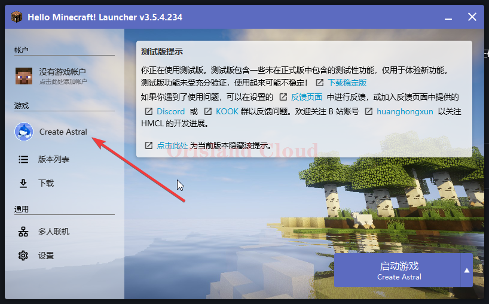
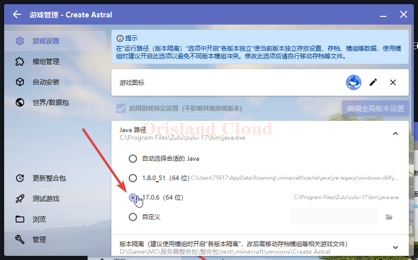

# Java版本指定

由于HMCL的版本隔离机制，在默认Java版本与MC需要版本不一致时，您需要手动调整到正确的Java版本上。

这里以一个整合包为例，调整Java从默认的Java8调整到Java17.

单机该整合包。

<figure><figcaption></figcaption></figure>

调整到正确的Java版本后，单机左上角的返回箭头即可完成Java指定版本配置。

如果您这里没有其他版本的Java，请参考 [java-an-zhuang.md](../java-an-zhuang.md "mention")章节进行对应版本的安装。

<figure><figcaption></figcaption></figure>
