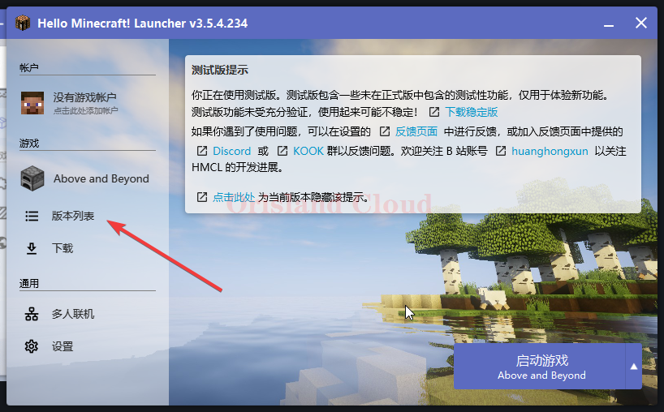
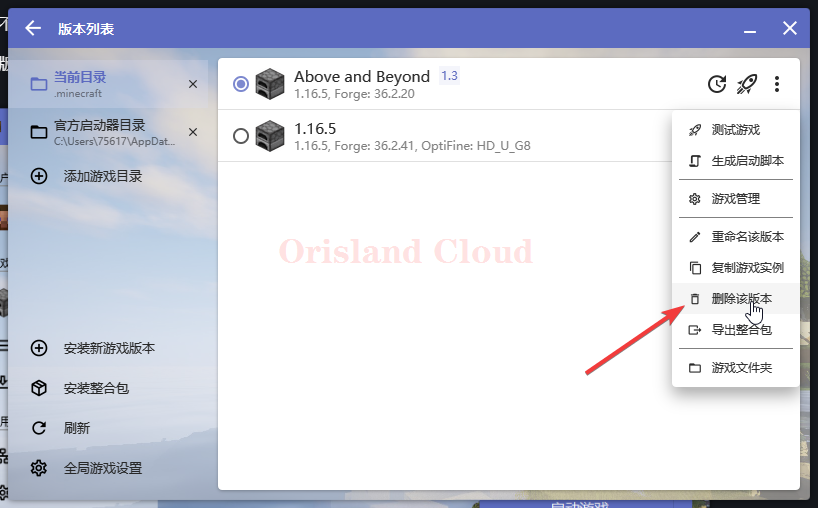

# 删除指定版本

### 删除指定游戏

删除不需要的游戏版本。

单机版本列表，找到不需要的游戏。

<figure><figcaption></figcaption></figure>

在右侧找到三点，单机删除该版本。

<figure><figcaption></figcaption></figure>

再次单机删除后即可移除游戏版本。

<figure><figcaption></figcaption></figure>
