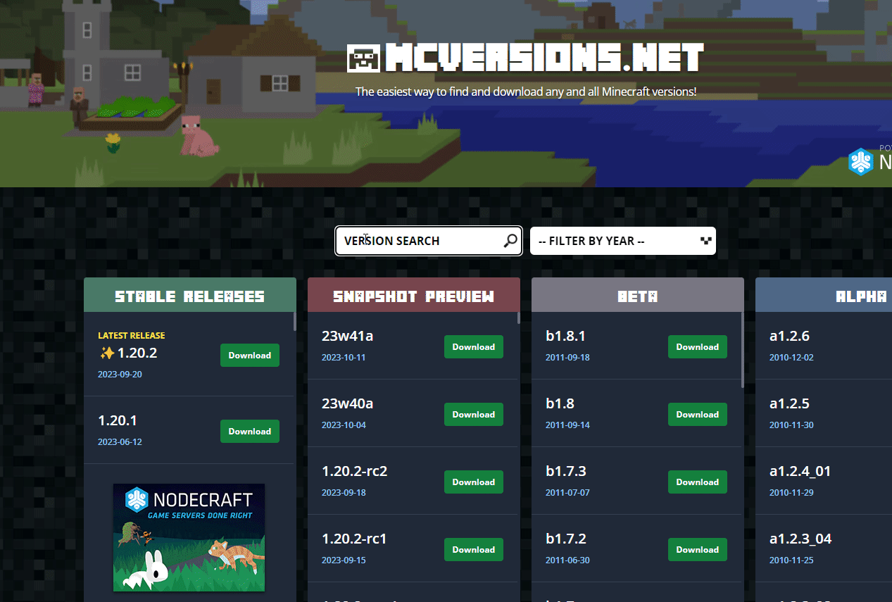

# 服务器核心选择与下载

根据您的不同需要选择不同的服务器核心。

<table data-full-width="true"><thead><tr><th></th><th>mod</th><th>插件</th><th>附加说明</th></tr></thead><tbody><tr><td>Minecraft原版</td><td>❌</td><td>❌</td><td>纯原版</td></tr><tr><td>forge</td><td>✔</td><td>❌</td><td>可以安装forge mod</td></tr><tr><td>fabric</td><td>✔</td><td>❌</td><td>可以安fabric mod</td></tr><tr><td>paper</td><td>❌</td><td>✔</td><td>经典paper，插件端</td></tr><tr><td>spigot</td><td>❌</td><td>✔</td><td>插件端</td></tr><tr><td>purpur</td><td>❌</td><td>✔</td><td>高性能插件端（自称）</td></tr><tr><td>SpongForge</td><td>✔</td><td>✔</td><td>海绵端</td></tr><tr><td>CatServer</td><td>✔</td><td>✔</td><td>猫端</td></tr><tr><td>Mohist</td><td>✔</td><td>✔</td><td>墨端</td></tr><tr><td>Arclight</td><td>✔</td><td>✔</td><td>弧光端</td></tr><tr><td>BungeeCord</td><td>*</td><td>*</td><td>bc端</td></tr><tr><td>Waterfall</td><td>*</td><td>*</td><td>瀑布端</td></tr><tr><td>Velocity</td><td>*</td><td>*</td><td>新一代反代端</td></tr><tr><td>Bedrock</td><td>*</td><td>*</td><td>基岩端</td></tr></tbody></table>

纯Mod服:

[#forge](fu-wu-qi-he-xin-xuan-ze-yu-xia-zai.md#forge "mention")[#fabric](fu-wu-qi-he-xin-xuan-ze-yu-xia-zai.md#fabric "mention")

纯插件服:

[#craftbukkit](fu-wu-qi-he-xin-xuan-ze-yu-xia-zai.md#craftbukkit "mention")[#spigot](fu-wu-qi-he-xin-xuan-ze-yu-xia-zai.md#spigot "mention")[#paper](fu-wu-qi-he-xin-xuan-ze-yu-xia-zai.md#paper "mention")[#purpur](fu-wu-qi-he-xin-xuan-ze-yu-xia-zai.md#purpur "mention")

mod插件混合服务器:

[#spongeforge](fu-wu-qi-he-xin-xuan-ze-yu-xia-zai.md#spongeforge "mention")[#catserver](fu-wu-qi-he-xin-xuan-ze-yu-xia-zai.md#catserver "mention")[#mohist](fu-wu-qi-he-xin-xuan-ze-yu-xia-zai.md#mohist "mention")

官方原版核心:

[#chun-jing-yuan-ban-guan-fang-he-xin](fu-wu-qi-he-xin-xuan-ze-yu-xia-zai.md#chun-jing-yuan-ban-guan-fang-he-xin "mention")

反向代理群组服核心:

[#bungeecord](fu-wu-qi-he-xin-xuan-ze-yu-xia-zai.md#bungeecord "mention")[#waterfall](fu-wu-qi-he-xin-xuan-ze-yu-xia-zai.md#waterfall "mention")[#velocity](fu-wu-qi-he-xin-xuan-ze-yu-xia-zai.md#velocity "mention")

基岩移动端:

[#bedrock](fu-wu-qi-he-xin-xuan-ze-yu-xia-zai.md#bedrock "mention")[#pocketmine-mp](fu-wu-qi-he-xin-xuan-ze-yu-xia-zai.md#pocketmine-mp "mention")[#nukkitx](fu-wu-qi-he-xin-xuan-ze-yu-xia-zai.md#nukkitx "mention")

## forge

forge服务器是目前mc服务器中占比最大的服务器。


灵工艺


推荐使用官方提供的最新的forge安装器。


官方forge


## fabric

fabric服务器的优化和流畅度一般优于forge，但是由于出现较晚，所以可用mod数量少于forge。


fabric


## Spigot

最经典的插件核心，官方没有提供直接的下载，需要自行构建，需要一定的技术门槛，建议选择下面的。


spigot


## CraftBukkit

经典插件服，俗称水桶服。


水桶服


## Paper

目前使用最普遍性能相对更好的经典插件服核心。


paper


## Purpur

paper类似，但是似乎拥有更好的性能和多线程特性，和更多的可配置项，是一个相对较新的项目。


purpur


## SpongeForge

俗称海绵端，混合端的始祖之一。


海绵


## Mohist

俗称墨端。


mohist3


## CatServer

俗称猫端。


catserver


## 纯净原版官方核心

本核心提供多个个下载渠道，部分配有不同方法的下载教程gif。

> 在OrislandCloud内，使用默认资源站进行下载

{% embed url="http://cloud.orisland.top/s/ZmsN?path=%2F%E6%B8%B8%E6%88%8F%E6%9C%8D%E5%8A%A1%E7%AB%AF%2F%E6%88%91%E7%9A%84%E4%B8%96%E7%95%8CMC%2FMC%E5%8E%9F%E7%89%88%E6%A0%B8%E5%BF%83" %}
单机即可访问进行瞎子啊


> MCVersion


MCVersion


<figure><figcaption>
双击放大
</figcaption></figure>

> 蓝奏云


密码:mc


官方数据源(需进行json格式化)


官方渠道


## BungeeCord&#x20;

最经典的反代，俗称bc反代。


bc


## Waterfall

在bc基础上改进的瀑布，俗称瀑布反代。


waterfall


### Velocity

全新一代反代，更好的性能，仅支持较新的mc版本。


velocity


## BedRock

官方基岩移动服务器核心，由于全部推倒重建，该版本拥有所有服务端中最好的性能发挥。


基岩端


### PocketMine-MP

民间使用PHP编写的基岩端服务器，历史悠久。


PHP是世界上最\*的语言


### NukkitX

Nukkit地位与上面的类似。




